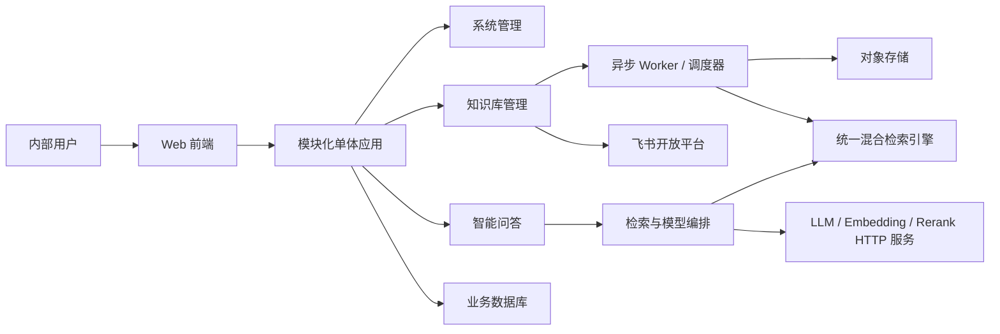
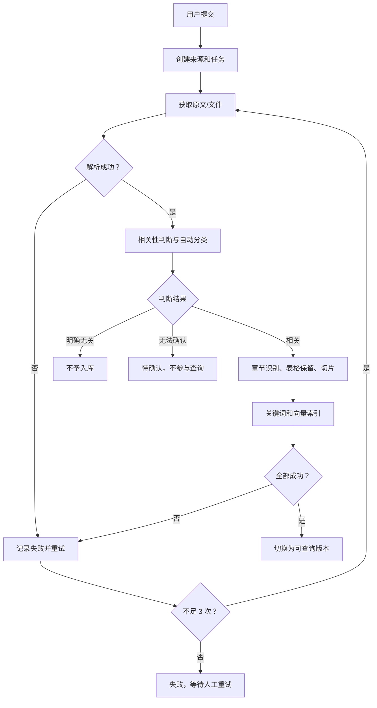
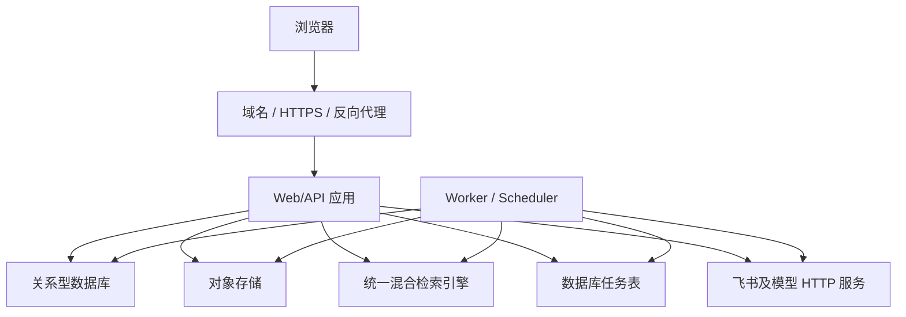

# AE 内部知识平台 V1 概要设计

版本：V1.0  
阶段：概要设计基线  
更新日期：2026-08-17  
适用范围：AE 部门内部产品知识查询 V1

> 本文依据 V1 需求基线及概要设计讨论形成，作为详细设计、原型设计、开发和测试的共同输入。文中已经确定系统边界、模块职责、关键数据流、异常恢复和验收基础；数据库表结构、API、页面交互、具体检索参数等在详细设计阶段展开。

## 1. 目标与范围

### 1.1 设计目标

面向约 30 名内部用户，建设产品知识查询系统。用户可以提交产品文档，并通过自然语言获得有依据、可追溯的综合答案。

概要设计回答：系统有哪些模块、模块如何协作、数据如何保存、外部服务如何接入、失败后如何恢复，以及 V1 如何部署、测试和演进。

### 1.2 V1 范围（已确认）

包含：

- 系统账号密码登录和飞书扫码登录；
- 飞书文档发现、链接提交及 Word、PDF、Excel 上传；
- 文档解析、相关性判断、自动分类、切片和索引；
- 飞书文档每日更新检查、失败重试和版本切换；
- 自然语言问答、可选查询条件、多轮追问和来源引用；
- 会话管理、用户反馈、文档处理和运行管理；
- 必要的配置、统计、备份和运行监控；
- 会话归档、逻辑删除、导出及内部分享快照。

不包含：

- 问题诊断业务模块；
- CDT 日志分析用例；
- 诊断报告生成及导出飞书云文档；
- 复杂角色权限、文档数据权限和操作审计体系。

问题诊断未来作为独立一级业务模块扩展；CDT 日志分析是其下的具体用例。

### 1.3 对早期需求基线的修正

| 事项 | 早期表述 | 当前设计基线 |
|---|---|---|
| 权限与审计 | 包含权限、敏感访问和查询审计 | V1 删除权限和审计相关需求 |
| 对话保存 | 曾提出 180 天 | 默认永久保存 |
| 结果模板 | 按知识类型固定模板 | 不设固定模板；按问题和证据动态组织，结构化内容优先用表格 |
| 来源选择 | 用户可限制知识来源 | 用户不选择来源；系统自动检索，产品、版本、文档类型是可选条件 |

## 2. 总体原则

- **业务与技术分层**：知识库管理、智能问答、系统管理是业务模块；RAG、BM25、向量检索、Rerank 和模型是技术能力。
- **依据优先**：产品事实必须来自已入库知识，不能由模型凭空补全。
- **答案优先**：先展示综合答案，再展示关键依据和原文链接。
- **来源可追溯**：关键结论能够定位到具体文档和章节。
- **最终一致**：文档新版全部处理成功后才替换线上旧版。
- **失败隔离**：单文档、模型调用或任务失败不影响其他任务。
- **配置解耦**：飞书、模型和存储能力通过配置切换。
- **控制复杂度**：V1 采用模块化单体，不为约 30 人规模提前引入微服务和复杂 Agent 编排；文档分类采用职责单一的 LLM 分类器。

## 3. 总体架构

### 3.1 实现形态（已确认）

- Web 前端提供登录、知识提交、问答、会话和管理页面。
- 后端采用模块化单体，对外提供统一 HTTP API。
- Worker 独立处理文档获取、解析、分类、切片、索引、同步和重试。
- 调度器每日创建飞书文档更新检查任务。
- PostgreSQL 保存权威业务状态；对象存储保存原文件、飞书版本快照和解析产物；统一混合检索引擎保存 BM25、向量和过滤元数据索引。
- 飞书、大模型、Embedding、Rerank 均按可配置 HTTP 服务调用；本地服务和外部服务不在业务架构上区别对待。

## 4. 业务模块

### 4.1 知识库管理

负责知识从“用户选择”到“可被查询”的生命周期：知识接入、重复识别、所有权、文档获取、解析、相关性判断、LLM 自动分类、切片、索引、同步、版本切换、撤回、下线、恢复和失败重试。

### 4.2 智能问答

负责从自然语言问题到有依据答案的完整链路：会话、问题理解、查询条件、混合检索、重排序、证据组织、答案生成、来源引用、多轮追问和反馈。

### 4.3 系统管理

负责用户账号和飞书绑定、文档状态、待确认文档、异常任务、人工重试、产品与版本配置、来源优先级、模型配置、运行统计和系统健康状态。

## 5. 用户与登录设计

### 5.1 登录规则（已确认）

- 支持系统账号密码和飞书扫码两种登录入口。
- 不开放独立密码自主注册；首次飞书扫码自动创建系统账号，用户之后可设置用户名和密码。
- 管理员可以为无飞书账号或测试场景创建例外账号。
- 飞书授权失效不删除账号、会话和已提交文档，引导用户重新授权。
- 解除飞书绑定后保留业务数据；已设置密码的用户仍可登录，但不能发现或提交自己的飞书文档。
- 账号停用后，两种登录方式都不可用。

### 5.2 身份模型（已确认）

- `users.id` 是系统统一用户主键。
- `(tenant_key, feishu_user_id)` 唯一识别飞书用户。
- `open_id`、`union_id` 作为辅助字段。
- 临时授权码和 `user_access_token` 不能作为唯一键。
- 创建用户和绑定飞书身份在同一事务完成，由数据库唯一约束阻止并发重复开户。

## 6. 知识接入设计

### 6.1 接入方式（已确认）

1. 绑定飞书后读取用户可见文档的标题、类型、位置和修改时间等元数据，由用户多选提交；
2. 粘贴飞书文档链接提交；
3. 上传 Word、PDF、Excel 等本地文件。

系统不会自动将用户所有飞书文档入库。用户明确提交后才读取正文并启动治理任务。

### 6.2 重复识别与所有权（已确认）

- 飞书文档使用规范化后的底层 token 判断重复。
- 本地文件使用内容 MD5 判断完全相同文件。
- 重复提交不重复解析和索引；首次成功提交者是知识来源所有者。
- 后续提交者不获得更新、撤回、删除或下线权利，但可以正常查询。
- 本地文件内容变化后，只有通过原文档的“更新文档”操作才作为新版本；普通上传视为新来源。
- 所有者可以下线文档；下线后其他用户可以重新提交并成为新所有者。

### 6.3 幂等规则（已确认）

- 相同 token 或 MD5 通过数据库唯一约束阻止并发重复创建。
- 异步任务以“知识来源 ID + 文档版本 + 任务类型”为幂等依据。
- 同一飞书 revision 只允许一个有效同步任务。

## 7. 知识治理设计

### 7.1 处理流程

### 7.2 LLM 文档分类器与元数据

文档分类由职责单一的 LLM 分类器完成。分类器不自主规划、不调用其他业务工具，也不直接修改文档状态；它读取数据库中的分类配置，对解析内容进行相关性判断并输出分类及元数据建议。分类配置支持维护和动态生效，具体表结构、缓存、提示词、输出 JSON Schema 和置信度阈值在详细设计阶段确定。

分类器输出产品、软件版本、产品形态、国产化属性、文档类型、业务主题、模块、关键词、更新时间和来源类型等信息。

- 明确相关且字段完整：正常入库。
- 明确相关但部分字段无法确定：允许入库，未知字段留空并记录待完善项。
- 相关性无法判断：进入待确认，不参与查询。
- 明确无关：不予入库。
- 分类器不得为了补齐字段而编造事实。

SEG 案件候选字段：反馈日期、案件描述、客户、类型、优先级、处理人、状态、问题原因、解决办法、问题分类、关闭日期、软件版本、产品形态、材料归档路径、备注。“类型”和“问题分类”的最终口径待确认。

### 7.3 切片原则（建议）

- 依据标题层级、段落、列表和表格边界切分，不仅使用固定长度。
- 切片携带标题、章节路径、产品、版本、文档类型、更新时间和来源链接。
- 表格尽量作为完整语义单元；大表格分段时重复表头。
- 相邻切片保留适量重叠，具体参数通过真实样本调整。
- 原文、解析文本、切片和索引版本可相互追踪。

### 7.4 状态设计

业务状态与任务状态分开，避免一个字段表达两类含义。

| 对象 | 状态 | 含义 |
|---|---|---|
| 知识来源 | 处理中 | 首版尚未形成可查询版本 |
| 知识来源 | 可查询 | 存在成功版本 |
| 知识来源 | 待确认 | 相关性无法判断，不参与查询 |
| 知识来源 | 失败 | 首版自动重试三次仍失败 |
| 知识来源 | 新版同步失败 | 旧版继续查询，新版处理失败 |
| 知识来源 | 已下线 | 不参与新查询，业务记录保留 |
| 处理任务 | 等待/执行中/成功/失败/取消 | 一次异步执行的状态 |

### 7.5 飞书更新和版本切换（已确认）

- 每日检查已提交飞书文档的修改时间或 revision，不做全文比对。
- 检测到变化后创建新版本处理任务。
- 新版任一阶段失败时，旧成功版继续参与查询。
- 自动重试最多三次；仍失败则记录阶段、原因，等待管理员手动重试。
- 新版全部成功后，在业务数据库中原子切换当前可查询版本。
- 切换成功后异步清理旧索引；清理失败不回滚新版，但需记录并重试。
- 普通用户不选择历史版本，查询始终使用最新成功版本。

### 7.6 下线与恢复（已确认）

- 文档成功入库后，知识来源所有者可以自行下线；其他重复提交者无权操作该来源。
- 下线立即停止参与新查询，但保留业务记录、原始文件、解析产物和历史引用快照。
- 历史会话仍展示当时的引用信息；来源当前不可用时明确标记“已下线”。
- 原所有者可以申请恢复，恢复时重新执行完整处理流水线，成功后才重新参与查询。
- 若同一来源已被其他用户重新提交并处于可查询状态，旧来源不得恢复，避免重复知识和所有权冲突。
- V1 不提供永久物理删除；异常所有权和恢复冲突由管理员处理。

## 8. 智能问答设计

### 8.1 会话和查询条件（已确认）

- 用户可以新建、查看、重命名、归档和删除自己的会话。
- 用户切换话题时不强制新建会话。
- 产品、版本、文档类型是可选条件，不要求用户选择问题类型或具体来源。
- 条件在当前会话的多轮追问中持续生效，新建会话时清空。
- 当前问题明确表达的新条件覆盖同维度旧条件，并更新会话状态；其他条件保留。
- 条件变化在界面可见；“新版本”等无法唯一确定的表达需要追问。
- 会话、消息、答案、引用和反馈默认永久保存。
- 会话归档可恢复；用户删除会话采用逻辑删除，业务数据库继续保留记录。

### 8.2 问答链路

1. 保存用户问题并创建回答记录；
2. 结合上下文解析指代、产品、版本和查询条件；
3. 问题不完整且无法可靠检索时先澄清；
4. 使用元数据条件做前置过滤；
5. 并行执行关键词和向量检索；
6. 合并去重后使用 Rerank 重排序；
7. 组装带来源标识的证据上下文；
8. 模型基于证据生成综合答案；
9. 校验引用是否对应检索证据；
10. 流式返回并保存最终答案、来源和状态。

### 8.3 检索策略（已确认）

- BM25 处理产品名、版本号、参数名和错误码等精确匹配；向量检索补充语义匹配。
- 两路结果按文档版本和切片标识去重后融合，再执行 Rerank。
- Rerank 只处理召回候选，以控制延迟和成本。
- 只检索处于“可查询”状态的当前成功版本。
- 召回数、融合权重、Rerank 数量和最低相关度阈值配置化，并使用真实问题集调优。
- V1 使用一个统一混合检索引擎（OpenSearch/Elasticsearch 类实现），在同一检索体系中完成 BM25、向量检索、元数据过滤、融合和排序，不额外引入独立向量数据库。
- OpenSearch 或 Elasticsearch 的最终选型根据公司既有环境和验证结果确定，不影响本概要架构。
- V1 不硬编码各种 collection 组合；主要通过统一索引和元数据过滤缩小范围。

### 8.4 答案与依据

不按产品规格、白皮书等设置固定回答模板。系统根据问题和证据动态组织：先给综合答案；适合结构化表达的规格、参数、版本差异和案件字段使用表格；必要时说明适用范围和限制；不完整展开原文，只展示摘要、关键依据和链接。

| 情况 | 系统行为 |
|---|---|
| 依据充分 | 回答并附来源 |
| 仅有部分依据 | 区分已确认和未确认内容，说明限制并展示相关来源 |
| 没有足够依据 | 明确提示资料不足，建议补充产品、版本或关键词 |
| 问题不完整 | 先追问必要信息，不生成确定结论 |
| 检索或模型异常 | 提示处理失败并支持重试，不能伪装成没有资料 |

模型不得把部分匹配资料包装成确定结论，也不得使用无来源通用知识补全内部产品事实。

### 8.5 多来源与冲突

来源优先级：

1. 正式产品规格和版本文档；
2. 正式测试结论；
3. 开发设计文档；
4. SEG 历史问题案件；
5. 一般说明或经验性资料。

- 来源互补时合并为综合答案，并分别标注来源。
- 不同优先级冲突时，以高优先级为主要依据，同时说明其他来源差异。
- 同一优先级冲突时，以更新时间较新的来源为主要依据。
- 发生冲突必须展示冲突说明、来源和更新时间，并提示人工确认。
- 同一文档新旧版本不构成检索冲突，只使用最新成功版本。

### 8.6 来源引用

每个来源至少保存和展示：文档标题、文档类型、可确定的产品和版本、章节路径、更新时间、原文链接，以及它所支撑的答案结论。

历史会话保存引用快照。来源下线后仍显示当时的来源信息，原文链接不可访问时提示来源已失效。

### 8.7 反馈、导出与分享

- 每个回答支持“有帮助”和“没有帮助”；无帮助原因选填。
- 原因可包括答案不准确、依据不相关、信息不完整、已过时和其他。
- 反馈关联回答、问题和来源，用于低满意度统计及后续评测集建设。
- 反馈不直接修改知识或模型答案，避免未经确认的数据污染。
- V1 支持导出单个完整会话，内容包含问题、回答、时间和来源链接，不展开来源全文。
- 分享采用创建时固定的内部快照，不跟随原会话后续变化；仅允许系统内部用户访问，不生成公网匿名链接。

## 9. 系统管理设计

### 9.1 用户管理

查看用户基础信息、登录方式、飞书绑定和账号状态；停用或恢复账号；创建例外账号；为未绑定飞书的例外账号重置密码。不包含角色授权和文档数据权限配置。

### 9.2 知识与任务管理

- 按来源、提交人、产品、版本、文档类型和状态查看文档；
- 查看处理任务的阶段、失败原因、重试次数和执行时间；
- 手动重试三次自动重试后仍失败的任务；
- 处理待确认文档；
- 查看新版同步失败、旧索引清理失败等异常。

### 9.3 配置管理

配置产品、版本、文档类型、分类规则、来源优先级、同步周期、重试策略、模型服务、超时和并发限制、检索参数、文件限制、导出、备份和清理策略。密钥只能在服务端安全保存，不向前端明文返回。

### 9.4 运营统计

统计查询次数、活跃用户、会话数、有结果/部分依据/无依据数量、反馈比例、高频和低满意度问题、文档处理成功率、同步成功率、重试次数、模型调用成功率及耗时。该统计用于运营改进，不等同于已取消的操作审计。

## 10. 技术支撑设计

### 10.1 异步任务（已确认）

V1 使用“数据库任务表 + 独立 Worker”，不引入消息队列：

- 应用重启后任务可恢复；
- 重复投递保持幂等；
- 支持三次自动重试和管理员手动重试；
- 可查看任务阶段、进度、错误和关联文档版本；
- 不同文档任务相互隔离。

### 10.2 模型网关

统一封装 LLM、Embedding 和 Rerank 的服务地址、模型配置、超时、重试、并发限制、返回校验和错误分类。业务模块不直接依赖具体供应商 SDK，优先使用标准 HTTP 接口或适配器。

### 10.3 检索服务

负责元数据过滤、关键词召回、向量召回、融合去重和重排序，输出带来源标识的证据集合，不直接生成答案。

### 10.4 查询降级规则（已确认）

- 查询 Embedding 失败：降级为 BM25 关键词检索，并向用户提示当前为降级查询。
- Rerank 失败：使用混合召回的原始融合顺序继续回答。
- LLM 答案生成失败：明确提示生成失败并允许重试，不返回拼接式或猜测性答案。
- 文档分类或文档 Embedding 失败：任务进入重试，不允许部分入库或提前切换为可查询。
- V1 不自动切换备用模型；模型替换通过配置和人工运维完成。

## 11. 数据设计概要

| 对象 | 职责 |
|---|---|
| User | 系统用户及账号状态 |
| ExternalIdentity | 飞书身份和绑定状态 |
| KnowledgeSource | 稳定的知识来源、所有者和业务状态 |
| DocumentVersion | 具体内容版本、修改时间和当前版本标记 |
| ProcessingTask | 获取、解析、分类、索引、同步和清理任务 |
| KnowledgeMetadata | 产品、版本、文档类型和产品形态等字段 |
| Chunk | 带章节及来源定位的检索单元；是重建检索索引的依据 |
| Conversation | 会话及会话级条件 |
| Message | 用户问题、澄清和回答 |
| Citation | 回答与文档版本/章节/切片的关系 |
| Feedback | 回答评价和选填原因 |
| SystemConfig | 业务与技术配置 |

存储职责：

- PostgreSQL 保存全部权威业务状态；
- 对象存储保存上传文件、飞书已入库版本快照、解析产物和导出文件；
- 统一混合检索引擎保存倒排数据、切片向量和过滤元数据。

检索索引可由成功文档版本和切片数据重建，不能作为业务状态的唯一真相来源。

## 12. 一致性、并发与恢复

- 一个知识来源最多只有一个当前可查询版本。
- 新版本处理期间不修改当前版本指针；新索引全部成功后再通过事务切换。
- 旧索引异步清理，短期共存不影响正确查询。
- 文档下线与新版同步并发时，下线优先；同步成功不能自动恢复文档。
- 回答请求使用唯一请求 ID，客户端重试不能产生重复消息。
- 手动重试创建新的执行尝试，不覆盖历史失败信息。
- Worker 中断后，超过心跳期限的执行中任务恢复为可重试状态。
- 已保存问题但未完成的回答最终标记为失败或可重试，不能永久停留在生成中。

## 13. 外部依赖与失败策略

| 依赖 | 用途 | 失败处理 |
|---|---|---|
| 飞书认证 | 扫码登录和身份信息 | 明确提示，不删除已有账号数据 |
| 飞书云文档/Wiki | 文档发现、获取和更新检查 | 区分权限、限流、资源不存在和网络错误，有限重试 |
| LLM | 分类、问题理解、答案生成 | 超时或失败提示服务异常，不生成无依据答案 |
| Embedding | 文档及查询向量化 | 文档任务失败重试；查询时降级为 BM25 并提示 |
| Rerank | 候选重排序 | 超时后使用融合召回顺序降级 |

外部调用设置连接超时、响应超时、最大重试次数和并发上限。认证失败和参数错误不重试；网络波动、限流和服务端错误有限退避重试。

## 14. 部署设计

- 使用同一套架构，可部署于公司内网或通过公网域名访问。
- 环境差异通过域名、证书、网络路由和配置解决，不拆两套代码。
- Web/API 和 Worker 使用同一版本发布但进程独立，避免耗时任务阻塞在线请求。
- V1 可从单实例应用起步；数据库、对象存储和索引独立持久化。
- 容量增加时优先横向扩展 Web 和 Worker，不首先拆微服务。

## 15. 基础安全

虽然 V1 不建设权限和审计体系，仍需：

- 密码使用成熟慢哈希算法加盐保存；
- 登录会话设置安全 Cookie、有效期和退出失效；
- 飞书 token 和模型密钥只保存在服务端；
- 上传文件校验类型、MIME、大小和解析安全；
- 限制服务端可访问的 URL 协议和目标，防止 SSRF；
- 页面输出和文档内容转义，防止脚本注入；
- 对登录、上传、问答和模型调用设置基础频率限制；
- 日志不输出密码、token、密钥或完整敏感正文。

## 16. 可观察性、备份和恢复

### 16.1 日志与指标

- 在线请求：请求 ID、接口、耗时、结果和错误类型；
- 异步任务：任务 ID、文档版本、阶段、重试次数和失败原因；
- 外部调用：服务、模型、耗时、状态和错误类别；
- 指标包括 API 和问答成功率、首字时间、任务积压、同步失败、外部服务错误率、存储健康和备份状态。

上述日志用于运行排障，不是产品级操作审计。

### 16.2 保存与备份

- 账号、知识元数据、任务、会话、消息、引用、反馈和配置默认持久化。
- 对话默认永久保存；未来清理策略必须配置化并明确影响范围。
- 必须备份 PostgreSQL 和原始文档。原始文档包括上传的 Word/PDF/Excel，以及飞书文档每个已入库版本的内容快照。
- 对象存储采用增量备份；重要解析产物建议纳入备份，以缩短恢复时间。
- Embedding 和混合检索索引属于可重建派生数据，索引快照可用于加快恢复，但不能替代数据库和原始文档备份。
- 定期做恢复演练，验证数据库、对象文件和引用关系。
- 具体备份频率、保留份数、RPO、RTO 在部署环境确认后形成运维方案。

## 17. 非功能目标（建议）

| 维度 | 首轮建议目标 |
|---|---|
| 普通管理接口 | 95% 请求 2 秒内返回，不含大文件和模型处理 |
| 问答体验 | 流式输出，目标 5 秒内开始返回内容 |
| 文档提交 | 快速返回任务 ID，解析和索引异步进行 |
| 并发基线 | 30 名注册用户，10 个并发问答作为首轮验证场景 |
| 文档规模 | 当前约 1,000 份，首轮按 3,000～5,000 份规划 |
| 单文件大小 | 默认上限 100 MB，详细设计可按解析能力细化格式限制 |
| 任务隔离 | 单文档失败不影响其他文档和在线问答 |
| 可恢复性 | 重启后数据不丢失，未完成任务可恢复或重试 |

这些是设计建议，不是已确认业务承诺；应根据真实文档规模、模型响应和部署资源压测后调整。

## 18. 测试与验收设计

### 18.1 测试层次

- 单元测试：重复识别、状态转换、条件覆盖、来源优先级、冲突判断和重试策略；
- 集成测试：飞书接口、文件解析、数据库事务、索引写入、混合检索和模型适配；
- 端到端测试：登录、提交、入库、问答、引用、反馈和会话恢复；
- 故障测试：飞书/模型超时、Worker 中断、索引失败和数据库重启；
- 性能测试：并发问答、批量处理、每日同步和积压恢复；
- 恢复测试：数据库和对象文件恢复、索引重建和任务恢复。

### 18.2 RAG 质量评测

已建立《RAG 业务黄金问题集 V0.1》，共 32 题：10 题硬件规格、15 题产品能力与白皮书、4 题多轮及边界行为、3 题 SEG 案件候选样本。29 题已有正式资料依据，3 题须待原始案件入库后复核。

[查看《AE 内部知识平台 RAG 业务黄金问题集 V0.1》](https://asiainfo-sec.feishu.cn/docx/KJEUdZtRxo2YS5xepIScHLtLnBb)

每条样本包含问题、类型、预期行为、期望关键答案、应命中的文档/章节和禁止断言。样本覆盖普通事实、对比、筛选、多轮、澄清、证据不足、来源冲突和案件查询。检索质量与答案/引用质量分开评分。

评估检索命中率、引用准确性、关键答案覆盖率、无依据结论比例、冲突识别、用户有帮助比例和问答耗时。不能只通过演示主观判断效果。

## 19. 主要风险

| 风险 | 应对 |
|---|---|
| 文档质量和分类字段不稳定 | 未知留空；相关性不确定进入待确认；LLM 分类器不编造 |
| 飞书授权或原文访问失效 | 保留旧成功版；记录错误；重新授权或人工处理 |
| 多来源冲突 | 来源优先级、更新时间、冲突提示和人工确认 |
| 模型幻觉 | 证据约束、引用校验和依据不足拒答 |
| 新版索引部分成功 | 全部成功后原子切换，旧版继续服务 |
| 重复任务或并发提交 | 唯一约束、幂等键和状态校验 |
| 外部服务不稳定 | 超时、有限重试、错误分类和可行的降级 |
| 黄金样本覆盖不足 | 以现有 32 题为初始基线，持续吸收真实查询和低满意度问题 |

## 20. V1 实施拆分建议

### 第一阶段：知识入库闭环

登录和飞书绑定、飞书/本地文件提交、治理流水线、状态与重试、待确认、下线、关键词和向量索引。

### 第二阶段：知识问答闭环

会话和条件、混合检索、Rerank、答案生成、多来源引用、冲突与依据不足处理、多轮追问和反馈。

### 第三阶段：运行与验收

管理后台、统计与配置、每日同步、监控、备份恢复、黄金问题集、质量评测、并发和故障测试。

## 21. 详细设计输入与未决项

以下事项不改变概要架构，在详细设计、样本盘点或部署方案中确定：

1. SEG 案件“类型”和“问题分类”的最终业务口径，以及更多已关闭案件样本；
2. PostgreSQL 表结构、索引、事务边界和数据迁移方案；
3. HTTP API、错误码、幂等键和前后端交互协议；
4. 页面原型、会话导出文件格式和分享快照的呈现细节；
5. 分类配置结构、分类器提示词、输出 Schema、置信度和人工处理界面；
6. 文档切片、Top-K、融合权重、Rerank 数量和相关度阈值；
7. OpenSearch 或 Elasticsearch 的环境选型及索引 Mapping；
8. Excel 解析边界、超大文档处理和 100 MB 默认上限的格式细化；
9. 黄金问题集评分方法、通过阈值和新增样本维护流程；
10. 部署资源、备份频率、保留份数、RPO、RTO 和告警接收方式。

## 22. 概要设计结论

V1 采用“模块化单体应用 + 独立异步 Worker + PostgreSQL 数据库任务表 + 对象存储 + 统一混合检索引擎 + 可配置模型 HTTP 服务”。业务上形成知识库管理、智能问答和系统管理三个一级模块，文档分类由职责单一的 LLM 分类器完成。

基于当前约 1,000 份文档、约 30 名用户的已知规模，系统按 3,000～5,000 份文档和 10 个并发问答进行首轮设计验证。该架构为后续问题诊断和 CDT 日志分析保留扩展边界，无需在 V1 提前引入微服务或复杂 Agent 编排。

本版本已形成概要设计基线，可以进入详细设计阶段。后续如果业务需求发生变化，应先更新需求基线并评估对本概要设计的影响。

## 23. 变更记录

| 日期 | 版本 | 说明 |
|---|---|---|
| 2026-08-14 | V0.12 | 根据已确认需求和常见工程实践形成完整可评审底稿，补充模块、数据、流程、外部依赖、部署、恢复、非功能、测试和风险设计 |
| 2026-08-17 | V1.0 | 收口已确认决策：LLM 文档分类器、数据库任务表、统一混合检索、下线恢复、会话归档与分享、失败降级、容量、备份和 32 题黄金问题集；形成详细设计输入基线 |
