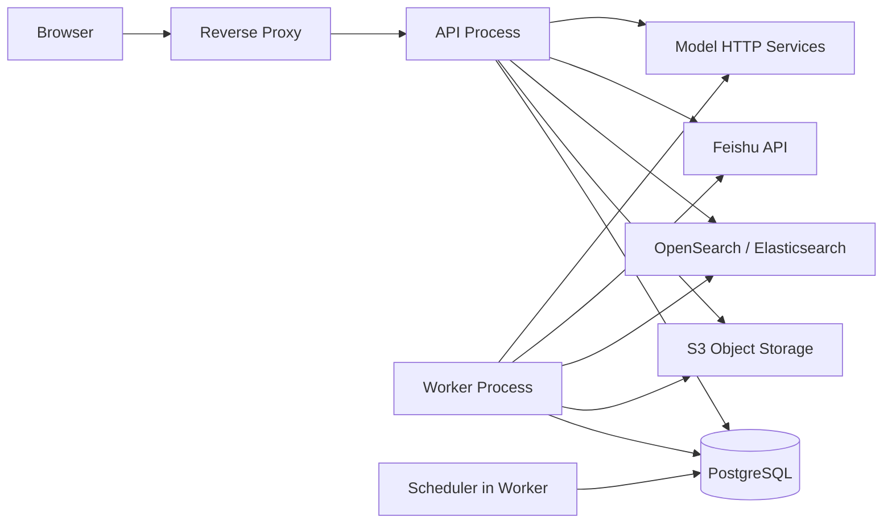

# DD-01 技术选型与工程结构

版本：V0.1  
状态：部分确认；Python、FastAPI、React、MUI 已确认，基础设施待评审  
日期：2026-08-17

## 1. 设计目标

在约 30 名用户、当前约 1,000 份且首轮按 3,000～5,000 份文档规划的规模下，选择一套可维护、可测试、便于调用外部模型且不提前引入分布式复杂度的工程结构。

## 2. 已确认约束

- 模块化单体，不拆微服务；
- Web/API 与 Worker 是独立进程；
- 使用 PostgreSQL 数据库任务表，不引入消息队列；
- 原始文件和飞书版本快照进入对象存储；
- BM25、向量和元数据过滤进入统一混合检索引擎；
- LLM、Embedding、Rerank 通过可配置 HTTP 服务调用；
- 支持公司内网部署，也支持通过域名和 HTTPS 访问；
- V1 首轮验证 10 个并发问答；
- 不引入独立向量数据库；允许通过配置启用备用模型切换，具体切换策略由 Model Gateway 负责。

## 3. 推荐技术基线

| 层次 | 推荐基线 | 选择理由 | 可替换点 |
|---|---|---|---|
| Web 前端 | React + TypeScript + Vite | 已确认；组件化和类型约束适合问答与管理后台 | React 大版本在项目初始化时锁定 |
| 前端路由与数据 | React Router + TanStack Query | 路由、服务端状态、缓存和请求失效职责明确 | 不把服务端状态重复存入全局状态库 |
| UI 组件 | [MUI（Material UI for React）](https://mui.com/material-ui/) | 已确认；提供主题、布局、表单、反馈和管理后台常用组件 | MUI X 付费能力如需使用须单独评估许可证 |
| 后端 | Python 3.12 + FastAPI + Pydantic v2 | 已确认；适合 HTTP/SSE、模型调用、文档处理和快速迭代 | Python 小版本与依赖锁在项目初始化时固定 |
| ASGI 运行时 | Uvicorn；生产环境由容器编排运行多个实例 | FastAPI 原生 ASGI，支持异步 I/O 和 SSE | 不在单容器内依靠动态扩进程替代平台扩容 |
| 数据访问 | SQLAlchemy 2.x + psycopg 3 + Alembic | ORM 与显式 SQL 可结合；支持异步访问、事务和版本化迁移 | 任务领取使用显式 SQL/SQLAlchemy Core，不隐藏锁语义 |
| 数据库 | PostgreSQL 16 或公司受支持的更高版本 | 事务、JSON、全文辅助能力和 `SKIP LOCKED` 适合数据库任务表 | 具体小版本由部署环境锁定 |
| 对象存储 | S3 兼容接口，优先复用公司对象存储；无现成服务时使用 MinIO | 原文件、快照和解析产物与本地磁盘解耦 | 业务代码只依赖 S3 适配接口 |
| 检索引擎 | OpenSearch 优先评估 | 同一引擎承载 BM25、向量和过滤，适合当前统一检索方案 | 若公司已有 Elasticsearch 集群则优先复用 |
| 文档解析 | pypdf/pdfplumber + python-docx + openpyxl，经统一 Parser Protocol 封装 | Python 原生覆盖 PDF、Word、Excel，便于保留结构化结果 | 扫描 PDF/OCR 和复杂表格后续按样本扩展；新增库先审查许可证 |
| 模型接入 | 统一 Model Gateway + HTTP 适配器 | 隔离供应商协议、超时、错误和返回校验 | 优先兼容 OpenAI 风格协议，但不作为唯一协议 |
| 流式回答 | SSE | 浏览器单向流式输出简单，满足问答场景 | V1 不需要 WebSocket 双向通道 |
| HTTP 客户端 | HTTPX | 统一异步调用飞书和模型服务，支持连接池与分项超时 | 禁止业务模块直接创建无管理的客户端实例 |
| 认证 | FastAPI 依赖 + PostgreSQL 服务端会话 + 飞书 OAuth/扫码 | 支持账号密码和飞书登录统一到系统用户 | Cookie 只保存随机会话令牌，服务端保存其哈希 |
| 后端测试 | pytest + pytest-asyncio + Testcontainers | 可验证异步业务、PostgreSQL、对象存储和检索集成 | 外部模型使用可控 Stub |
| 前端测试 | Vitest + React Testing Library + Playwright | 分别覆盖函数/组件和关键用户流程 | 端到端环境使用稳定测试数据 |
| Python 工具链 | uv + Ruff + mypy | 依赖锁定、格式、静态检查职责清晰 | 如公司已有统一工具链则遵从公司规范 |
| 部署 | 容器化部署；Web/API、Worker 独立容器 | 同一代码版本、不同启动角色，便于扩容和故障隔离 | 编排平台由公司环境决定 |

## 4. 关键取舍

### ADR-001 模块化单体而非微服务

决定：所有业务模块在同一代码库和同一发布版本中，使用包级边界隔离；Web/API 与 Worker 仅在运行进程上分离。

原因：当前用户和文档规模不足以抵消微服务带来的发布、追踪、数据一致性和运维成本。

后果：模块不能通过数据库表相互“偷读”；跨模块调用通过应用服务接口或领域事件完成，为未来按模块拆分保留边界。

### ADR-002 数据库任务表而非消息队列

决定：任务持久化在 PostgreSQL，由 Worker 使用事务和行锁领取。

原因：V1 任务量有限，数据库任务表能够同时承载状态查询、重试和后台管理，避免新增消息中间件。

后果：必须设计合理索引、批量领取、`SKIP LOCKED`、心跳和超时回收；任务载荷只保存业务主键，不保存大正文。

### ADR-003 统一混合检索而非独立向量库

决定：BM25、向量和过滤元数据使用同一 OpenSearch/Elasticsearch 类引擎。

原因：减少数据复制、结果融合和运维组件数量。

后果：索引 Mapping、中文分词、向量维度和版本别名必须统一设计；业务数据仍以 PostgreSQL 为准。

### ADR-004 SSE 而非 WebSocket

决定：回答流式输出使用 SSE，普通命令仍使用 HTTP JSON。

原因：问答主要是服务端向客户端单向发送增量内容，SSE 足够且恢复语义更简单。

后果：中止生成使用独立 HTTP 命令；反向代理必须关闭响应缓冲并配置长连接超时。

### ADR-005 Python/FastAPI 与 React 技术栈

决定：后端使用 Python 3.12、FastAPI、Pydantic v2 和 SQLAlchemy 2.x；前端使用 React、TypeScript 和 Vite。

原因：Python 便于整合文档解析、模型调用和 RAG 组件；FastAPI 原生支持异步 HTTP 与 SSE；React 适合构建问答交互和管理后台，并具有成熟的路由、服务端状态和测试生态。

后果：必须严格隔离 API 事件循环与阻塞解析任务；依赖版本通过锁文件固定；Pydantic Schema、领域模型和 SQLAlchemy Model 不合并为同一对象；前端服务端状态统一由 TanStack Query 管理。

### ADR-006 MUI 作为前端组件库

决定：React 页面统一使用 [MUI 官方组件库](https://mui.com/material-ui/)，基础依赖以 `@mui/material` 和 `@mui/icons-material` 为主。项目文档、依赖评估和开发规范只引用 MUI 官方页面，不引用第三方跳转或转载地址。

原因：项目没有公司组件库，MUI 可以为登录、问答、表单、表格、状态反馈和管理后台提供一致的交互基础，并支持通过主题集中管理视觉规范。

后果：页面不得各自维护一套颜色、间距和状态样式；主题 Token 在原型阶段统一定义。需要高级表格功能时，先评估 MUI X Community 是否满足需求；Pro/Premium 能力不得在未确认许可证和预算前写入 V1 必需设计。

## 5. 运行进程



### 5.1 API 进程

负责登录、文档提交、查询、会话、管理 API 和 SSE 输出。API 不在请求线程中执行文档解析、Embedding 或索引构建。

### 5.2 Worker 进程

负责 RAG 回答生成、飞书内容获取、文件解析、分类、切片、Embedding、索引、同步、清理、导出和其他可恢复任务。SSE 仍由 API 输出，Worker 只更新持久化回答状态和结果。Worker 可以横向启动多个实例，但同一任务只能由一个实例持有有效租约。

### 5.3 Scheduler

作为 Worker 内部组件定时扫描需要更新检查的飞书来源，并创建幂等任务。V1 不单独部署调度服务。

## 6. 后端模块边界

推荐顶层模块：

```text
src/ae_knowledge
├── auth              账号、密码、会话、飞书身份
├── knowledge         来源、版本、元数据、所有权、下线与恢复
├── ingestion         获取、解析、分类、切片与索引流水线
├── task              数据库任务、调度、重试与租约
├── retrieval         查询理解、过滤、召回、融合与 Rerank
├── qa                证据组织、答案生成、引用校验与流式输出
├── conversation      会话、消息、反馈、导出与分享快照
├── administration    用户、文档、任务、配置和统计管理
├── integration       飞书、模型、对象存储和检索引擎适配
├── shared            错误模型、ID、时间、分页等最小公共能力
├── api_main.py       API 进程入口
└── worker_main.py    Worker/Scheduler 进程入口
```

### 6.1 依赖方向

- `auth`、`knowledge`、`task`、`conversation` 保存各自业务状态。
- `ingestion` 编排 `knowledge`、`task` 和外部适配器，不拥有知识来源状态。
- `retrieval` 只返回证据候选，不生成自然语言答案。
- `qa` 调用 `retrieval` 和模型网关，保存消息和引用时通过 `conversation`。
- `administration` 只能调用公开应用服务，不直接更新其他模块表。
- `integration` 实现模块声明的端口；业务模块不得依赖供应商 SDK 类型。
- `shared` 不得成为放置任意公共业务代码的容器。

### 6.2 模块内部结构

每个业务模块采用相同分层：

```text
module
├── api             FastAPI Router、Pydantic 请求/响应模型
├── application     用例服务、命令、查询、事务入口
├── domain          实体、值对象、状态机、领域规则、Protocol
└── infrastructure  SQLAlchemy Repository、SQL、外部适配实现
```

Router 不直接访问 Repository；Repository 不返回 HTTP Schema；外部 API 响应必须先转换为内部模型。FastAPI 的 `Depends` 只负责装配认证、事务和应用服务，不承载业务判断。

### 6.3 异步与阻塞边界

- FastAPI Router、数据库访问、HTTPX 和 SSE 使用 `async`；
- PDF、Word、Excel 解析属于阻塞或 CPU 密集工作，只能在 Worker 中执行；
- Worker 通过有界线程池或进程池隔离解析器，禁止阻塞 API 事件循环；
- 单个任务必须设置执行超时和租约心跳；超时只终止本次 attempt，不直接把知识来源改为失败；
- Repository 在同一用例中共享一个 `AsyncSession`，事务由 application 层显式提交或回滚。

## 7. 前端工程结构

```text
src
├── app              路由、布局、全局错误和会话初始化
├── modules
│   ├── auth
│   ├── knowledge
│   ├── chat
│   ├── conversation
│   └── administration
├── shared
│   ├── api
│   ├── components
│   ├── hooks
│   └── types
└── prototypes       原型确认期可复用的页面状态样例，不进入生产包
```

前端按业务模块组织，而不是按 `components/pages/services` 全局平铺。每个页面状态必须能够通过 Mock 数据独立复现，以支持原型评审和视觉回归测试。

- React Router 管理路由和页面级数据边界；
- TanStack Query 管理服务端状态、分页、缓存失效和重试；
- 仅跨页面且不属于服务端事实的 UI 状态才进入轻量全局状态；
- SSE 回答流由 chat 模块维护，完成后以服务端最终消息为准刷新缓存；
- 原型中的每一种页面状态都应能通过 Storybook 或等效隔离预览方式复现，具体工具在原型设计分册确认。

### 7.1 MUI 使用规则

- 应用根节点统一配置 `ThemeProvider` 和 `CssBaseline`；
- 颜色、字体、圆角、间距、断点和状态色集中定义为主题 Token；
- 页面优先组合 MUI 原子组件，不复制修改组件库源码；
- 业务组件放在所属模块，共用展示组件经过两个以上模块复用后再提升到 `shared/components`；
- 表单错误由字段级提示和页面级反馈共同表达，不能只依赖 Snackbar；
- Snackbar 用于短暂操作结果，长期失败、降级查询和来源冲突使用页面内 Alert；
- Dialog 只用于需要用户明确确认的危险或不可逆动作；普通编辑使用页面或 Drawer；
- 智能问答正文和引用区域使用语义化 HTML，不能完全由视觉容器替代标题、列表和表格结构；
- 大数据表格的分页、筛选和排序默认由服务端完成，前端组件不加载全部记录后自行处理。

## 8. 配置设计

配置分为三类：

1. 启动配置：数据库、对象存储、检索引擎、飞书应用和模型服务地址，通过环境变量或受管配置注入；
2. 运行配置：产品、版本、分类规则、来源优先级、检索参数、超时和并发限制，保存于 PostgreSQL；
3. 密钥：数据库密码、飞书 Secret、模型密钥和对象存储密钥，仅由部署环境的 Secret 机制注入，不进入运行配置表。

运行配置需要版本号和更新时间。一次问答或任务执行在开始时读取配置快照，执行过程中不因管理员修改配置而改变语义。

## 9. 错误模型

统一错误至少包含：

```json
{
  "code": "KNOWLEDGE_SOURCE_NOT_FOUND",
  "message": "知识来源不存在或已不可用",
  "requestId": "...",
  "retryable": false,
  "details": {}
}
```

错误分为参数错误、认证错误、业务状态冲突、资源不存在、外部依赖错误、限流、超时和内部错误。前端只根据稳定错误码决定交互，不解析服务端错误文本。

## 10. 日志与关联标识

- 每个 HTTP 请求生成 `request_id`；
- 每次回答生成 `answer_id`；
- 每个异步任务生成 `task_id` 和独立 `attempt_id`；
- 每个文档处理链路包含 `source_id` 与 `version_id`；
- 外部请求记录依赖名称、耗时、结果和关联 ID，但不记录 Token、密钥或完整正文。

## 11. 当前待确认

以下决定会影响后续详细设计，需要在 DD-02 前关闭：

1. 公司是否已有可复用的 Elasticsearch/OpenSearch 集群；
2. 公司是否已有 S3 兼容对象存储；
3. MUI 主题的品牌色、字体、密度、圆角和深色模式是否有明确要求；
4. 目标部署环境是 Docker Compose、Kubernetes，还是现有应用平台；
5. 飞书文档扫描所需应用由本系统自建，还是复用现有企业应用；
6. Python 与 npm 依赖及容器基础镜像是否有公司内部镜像源和安全准入要求。

上述问题不影响详细设计总纲，但会影响代码结构、依赖、部署和部分 API 实现。

## 12. 下一步

技术基线确认后进入 DD-02，首先定义 `User`、`KnowledgeSource`、`DocumentVersion`、`ProcessingTask`、`Conversation`、`Message/Answer`、`Citation` 和 `ShareSnapshot`，并绘制知识来源、文档版本、任务和回答四个核心状态机。
