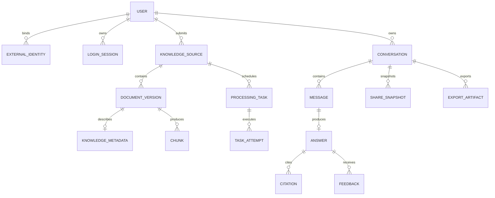
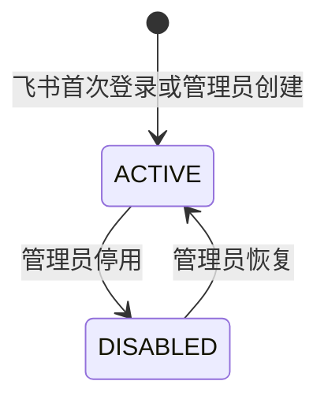
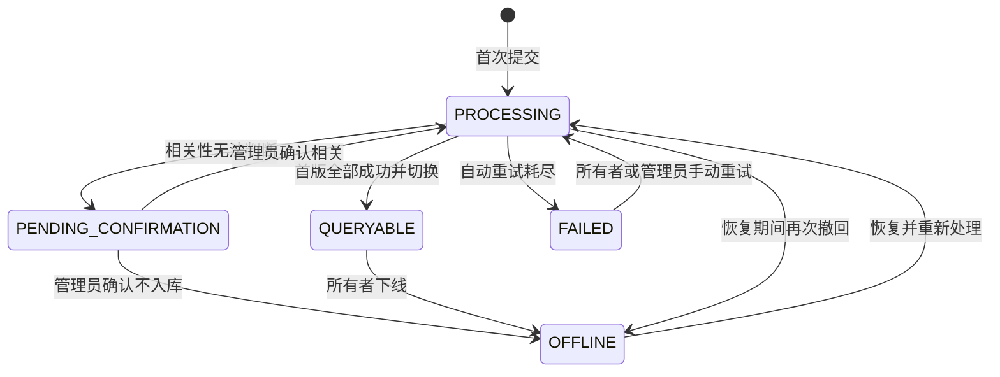
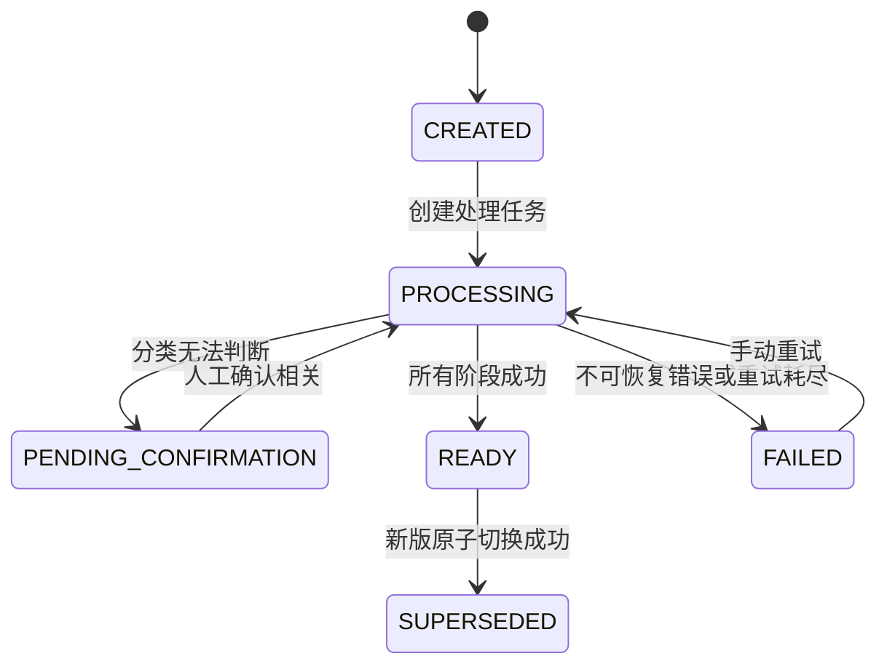
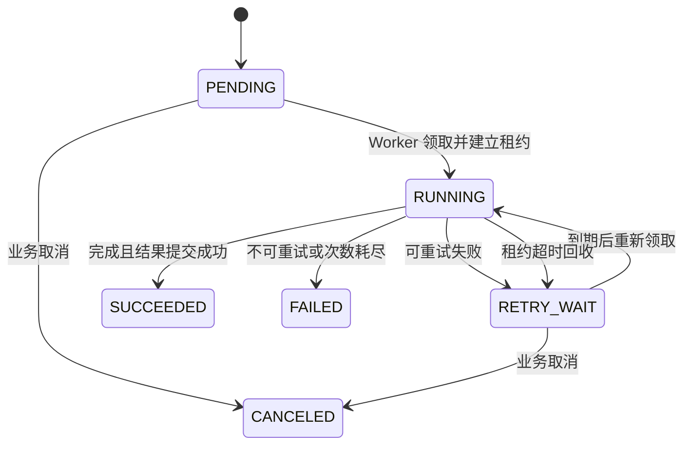
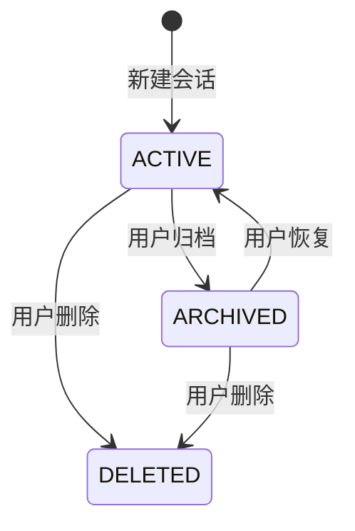
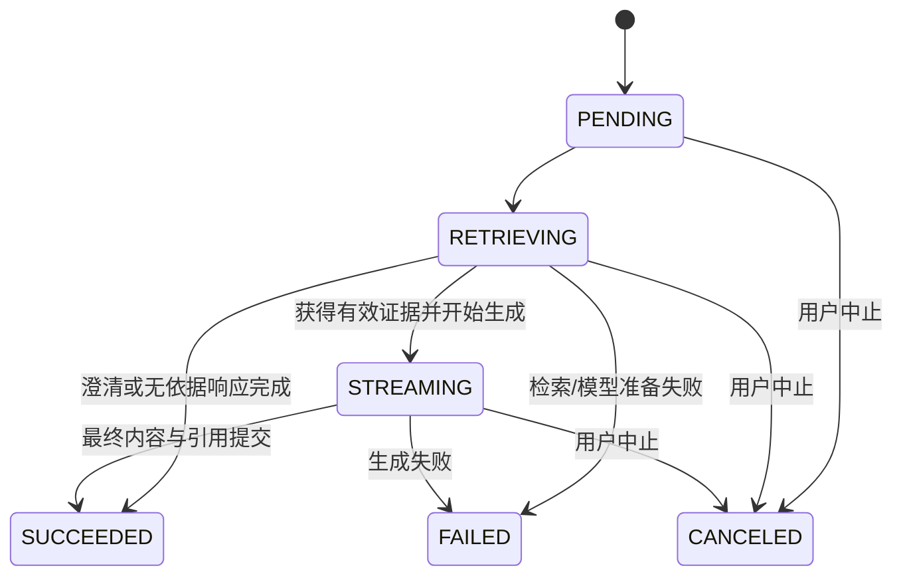

# DD-02 领域模型与状态机

版本：V0.1  
状态：讨论稿  
日期：2026-08-17  
上游文档：DD-00、DD-01、概要设计 V1.0

## 1. 设计目标

本设计定义 V1 的领域对象、所有权、状态、命令、不变量和并发优先级。数据库表结构、字段类型和索引在 DD-03 展开；本章先确定业务语义，避免由表结构反向决定业务。

## 2. 领域边界

| 领域 | 状态所有者 | 负责内容 | 不负责内容 |
|---|---|---|---|
| 身份与认证 | User、ExternalIdentity、LoginSession | 账号、密码、飞书身份、登录会话和停用 | 文档权限和业务角色体系 |
| 知识库 | KnowledgeSource、DocumentVersion、KnowledgeMetadata | 来源、所有者、版本、分类、上下线和当前可查询版本 | 任务执行和自然语言回答 |
| 任务调度 | ProcessingTask、TaskAttempt | 等待、领取、租约、重试、失败和恢复 | 决定知识来源的业务状态 |
| 会话问答 | Conversation、Message、Answer、Citation、Feedback | 会话、多轮问题、回答、引用和反馈 | 文档索引构建 |
| 分享导出 | ShareSnapshot、ExportArtifact | 不可变分享快照和导出文件 | 修改原会话 |
| 系统配置 | ConfigItem、ConfigRevision | 分类、检索、模型和运行配置版本 | 保存密钥明文 |

## 3. 核心对象关系



关系图只表达关联，不代表所有对象必须放入同一事务或同一数据库聚合。

## 4. 聚合与事务边界

### 4.1 User 聚合

聚合根：`User`。

包含或管理：账号状态、密码凭据引用、飞书身份绑定、登录会话。

主要不变量：

- 系统内部始终使用 `user_id` 关联业务数据；
- `(tenant_key, feishu_user_id)` 全局唯一；
- 账号停用后不能创建新会话或业务命令；
- 飞书解绑不删除用户、会话和已提交知识；
- 临时授权码和 access token 不能成为用户标识。

### 4.2 KnowledgeSource 聚合

聚合根：`KnowledgeSource`。

包含或控制：来源身份、提交者/所有者、业务状态、当前可查询版本指针、待处理版本引用、来源更新时间和下线原因。

主要不变量：

- 一个来源最多只有一个 `current_version_id`；
- `current_version_id` 只能指向状态为 `READY` 的版本；
- 下线来源不能参与新查询；
- 新版本失败不得清空或替换旧的 `current_version_id`；
- 只有当前所有者可以下线或发起恢复，管理员仅处理异常；
- 同一飞书底层 token 或相同本地 MD5 不能存在两个有效来源。

### 4.3 ProcessingTask 聚合

聚合根：`ProcessingTask`，`TaskAttempt` 记录每次实际执行。

主要不变量：

- 相同幂等键最多存在一个未终结任务；
- 同一时刻最多一个 Worker 持有有效租约；
- 重试创建新的 attempt，不覆盖旧 attempt；
- 任务成功只表示任务步骤完成，不能绕过 KnowledgeSource 状态机；
- 失败任务是否允许重试由错误分类和尝试次数共同决定。

### 4.4 Conversation 聚合

聚合根：`Conversation`。

包含：会话状态、会话级查询条件、消息顺序。`Answer` 和 `Citation` 由会话应用服务协调写入，但回答生成不持有长事务。

主要不变量：

- 消息序号在会话内单调递增；
- 已逻辑删除的会话不接受新问题；
- 归档会话恢复后可以继续提问；
- 一条用户消息最多有一个当前回答记录；
- 引用只能关联本次回答证据集合中的文档版本和切片。

### 4.5 ShareSnapshot 聚合

分享快照创建后内容不可变，只允许撤销访问。它保存创建时的会话内容副本及来源摘要，不实时读取原会话生成页面。

## 5. User 状态机

### 5.1 状态

| 状态 | 代码 | 可登录 | 可提交/问答 | 说明 |
|---|---|---:|---:|---|
| 正常 | `ACTIVE` | 是 | 是 | 默认状态 |
| 停用 | `DISABLED` | 否 | 否 | 管理员停用，业务数据保留 |

飞书是否绑定是 ExternalIdentity 的属性，不作为 User 主状态。用户可以在未绑定飞书时使用已设置的账号密码登录，但不能发现和提交自己的飞书文档。



### 5.2 命令

- `RegisterFromFeishu`
- `CreateLocalUserByAdmin`
- `SetPassword`
- `BindFeishuIdentity`
- `UnbindFeishuIdentity`
- `DisableUser`
- `EnableUser`
- `CreateLoginSession`
- `RevokeLoginSession`

## 6. KnowledgeSource 状态机

### 6.1 主状态

| 状态 | 代码 | 参与查询 | 含义 |
|---|---|---:|---|
| 处理中 | `PROCESSING` | 否 | 首个版本尚未形成可查询版本 |
| 待确认 | `PENDING_CONFIRMATION` | 否 | 相关性无法判断，等待管理员处理 |
| 可查询 | `QUERYABLE` | 是 | 存在当前成功版本 |
| 失败 | `FAILED` | 否 | 首版在自动重试后仍失败 |
| 已下线 | `OFFLINE` | 否 | 所有者主动下线，数据保留 |

“新版同步失败”不作为主状态，而是组合展示状态：`status=QUERYABLE` 且 `update_status=FAILED`。这样旧版仍可查询，不会因同步失败错误地改变主状态。

### 6.2 更新状态

| 状态 | 代码 | 含义 |
|---|---|---|
| 空闲 | `IDLE` | 没有新版处理 |
| 检查中 | `CHECKING` | 正在检查飞书修改时间/revision |
| 处理中 | `UPDATING` | 正在处理新版本 |
| 更新失败 | `FAILED` | 新版本失败，旧版继续服务 |

### 6.3 状态转换



### 6.4 查询展示状态

前端展示状态由主状态、更新状态和是否存在当前版本组合计算，不额外保存重复状态：

| 条件 | 展示状态 |
|---|---|
| `QUERYABLE + IDLE` | 可查询 |
| `QUERYABLE + UPDATING` | 可查询，新版处理中 |
| `QUERYABLE + FAILED` | 可查询，新版同步失败 |
| `OFFLINE` | 已下线 |
| `PROCESSING` 且由恢复触发 | 恢复处理中 |

### 6.5 命令

- `SubmitFeishuSource`
- `SubmitLocalFile`
- `ConfirmRelevant`
- `RejectIrrelevant`
- `ActivateFirstVersion`
- `StartVersionUpdate`
- `ActivateNewVersion`
- `MarkInitialProcessingFailed`
- `MarkUpdateFailed`
- `TakeOffline`
- `RestoreSource`

## 7. DocumentVersion 状态机

### 7.1 生命周期状态

| 状态 | 代码 | 含义 |
|---|---|---|
| 已创建 | `CREATED` | 已登记版本和原始定位信息 |
| 处理中 | `PROCESSING` | 处理流水线执行中 |
| 待确认 | `PENDING_CONFIRMATION` | 分类器无法判断相关性 |
| 就绪 | `READY` | 原文、解析、切片和索引全部成功 |
| 失败 | `FAILED` | 当前版本处理失败 |
| 已被替代 | `SUPERSEDED` | 曾为成功版本，已被新版替代 |

### 7.2 处理阶段

`processing_stage` 用于表示当前位置，不与生命周期状态混在一个枚举中：

```text
FETCHING
→ PARSING
→ CLASSIFYING
→ CHUNKING
→ EMBEDDING
→ INDEXING
→ FINALIZING
```



### 7.3 版本切换事务

新版本进入 `READY` 不等于已经参与查询。激活事务必须同时完成：

1. 锁定 KnowledgeSource；
2. 校验来源不是 `OFFLINE`；
3. 校验目标版本属于该来源且为 `READY`；
4. 将 `current_version_id` 指向目标版本；
5. 首版激活时将来源设为 `QUERYABLE`；
6. 将旧当前版本标记为 `SUPERSEDED`；
7. 将更新状态恢复为 `IDLE`；
8. 创建旧索引异步清理任务。

任一步失败，事务整体回滚。旧版本索引的物理删除不属于该事务。

## 8. ProcessingTask 状态机

### 8.1 状态

| 状态 | 代码 | 可被 Worker 领取 | 说明 |
|---|---|---:|---|
| 等待 | `PENDING` | 是 | 达到计划时间后可领取 |
| 执行中 | `RUNNING` | 否 | Worker 持有租约 |
| 等待重试 | `RETRY_WAIT` | 是 | 到达下次执行时间后可领取 |
| 成功 | `SUCCEEDED` | 否 | 终结状态 |
| 失败 | `FAILED` | 否 | 自动重试耗尽或不可重试 |
| 已取消 | `CANCELED` | 否 | 业务状态使任务失效 |



### 8.2 错误分类

| 类别 | 是否自动重试 | 示例 |
|---|---:|---|
| `TRANSIENT` | 是 | 网络中断、外部 5xx、临时限流 |
| `AUTH` | 否 | 飞书授权失效、密钥无效 |
| `VALIDATION` | 否 | 文件格式不支持、模型输出 Schema 错误达到限制 |
| `NOT_FOUND` | 否 | 飞书文档被删除或无权访问 |
| `CONFLICT` | 视业务状态 | 来源已下线、目标版本已被替代 |
| `INTERNAL` | 是，有限次数 | 未分类内部异常 |

模型输出格式错误可以在同一次 attempt 内做有限纠正请求，但不能无限重试；纠正仍失败后按 `VALIDATION` 处理。

## 9. Conversation 状态机

| 状态 | 代码 | 可提问 | 可查看 | 可导出/分享 |
|---|---|---:|---:|---:|
| 活跃 | `ACTIVE` | 是 | 是 | 是 |
| 已归档 | `ARCHIVED` | 否 | 是 | 是 |
| 已删除 | `DELETED` | 否 | 用户列表隐藏 | 否 |



V1 的 `DELETED` 是逻辑删除终态，不向用户提供恢复入口。管理员数据维护不属于普通产品功能。

会话级查询条件包含产品、版本和文档类型。当前问题明确给出的同维度条件覆盖旧值；未涉及的条件继续保留；无法唯一确定的新条件触发澄清，不提前写入会话条件。

## 10. Answer 状态机

用户消息保存后立即创建 Answer，避免请求中断后无法判断回答是否曾开始。

| 状态 | 代码 | 含义 |
|---|---|---|
| 等待 | `PENDING` | 已保存问题，尚未开始生成 |
| 检索中 | `RETRIEVING` | 查询理解、召回和排序中 |
| 生成中 | `STREAMING` | 已开始 SSE 输出 |
| 成功 | `SUCCEEDED` | 最终答案和引用已保存 |
| 失败 | `FAILED` | 明确失败，可由用户重试 |
| 已中止 | `CANCELED` | 用户主动停止生成 |



### 10.1 中止与完成并发

- 中止和成功都使用条件更新，仅允许从非终结状态转换；
- 若成功事务先提交，中止返回“回答已完成”；
- 若中止先提交，生成结果不得再覆盖为成功；
- 已经发送到浏览器但未形成成功事务的片段不作为正式回答，刷新页面显示“已中止”或“失败”；
- 用户重试创建新的用户消息/回答，旧失败回答保留，不原地覆盖。

## 11. Citation 与证据约束

Citation 创建后不可修改，至少记录：

- `answer_id`；
- `source_id` 与 `document_version_id`；
- `chunk_id` 或可定位的章节路径；
- 文档标题、类型、产品、版本和更新时间快照；
- 原文链接快照；
- 支撑的答案结论或引用序号；
- 本次证据排序和相关度信息。

来源下线后 Citation 不删除；展示时结合来源当前状态标记“来源已下线”。原文链接失效时保留快照信息并提示不可访问。

## 12. Feedback 规则

- 同一用户对同一回答保留一条当前反馈；再次反馈视为修改；
- 反馈值为 `HELPFUL` 或 `NOT_HELPFUL`；
- `NOT_HELPFUL` 原因选填，可多选预定义原因并补充文本；
- 反馈只影响统计和样本候选，不直接修改知识、排序权重或模型答案；
- 低满意度问题经业务确认后才能加入黄金问题集。

## 13. ShareSnapshot 状态机

| 状态 | 代码 | 含义 |
|---|---|---|
| 可访问 | `ACTIVE` | 内部用户可通过分享链接查看固定快照 |
| 已撤销 | `REVOKED` | 链接不可继续访问，快照数据保留 |

创建快照时复制会话标题、问题、回答、时间和来源摘要，不复制来源全文。原会话后续新增消息、修改标题、归档或删除均不改变已创建快照。

“撤销分享”属于推荐能力，概要设计只明确内部不可变快照；是否进入 V1 原型需要产品确认。

## 14. 关键并发优先级

### 14.1 下线与同步完成

下线优先。两者都必须锁定 KnowledgeSource：

- 下线先提交：同步激活发现 `OFFLINE`，取消激活并保留处理产物待清理；
- 同步先提交：新版成为当前版本，随后下线使整个来源停止查询。

最终状态都必须是 `OFFLINE`，不能因同步完成自动恢复。

### 14.2 重复提交

- 飞书来源按规范化底层 token 建立唯一键；
- 本地文件按内容 MD5 建立唯一键；
- 并发提交由数据库唯一约束决定唯一来源；
- 冲突请求返回已存在来源的摘要，不创建第二份任务，也不改变所有者。

### 14.3 手动重试与自动重试

- 未终结任务存在时，不允许再创建相同幂等键任务；
- 自动重试耗尽后，手动重试创建新任务并关联旧任务；
- 多次点击手动重试使用客户端幂等键，只有一次成功创建。

### 14.4 会话条件与同时提问

同一会话默认只允许一个未终结 Answer。前端禁用重复发送，后端仍以唯一约束/条件检查兜底。若未来允许并行提问，需要引入基于消息序号的上下文快照，不属于 V1。

## 15. 状态修改实现规则

- 所有业务状态只能通过 application 用例服务调用领域转换方法修改；
- API Router、Worker Handler 和管理员页面不得直接更新状态字段；
- 关键转换使用数据库行锁或乐观版本号，DD-03 决定具体策略；
- 状态转换同时写入必要的 `updated_at`、操作者和原因字段，但这不是产品级审计日志；
- 创建后续任务时，与业务状态更新放在同一 PostgreSQL 事务中；
- 外部 HTTP 调用不得发生在持有数据库行锁的事务内；
- 长流程通过短事务和持久化任务推进，不使用跨步骤长事务。

## 16. 领域命令结果

命令返回稳定结果类型：

- `Accepted`：状态已改变或任务已创建；
- `NoOp`：幂等重复，目标状态已经满足；
- `Conflict`：当前状态不允许操作；
- `Rejected`：业务规则拒绝；
- `NotFound`：目标不存在或对当前用户不可见。

API 层负责映射为 HTTP 状态码，领域层不依赖 HTTP 概念。

## 17. 待确认事项

1. “待确认”文档由管理员确认相关或无关，V1 不支持提交者补充说明；
2. 已下线来源是否允许所有者无限次恢复，或需要冷却时间；
3. 分享快照是否提供“撤销分享”入口；
4. 会话逻辑删除后是否允许管理员从管理后台查看，本设计暂不提供产品入口；
5. 用户账号停用后，其已入库知识是否继续参与查询；本设计建议继续参与，因为知识归属系统而非登录状态；
6. 飞书原文已删除但系统仍有最近成功快照时，是继续查询并标记来源失效，还是自动下线；概要设计尚未明确。

## 18. 下一步输入 DD-03

数据库设计需要据此落实：

- 聚合根主表和关联实体表；
- 状态枚举或约束；
- token/MD5 唯一约束；
- 当前版本唯一性；
- 任务幂等键、租约和 attempt；
- 会话消息顺序和单个未终结回答约束；
- Citation 快照字段；
- 乐观版本号、行锁范围和事务伪代码。
