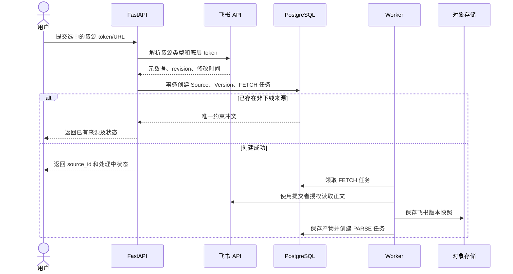
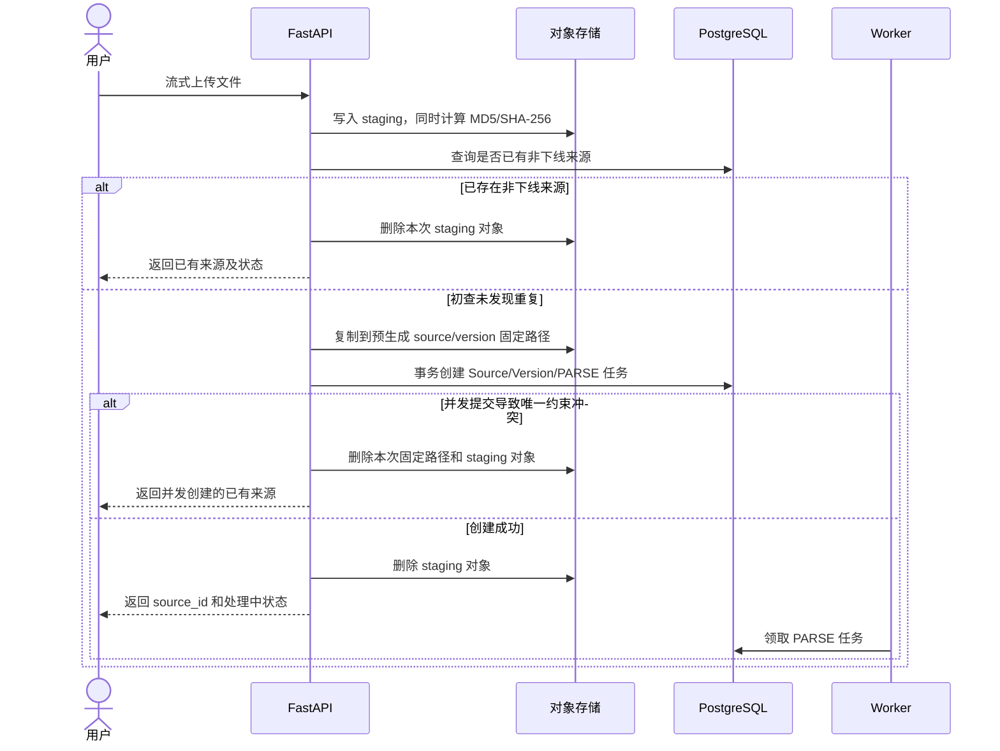
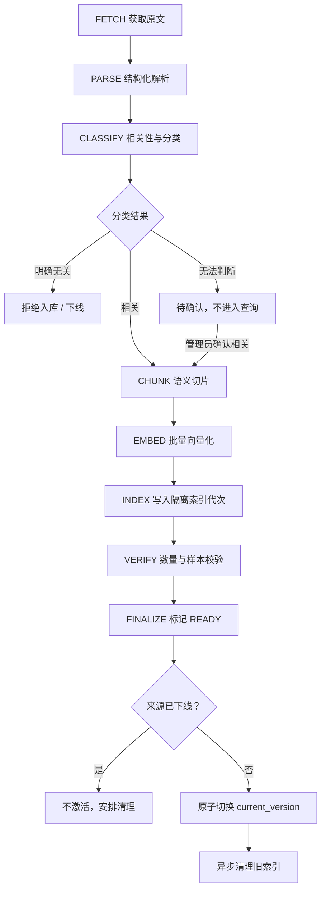
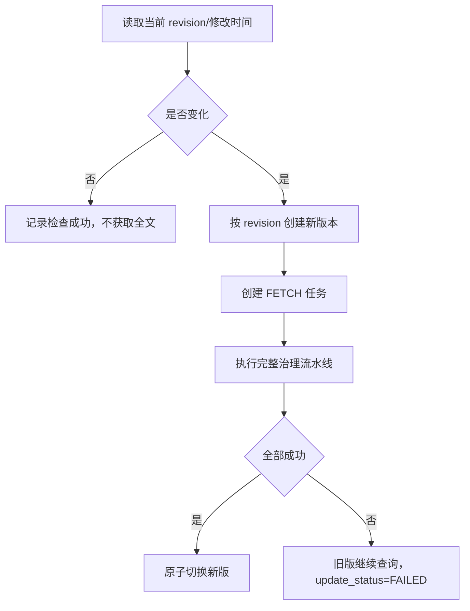

# DD-04 文档接入与治理流水线

版本：V0.1  
状态：讨论稿  
日期：2026-08-17  
依赖：DD-02 领域模型、DD-03 数据库设计

## 1. 设计目标

将飞书文档和本地文件稳定转换为可检索知识。流水线必须满足：

- 用户明确选择后才读取飞书正文；
- 重复来源不重复解析、Embedding 和索引；
- 每个阶段可观测、可重试、可恢复且幂等；
- 新版本失败不影响当前成功版本；
- 待确认和部分失败内容不进入查询；
- 原文、解析产物、Chunk、向量和索引可以按版本追踪；
- 下线优先于并发处理和版本切换。

## 2. 接入入口

### 2.1 飞书文档发现

用户绑定飞书后，系统只读取当前用户可见资源的必要元数据，用于选择，不读取正文：

- 标题；
- 资源类型；
- 所在位置或 Wiki 路径；
- 最近修改时间；
- 资源 token/node token；
- 是否已提交及当前处理状态。

用户通过类似微信多选的交互选择多个资源，再点击“提交入库”。选择列表不等于知识库，未提交资源不得创建 KnowledgeSource。

发现结果采用游标分页并短期缓存。缓存只改善浏览体验，不作为资源权限或入库状态依据；提交时必须重新解析资源并验证访问能力。

### 2.2 飞书链接提交

用户可以粘贴 Docx、Wiki、Sheet 或 Drive 文件链接。系统先规范化 URL，再解析为实际资源类型和底层 token。Wiki 链接以其指向的底层资源 token 作为重复识别依据，不使用页面 URL 字符串判断重复。

### 2.3 本地文件上传

用户上传 Word、PDF 或 Excel。API 流式接收文件并写入对象存储暂存区，同时计算：

- MD5：只用于完全相同文件的重复识别；
- SHA-256：用于内容完整性校验；
- 实际字节数；
- MIME 探测结果。

API 不把完整文件加载进内存。超过 100 MB、扩展名与 MIME 明显不一致或格式不在允许清单时，在创建知识来源前拒绝。

## 3. 格式支持矩阵

| 类型 | 首选格式 | 解析器 | V1 处理原则 |
|---|---|---|---|
| Word | `.docx` | `python-docx` | 提取标题、段落、列表、表格和关系顺序 |
| PDF | `.pdf` | `pypdf` + `pdfplumber` | 提取页面文本、块和可识别表格，保留页码 |
| Excel | `.xlsx` | `openpyxl` | 按工作表和有效区域读取，保留表头、单元格值及公式信息 |
| 旧版 Word | `.doc` | 待确认 | 建议通过受控 LibreOffice 转换后进入 DOCX 解析 |
| 旧版 Excel | `.xls` | 待确认 | 建议通过受控 LibreOffice 转换或专用解析器处理 |
| 扫描 PDF | `.pdf` | 待后续能力 | 无文本层时明确标记需 OCR；V1 是否启用 OCR 待样本确认 |

带密码、损坏、宏或外部数据连接的文档不得静默忽略问题：解析器返回明确错误或安全警告。宏不执行，Excel 外部链接不访问，公式默认读取缓存显示值并同时保存公式文本。

## 4. 接入时序

### 4.1 飞书提交



### 4.2 本地上传



对象存储与数据库无法形成分布式事务，因此采用“staging + 预生成 UUID + 先写不可变固定对象 + 后提交数据库”：只有固定对象写入成功才允许创建 Source/Version/PARSE 任务。数据库提交失败或并发唯一冲突时立即删除本次对象；删除失败由孤儿对象清理任务按生命周期处理。这样数据库成功记录不会指向尚未写入的 raw 对象。

## 5. 流水线总览



本地文件从 PARSE 开始；飞书资源从 FETCH 开始。每个阶段是独立数据库任务，成功事务创建下一阶段任务。不存在依赖内存消息传递的长流水线。

## 6. 阶段任务契约

### 6.1 通用输入输出

所有阶段任务 payload 只包含：

```json
{
  "source_id": "uuid",
  "version_id": "uuid",
  "requested_by": "uuid-or-null",
  "reason": "INITIAL|UPDATE|RESTORE|MANUAL_RETRY"
}
```

正文、表格和向量不得放入 task payload。阶段开始前重新读取版本、来源和任务状态；来源已下线或版本已被替代时返回可识别的 `CONFLICT`，由编排逻辑取消后续阶段。

幂等键格式：

```text
version:{version_id}:stage:{stage_name}
```

相同阶段重复执行必须覆盖同一版本的阶段产物或先清理后重建，不能追加重复 Chunk 或索引文档。

### 6.2 FETCH

输入：飞书资源定位、提交者 ExternalIdentity。

行为：

1. 刷新用户 token（必要时）；
2. 读取资源当前元数据并确认目标 revision；
3. 获取正文、表格和内嵌资源描述；
4. 转换为可长期保存的版本快照；
5. 计算 SHA-256；
6. 写入固定 raw object key；
7. 更新 DocumentVersion 并创建 PARSE 任务。

输出：`raw_object_key`、`content_sha256`、`external_revision`、`source_modified_at`。

若获取到的 revision 与创建版本时不同，当前任务不混合两个 revision。取消该版本并为最新 revision 创建新版本，避免元数据和正文不一致。

### 6.3 PARSE

输入：raw object。

输出：标准 `ParsedDocument` 和 `parsed_object_key`。

标准结构：

```json
{
  "schema_version": "1.0",
  "title": "文档标题",
  "source_type": "DOCX|PDF|XLSX|FEISHU_DOCX|FEISHU_SHEET",
  "elements": [
    {
      "type": "heading|paragraph|list_item|table|sheet_region",
      "level": 2,
      "text": "规范化文本",
      "locator": {"page": 3, "block_id": null, "sheet": null, "range": null},
      "table": null
    }
  ],
  "warnings": []
}
```

解析规范：

- 保留标题层级和元素顺序；
- 表格保存二维单元格、合并信息、表头和来源定位，不先扁平为无结构文本；
- Excel 按工作表形成 sheet_region，忽略纯空白区域；
- 页眉页脚重复内容可标记但不在解析阶段永久删除；
- 不执行宏、脚本、外部链接或嵌入程序；
- 产物带 `schema_version` 和解析器版本，便于未来重解析。

### 6.4 CLASSIFY

输入：ParsedDocument 的受控文本窗口、当前分类配置版本和来源元数据。

输出：相关性、分类、结构化元数据、置信信息和缺失字段。详细 Prompt、Pydantic Schema 和校验见 DD-05。

结果处理：

- `RELEVANT`：保存 metadata，进入 CHUNK；
- `IRRELEVANT`：首版来源转 OFFLINE，并记录业务原因“明确无关”；
- `UNCERTAIN`：版本和来源进入 PENDING_CONFIRMATION，不创建 CHUNK；
- 输出 Schema 非法：任务按模型输出错误规则有限重试，不猜测结果。

分类器不直接更新来源状态，由 CLASSIFY Handler 校验输出后调用 knowledge 应用服务完成转换。

### 6.5 CHUNK

输入：ParsedDocument、DocumentMetadata、切片配置版本。

行为：

- 以标题、段落、列表和表格语义边界优先切分；
- 表格优先保持为完整单元，超限时按行分段并重复表头；
- 每个 Chunk 保存 heading_path、locator、metadata_snapshot 和 content_sha256；
- 相邻重叠仅用于正文段落，不把表格机械截断；
- 删除/替换该版本旧 Chunk 后批量写入新结果，事务内保证唯一 ordinal。

初始切片长度和重叠值在 DD-07 给出，并通过黄金问题集调整。

### 6.6 EMBED

输入：版本全部 Chunk、Embedding 配置快照。

行为：

- 按模型限制批量请求；
- 校验返回数量、顺序、维度和有限数值；
- 临时向量以当前任务运行产物或直接流水写入隔离索引，不写入 PostgreSQL；
- 任一批次最终失败时整个版本不能进入 READY；
- 重试可跳过已确认成功且内容哈希一致的批次，但必须以 generation 隔离，不能混用不同模型或维度。

查询 Embedding 允许降级 BM25；文档 Embedding 不允许以 BM25-only 形式部分入库。

### 6.7 INDEX 与 VERIFY

每个版本写入独立 `index_generation`，索引文档 ID 使用稳定格式：

```text
chunk:{chunk_id}:generation:{index_generation}
```

写入内容包括 Chunk 文本、向量、source_id、version_id、产品、版本、文档类型、更新时间、标题路径和当前生成代次。

VERIFY 至少检查：

- 数据库 Chunk 数量与索引成功数量一致；
- 所有向量维度一致；
- 随机抽样若干索引文档能按 ID 读取；
- source_id/version_id/metadata 与数据库快照一致；
- 无失败 bulk item；
- 索引 generation 未被其他任务复用。

只有 VERIFY 通过后才能进入 FINALIZE。

### 6.8 FINALIZE

1. 将 DocumentVersion 标记为 READY；
2. 开启短事务锁定 KnowledgeSource；
3. 校验来源未下线、pending_version 指向目标版本；
4. 原子切换 current_version；
5. 首版将来源设为 QUERYABLE；
6. 新版将旧版本标记 SUPERSEDED；
7. 创建旧 generation 清理任务；
8. 提交事务。

若来源已经 OFFLINE，版本产物不激活，创建当前 generation 清理任务；不得因 FINALIZE 自动恢复来源。

## 7. 对象存储布局

推荐对象键：

```text
raw/{source_id}/{version_id}/original.{ext}
parsed/{source_id}/{version_id}/document-v1.json
derived/{source_id}/{version_id}/tables/{element_id}.json
exports/{user_id}/{export_id}/{filename}
staging/uploads/{upload_id}
```

规则：

- Bucket 和对象键不包含用户原始文件名，避免路径注入和敏感信息泄漏；
- 原文件名保存在数据库并在下载响应中安全编码；
- 固定版本对象写入后不可原地覆盖，重新解析使用新的 parsed schema 文件名或 generation；
- staging 设置生命周期清理，但数据库提交成功前不得依赖生命周期作为唯一清理方式；
- 对象 metadata 保存 SHA-256、source_id、version_id 和 media type，不保存 access token。

## 8. 飞书每日更新

### 8.1 调度范围

每日 Scheduler 为非下线的飞书来源创建 `CHECK_FEISHU_REVISION` 任务。相同来源和业务日期使用幂等键：

```text
source:{source_id}:check-revision:{yyyy-mm-dd}
```

### 8.2 检查流程



不做全文比对。修改时间或 revision 未变化时不下载正文、不生成新版本。

同一 revision 通过 `UNIQUE(source_id, external_revision)` 防止并发重复建版。

### 8.3 更新失败

- 网络、限流和服务端临时错误最多自动尝试三次；
- 授权失效、无权限和资源不存在不做无意义高频重试；
- 新版失败只更新 `update_status=FAILED` 和错误摘要，current_version 不变；
- 管理后台展示失败阶段、错误类别、最后时间和手动重试入口；
- 手动重试继续处理同一版本，不创建内容相同的新版本。

## 9. 待确认文档

### 9.1 进入条件

只有相关性无法可靠判断时进入待确认。部分元数据未知但相关性明确的文档正常入库，未知字段保持 null，不因字段不全阻断。待确认结果只能由管理员处理，提交者不能补充说明或直接确认。

### 9.2 管理员操作

- 确认相关：可以修正分类和关键元数据，保存后从 CHUNK 阶段继续；
- 确认无关：来源转 OFFLINE，不进入索引；
- 重新分类：使用指定分类配置版本重新执行 CLASSIFY；
- 查看依据：展示分类器摘要、候选分类和低置信字段，但不展示隐藏推理过程。

待确认期间 raw 和 parsed 产物保留，避免确认后重复获取和解析。

## 10. 分类修改与重新索引

提交者或管理员是否有权修改分类由产品交互决定；技术上提供以下命令：

### 10.1 仅元数据变化

产品、版本、文档类型、标签等变化但 Chunk 内容不变时：

1. 创建新的 metadata revision；
2. 创建 `REINDEX_METADATA` 任务；
3. 在新 generation 中复用已有向量，只更新过滤和展示元数据；
4. VERIFY 后切换 generation；
5. 清理旧 generation。

如果检索引擎不支持安全复用向量，则重新批量读取/写入索引，但不重新调用 Embedding。

### 10.2 切片规则或正文变化

切片规则变化、解析器修复或正文更新必须从 CHUNK 或 PARSE 阶段开始，并生成新的 index generation。不能只修改索引 metadata。

分类配置变更不自动重跑全部历史文档。管理员可以选择范围创建批量重分类任务，避免一次配置修改造成全库重建。

## 11. 本地文件更新

- 只有来源所有者从原文档详情发起“更新文档”，新文件才作为该来源新版本；
- 普通上传入口对内容不同的文件创建新来源；
- 更新文件 MD5 与当前版本相同则返回 NoOp；
- 内容不同则创建 version_no+1，从 PARSE 开始完整处理；
- 新版本失败时旧版继续查询；
- 新文件名可以更新来源展示名，但历史 Citation 保留旧标题快照。

## 12. 下线与恢复

### 12.1 下线

下线事务完成：

- 来源设为 OFFLINE；
- pending_version 清空；
- 创建取消未开始任务的命令记录；
- 创建检索下线任务，使当前版本停止新查询；
- 保留数据库、raw、parsed、Chunk 和历史 Citation。

正在执行的阶段任务在提交结果前重新校验来源状态；发现 OFFLINE 后不创建下一任务，并安排当前 generation 清理。

### 12.2 恢复

- 检查是否已有其他非下线来源占用相同 canonical_key；存在则拒绝恢复；
- 创建新的 DocumentVersion；
- 飞书来源重新 FETCH，本地来源可复用原 raw 对象但仍重新 PARSE；
- 执行完整分类、切片、Embedding、索引和激活流程；
- 成功前来源保持 PROCESSING，不允许直接把旧索引重新上线。

## 13. 失败与重试矩阵

| 阶段 | 常见错误 | 自动重试 | 最终结果 |
|---|---|---:|---|
| FETCH | 网络、限流、5xx | 是，最多 3 次 | 首版 FAILED；新版旧版继续 |
| FETCH | 授权失效/无权限 | 否 | 记录并提示重新授权/处理 |
| FETCH | 资源不存在 | 否 | 进入来源失效待处理，不自动伪装成功 |
| PARSE | 临时对象读取失败 | 是 | 重试耗尽后失败 |
| PARSE | 加密、损坏、格式不支持 | 否 | 明确解析失败 |
| CLASSIFY | 模型超时/5xx | 是 | 重试耗尽后失败 |
| CLASSIFY | Schema 非法 | 有限纠正后再判定 | 不猜测分类 |
| CHUNK | 配置或内容不合法 | 否 | 修复配置/文档后手动重试 |
| EMBED | 超时、限流、批次失败 | 是 | 不允许部分入库 |
| INDEX | bulk 部分失败 | 是，仅重试失败项 | VERIFY 未通过不得激活 |
| FINALIZE | 来源已下线 | 否 | 不激活并清理派生产物 |
| CLEANUP | 检索/对象临时错误 | 是 | 不回滚已激活新版，但持续告警 |

自动重试默认使用带抖动的指数退避，具体时间在 DD-06 统一定义。

## 14. 可观察性

每个阶段记录：

- task_id、attempt_id、source_id、version_id；
- stage、开始/结束时间、等待时间和处理时间；
- 输入元素数、输出元素数、Chunk 数和索引文档数；
- 外部服务名称、响应状态、重试次数；
- parser/model/config revision；
- 错误类别和稳定错误码；
- 不记录完整正文、token 或密钥。

核心指标：

- 各阶段成功率和 P50/P95 耗时；
- 任务积压和最老等待时间；
- 待确认数量；
- 首版失败和新版同步失败数量；
- 各格式解析失败率；
- Chunk/索引数量不一致次数；
- 孤儿 staging 对象数量；
- 旧索引清理失败数量。

## 15. 接入与治理测试

### 15.1 正常流程

- 飞书 Docx、Wiki、Sheet 和 Drive 文件提交；
- DOCX、PDF、XLSX 上传；
- 多选批量提交中部分重复、部分成功；
- 文档入库后可检索并引用原文；
- 飞书 revision 更新后新版切换；
- 本地文件从详情页更新。

### 15.2 边界与异常

- 100 MB 边界、0 字节、扩展名/MIME 不一致；
- 两用户并发提交同一 token/MD5；
- 飞书授权在 FETCH 前失效；
- 获取期间 revision 再次变化；
- PDF 无文本层、Word 加密、Excel 超大空白区域；
- 分类 UNCERTAIN、无关和 Schema 非法；
- Embedding 返回数量或维度错误；
- OpenSearch bulk 部分失败；
- Worker 在每个阶段写入前后中断；
- FINALIZE 与下线并发；
- 新版失败时旧版仍可检索；
- 重复执行每个阶段不产生重复 Chunk/索引；
- staging 写入后数据库事务失败并完成清理。

### 15.3 验收证据

每个测试保存 source/version/task 状态、对象键、Chunk 数、索引数和最终查询结果。只看到页面显示“成功”不能证明流水线正确。

## 16. 待确认事项

1. V1 是否必须支持 `.doc` 和 `.xls`，以及是否允许 Worker 容器安装 LibreOffice；
2. 扫描 PDF 是否进入 V1 OCR 范围；
3. 飞书资源被删除或永久失去访问权后，旧快照继续查询还是自动下线；
4. 分类修改权限属于提交者、管理员，还是两者；
5. 待确认页面 V1 不允许提交者补充说明；
6. 单个 Excel 的最大工作表数、行列数和解析时间限制；
7. 飞书内嵌图片是否需要 OCR 或仅保留资源引用；
8. 解析产物是否全部纳入备份，还是只备份 raw 并允许重解析。

## 17. 下一步

- DD-05 定义 LLM 分类器的配置、Prompt、Pydantic Schema 和评测；
- DD-06 定义数据库任务领取、心跳、退避、恢复和 Worker 并发；
- DD-07 定义切片参数、索引 Mapping、混合检索和问答证据链。
