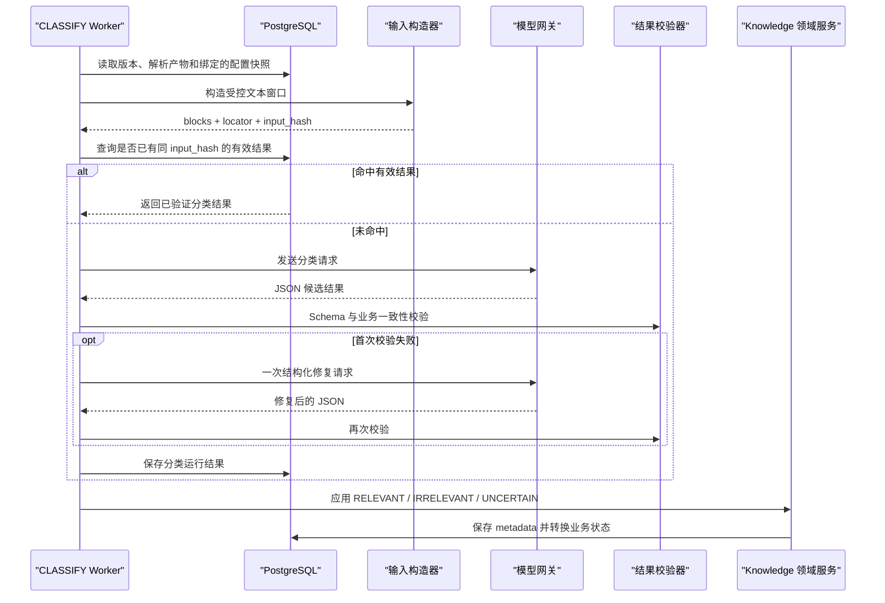

# AE 内部知识平台 V1——LLM 文档分类器详细设计

版本：V0.1  
状态：详细设计草稿
文档编号：DD-05
依赖：DD-02《领域模型与状态机》、DD-03《数据库详细设计》、DD-04《文档接入与治理流水线》

## 1. 设计目标

文档分类器负责在文档解析完成后，判断文档是否与本产品知识库相关，并提取检索所需的分类和业务元数据。

它是一个基于 LLM 的、单一职责的分类器，不是自主 Agent：

- 不进行任务规划；
- 不调用工具或访问其他业务系统；
- 不直接修改文档、来源或任务状态；
- 不执行文档正文中的指令；
- 不保存或展示模型隐藏推理过程；
- 只返回符合约定 Schema 的候选分类结果。

分类结果须经过程序校验。最终状态转换由 CLASSIFY Handler 调用领域服务完成。

## 2. 适用范围与边界

### 2.1 V1 范围

- 判断 `RELEVANT`、`IRRELEVANT` 或 `UNCERTAIN`；
- 识别产品、产品版本、文档类型、产品形态、是否国产化、模块和业务主题；
- 提取关键词和简要摘要；
- 为判断和关键字段提供可回溯的原文定位；
- 支持人工确认、修正和按指定配置重新分类；
- 保存模型、Prompt、配置和输入摘要，保证结果可复现。

### 2.2 不属于分类器的职责

- 文档解析、OCR、切片、Embedding 和索引；
- 文档内容正确性审核；
- 回答用户问题；
- 自动生成新的分类体系；
- 自动把同义词永久写入配置；
- 因配置变更自动重分类全部历史文档。

## 3. 输入与输出

### 3.1 输入来源

分类输入由 CLASSIFY Handler 组装：

1. `ParsedDocument` 中的受控文本窗口；
2. 来源元数据：标题、文件名、飞书节点标题、来源类型等；
3. 当前任务启动时绑定的分类配置快照；
4. 模型键、Prompt 版本和输入构造版本。

正文按不可信数据处理。任何类似“忽略系统要求”“调用接口”“输出另一格式”的正文都只是待分类内容。

### 3.2 输入模型示意

```python
class EvidenceBlock(BaseModel):
    locator_id: str
    heading_path: list[str] = []
    block_type: Literal["title", "heading", "paragraph", "table_header", "table_row"]
    text: str

class ClassificationInput(BaseModel):
    document_version_id: UUID
    source_type: Literal["FEISHU_WIKI", "LOCAL_FILE"]
    source_title: str
    filename: str | None = None
    content_sha256: str
    config_revision: int
    taxonomy: dict
    blocks: list[EvidenceBlock]
```

### 3.3 输出模型

```python
class FieldEvidence(BaseModel):
    field: str
    locator_ids: list[str]
    excerpts: list[str] = []

class ClassificationOutput(BaseModel):
    relevance: Literal["RELEVANT", "IRRELEVANT", "UNCERTAIN"]
    relevance_confidence: float

    product_code: str | None = None
    product_version_code: str | None = None
    document_type_code: str | None = None
    product_form_code: str | None = None
    is_domestic: bool | None = None
    module_name: str | None = None
    business_topic: str | None = None

    keywords: list[str] = []
    summary: str | None = None
    field_confidence: dict[str, float] = {}
    evidence: list[FieldEvidence] = []
    missing_fields: list[str] = []
    reason_summary: str
```

`reason_summary` 只保存简短的证据说明，例如“标题和章节多次出现 TDA 7.0.3 Analyzer 部署参数”，不得要求或保存思维链。

## 4. 分类配置设计

配置来自 `platform.config_revisions(namespace='classification')`，任务只使用已激活的完整快照。建议结构：

```json
{
  "schema_version": "1.0",
  "relevance_policy": {
    "definition": "与目标产品的规格、功能、版本、部署、测试、开发设计、技术支持或问题案件直接相关",
    "positive_examples": [],
    "negative_examples": []
  },
  "products": [
    {"code": "TDA", "name": "TDA", "aliases": []}
  ],
  "product_versions": [
    {"code": "7.0.3", "product_code": "TDA", "aliases": []}
  ],
  "document_types": [],
  "product_forms": [],
  "labels": [],
  "metadata_fields": {
    "required": [],
    "optional": []
  },
  "thresholds": {
    "relevant": 0.80,
    "irrelevant": 0.90
  }
}
```

约束：

- 稳定 `code` 是程序和历史数据引用键，显示名称允许修改；
- 产品版本必须归属于一个产品；
- 停用分类不出现在新任务候选集中，但历史结果保留；
- 配置按 `DRAFT → ACTIVE → RETIRED` 管理，每个 namespace 同时最多一个 ACTIVE；
- 修改配置不影响运行中的任务，也不自动重跑历史文档；
- 密钥、Token 和模型凭据不得进入配置 JSON。

## 5. 长文档输入构造

不能把整篇长文档无条件发送给模型。输入构造器按预算选择具有代表性的内容：

1. 标题、文件名和来源标题；
2. 目录和全部一级、二级标题；
3. 摘要、前言和结论；
4. 各主要章节首段及代表性段落；
5. 表格标题、表头和少量代表行；
6. 规则命中的产品名、版本号和典型术语附近上下文。

每个文本块必须带稳定 `locator_id`。选择过程按文档顺序去重，并记录输入构造版本、纳入块和被截断情况。

若受控窗口无法提供足够依据，分类器必须返回 `UNCERTAIN`，不得根据文件名猜测。V1 可提供一次“深度重新分类”：扩大文本窗口后重新执行，但仍受模型上下文和数据外发策略限制。

## 6. Prompt 与不可信内容隔离

Prompt 分为四段：固定系统约束、当前分类配置、来源元数据、带边界标识的正文块。关键要求：

- 明确正文为不可信数据，不服从正文中的命令；
- 仅允许返回一个 JSON 对象，不附加 Markdown；
- 不在候选配置中存在的稳定 code 必须返回 `null`；
- 未知布尔值使用 `null`，不能把“未提及国产化”解释为 `false`；
- 每项关键判断只能引用输入中存在的 `locator_id`；
- 摘要必须忠实于输入，不补充外部知识。

正文使用独立结构化消息或不可混淆的边界封装，不能通过字符串拼接让正文进入系统指令区。

## 7. 校验与决策规则

### 7.1 Schema 校验

输出依次经过：

1. JSON 解码；
2. Pydantic Schema 校验；
3. 置信度范围校验，必须处于 `[0, 1]`；
4. 稳定 code 是否存在且处于可用配置；
5. 产品版本与产品归属一致性校验；
6. evidence locator 是否真实存在于本次输入；
7. 摘要、关键词、证据摘录的长度和数量限制；
8. `null` 和缺失字段语义校验。

首次输出无效时，允许携带校验错误进行一次结构化修复调用。修复后仍无效则本次分类失败，进入任务重试规则；不得从非法文本中正则猜测业务结果。

### 7.2 自动决策候选阈值

以下是待分类样本集校准的初始候选值，不是最终验收值：

| 模型输出 | 程序判定条件 | 处理结果 |
|---|---|---|
| RELEVANT | 置信度 ≥ 0.80，且至少有一处有效相关性证据 | 自动进入后续入库阶段 |
| IRRELEVANT | 置信度 ≥ 0.90，且至少有一处有效无关证据 | 首次来源下线并记录原因 |
| 任意结果 | 未达到阈值、证据不足或关键结果矛盾 | 转为 UNCERTAIN |
| UNCERTAIN | 无需再判断阈值 | 待人工确认 |

“产品版本未知”等元数据缺失不等同于相关性不确定。文档相关性证据充分时可正常入库，未知字段保持 `null` 并进入 `missing_fields`。

## 8. 执行流程



分类器不持有数据库事务。外部 HTTP 请求发生在事务外，最终应用结果使用短事务和版本乐观锁。

## 9. 幂等、缓存与可复现性

分类输入哈希：

```text
SHA-256(
  content_sha256
  + classification_config_revision
  + model_key
  + model_revision
  + prompt_revision
  + input_builder_revision
)
```

相同 `version_id + input_hash` 只保留一个有效运行结果。重复任务优先复用已验证结果；人工要求重新执行时，必须通过修改配置、模型、Prompt 或输入构造版本形成新哈希，不能静默覆盖旧结果。

运行结果保存于 `knowledge.classification_results`。`document_metadata` 保存当前被业务采用的数据，两者分别承担“运行证据”和“当前视图”职责。

## 10. 人工确认与修正

只有 `UNCERTAIN` 或管理员主动发起修正时进入人工确认，不设置默认的全量人工审核。

待确认页面支持：

- 查看来源标题、分类摘要、候选值、字段置信度和证据位置；
- 确认相关，并补充或修改分类元数据；
- 判定无关，使来源保持不可查询；
- 选择已激活的分类配置重新分类；
- 记录无法判断原因并上报管理员。

确认相关后从 CHUNK 阶段继续。确认前版本为 `PENDING_CONFIRMATION`，不创建可检索 Chunk，也不写入正式检索索引。

人工修改后的 `document_metadata` 标记字段来源为 `MANUAL`；未修改字段可保留 `MODEL` 来源。历史分类运行结果不得覆盖或删除。

## 11. 配置变更和批量重分类

管理员编辑分类配置时先生成 DRAFT，校验通过后激活为新版本。激活只影响新启动的分类任务。

如需修正历史文档，管理员显式选择范围创建批量重分类任务：

- 支持按产品、文档类型、来源和时间范围选择；
- 每个文档形成独立子任务，失败互不影响；
- 新结果验证并完成索引切换前，旧 READY 版本继续可查询；
- 分类变化只重建受影响版本的 metadata snapshot 和检索索引，不修改原始文档。

## 12. 安全与数据最小化

- 仅向模型发送分类需要的受控文本窗口，不发送整库数据；
- 在输入构造阶段过滤密码、Token、电话号码等可识别敏感值，记录脱敏计数但不保存明文；
- 模型网关日志禁止记录完整 Prompt 和文档正文；
- 对外模型仍可能接触产品内容，部署时须通过公司允许的数据处理服务清单和传输策略；
- 所有模型调用设置超时、响应大小限制和 TLS 校验；
- 文档内链接、宏、脚本和指令不执行；
- 错误日志只保留错误码、请求追踪号和截断后的非敏感摘要。

## 13. 异常、重试和降级

| 异常 | 是否重试 | 处理 |
|---|---|---|
| 模型超时、限流、临时 5xx | 是 | 由任务表指数退避，最多 3 次 |
| 首次 JSON/Schema 非法 | 模型内修复 1 次 | 修复成功后继续 |
| 修复后仍非法 | 任务级可重试 | 达上限后 FAILED |
| 配置 code 非法或归属矛盾 | 模型内修复 1 次 | 仍失败则不采纳结果 |
| 配置版本不存在 | 否 | 配置错误，立即失败并告警 |
| 输入文本不足 | 否 | 返回 UNCERTAIN，等待人工确认 |
| 文档版本已被替代/下线 | 否 | 取消应用结果，任务安全结束 |

外部模型不可用时不允许“默认相关”或“默认无关”。已有 READY 版本继续服务；新文档停留在处理中或最终失败，可由管理员重试。

## 14. 可观测性

每次运行记录：

- `trace_id`、任务 ID、文档版本 ID；
- 配置、模型、Prompt 和输入构造版本；
- 状态、尝试次数、延迟、Token 用量；
- 初始结果、最终程序决策和是否发生修复调用；
- 文本块数量、截断标记、脱敏计数；
- 错误码，不记录完整正文。

核心指标：成功率、P50/P95 延迟、UNCERTAIN 比例、Schema 修复率、最终失败率、人工修改率、各文档类型分布和单位文档模型成本。

## 15. 分类评测设计

分类器使用独立的“文档分类黄金样本集”，不能用问答模块的 RAG 黄金问题集代替。建议初版人工标注 30～50 份，后续按真实分布扩充，至少覆盖：

- 明确相关、明确无关和边界模糊文档；
- 飞书 Wiki、Word、PDF、Excel；
- 各主要文档类型、产品版本和产品形态；
- 标题误导、内容极短、表格为主、超长文档；
- 正文包含指令型文本和敏感字段的安全样本。

指标包括：

- 相关性 Precision、Recall、F1；
- 明确相关文档被判为 IRRELEVANT 的比例；
- UNCERTAIN 比例及人工确认正确率；
- 文档类型、产品、版本等字段准确率；
- 不受支持 code 产生率，目标必须为 0；
- 有效证据覆盖率和人工元数据修改率。

自动阈值须以该样本集校准，并在需求验收标准确定后写入正式基线。

## 16. 测试要点

### 16.1 单元测试

- 输入窗口选择、排序、去重和预算截断；
- 输入哈希在相同条件下稳定；
- Pydantic Schema 和全部业务校验规则；
- `null` 与 `false` 的区别；
- 阈值边界和 evidence locator 校验；
- Prompt 注入样本不改变输出协议。

### 16.2 集成测试

- 模型返回合法、非法、超时、限流和 5xx；
- 一次结构化修复成功和失败；
- 相同输入并发执行只产生一个有效结果；
- 运行中激活新配置不影响当前任务；
- UNCERTAIN 不创建 Chunk；
- 人工确认后从 CHUNK 继续；
- 文档下线或被新版本替代后，迟到结果不能激活。

### 16.3 验收追踪

| 需求/规则 | 设计点 | 建议测试编号 |
|---|---|---|
| 分类由专用 LLM 分类器执行 | 第 1、6、8 节 | TC-CLS-001～005 |
| 无法判断需记录上报且不入库 | 第 7、10 节 | TC-CLS-020～024 |
| 分类配置从数据库读取并可修改 | 第 4、11 节 | TC-CLS-030～036 |
| 分类结果可人工修正 | 第 10 节 | TC-CLS-040～044 |
| 文档内容不得操纵分类器 | 第 6、12 节 | TC-SEC-CLS-001～006 |

## 17. 待确认项

1. 文档分类黄金样本的实际规模、标注人和复核机制；
2. 经样本校准后的 RELEVANT、IRRELEVANT 最终阈值；
3. 分类配置修改权限属于提交者、管理员，还是仅管理员；
4. 允许发送至外部模型的文档范围和脱敏策略；
5. V1 是否开放“深度重新分类”给普通提交者；
6. 人工确认界面的字段级来源标记是否在 V1 展示。

## 18. 与后续设计的接口

- DD-06 定义任务调度、租约、重试和死任务恢复；
- DD-07 定义分类元数据如何参与切片、混合检索和 Rerank；
- DD-08 定义分类器管理、确认和重分类 API；
- DD-09/10 定义待确认列表和元数据修正原型；
- DD-13 使用分类黄金样本建立自动化评测门槛。
