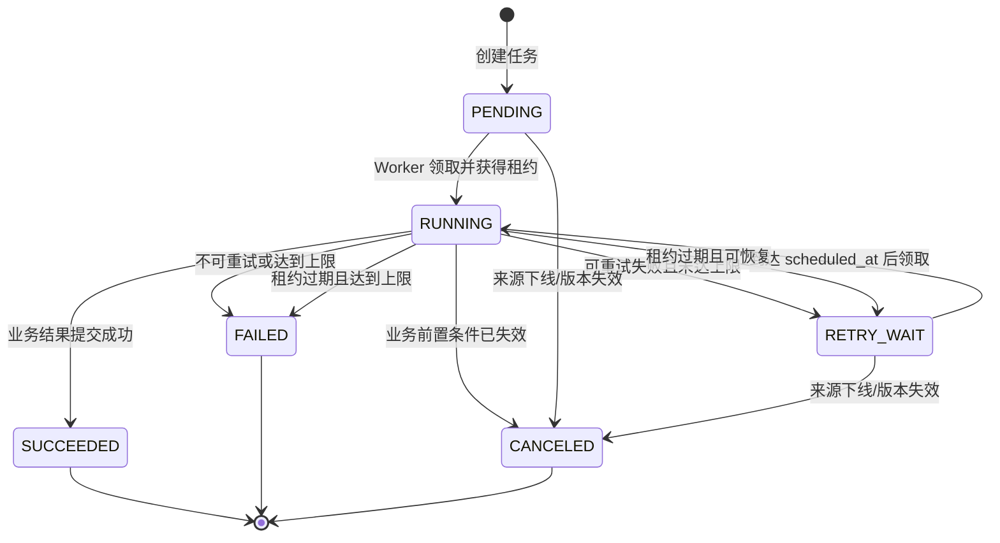

# AE 内部知识平台 V1——异步任务与调度详细设计

版本：V0.1
状态：详细设计草稿
文档编号：DD-06
依赖：DD-02《领域模型与状态机》、DD-03《数据库详细设计》、DD-04《文档接入与治理流水线》

## 1. 设计目标

V1 使用 PostgreSQL 任务表驱动文档治理、同步检查、索引清理和导出等后台工作，不引入消息队列。目标是：

- API 请求快速返回，耗时操作由 Worker 异步执行；
- Worker 崩溃、网络中断和进程重启后任务可恢复；
- 允许任务至少执行一次，但业务结果必须幂等；
- 并发 Worker 不重复领取同一有效租约任务；
- 任务失败有明确分类、有限重试和人工重试入口；
- 任务状态可查询、可统计、可定位。

本设计适用于约 1,000 份文档、约 30 名用户的 V1 规模。若未来吞吐量、跨系统事件数量或任务延迟目标明显增长，再评估引入消息队列，不在当前阶段预先复杂化。

## 2. 运行组件

| 组件 | 职责 |
|---|---|
| API Process | 接收业务命令，在业务事务内创建首个任务 |
| Scheduler Process | 创建周期任务，如每日 Wiki revision 检查 |
| Worker Process | 领取任务、续租、执行 Handler、提交结果 |
| Reaper | 扫描租约过期任务并恢复或终结 |
| PostgreSQL | 任务事实来源、并发协调、执行历史 |
| 外部资源 | 飞书、对象存储、模型服务、检索引擎 |

Scheduler、Worker 和 Reaper 可由同一 Worker 可执行程序中的不同循环承担，但逻辑职责和指标分开。多实例部署时，数据库约束与行锁负责协调，不能依赖单机内存锁。

## 3. 任务类型与路由

建议使用稳定任务类型 code：

| 类别 | task_type | 默认优先级 | 默认最大尝试次数 |
|---|---|---:|---:|
| 问答 | `GENERATE_ANSWER` | 20 | 2 |
| 入库 | `FETCH_SOURCE` | 50 | 3 |
| 入库 | `PARSE_DOCUMENT` | 60 | 3 |
| 入库 | `CLASSIFY_DOCUMENT` | 60 | 3 |
| 入库 | `CHUNK_DOCUMENT` | 70 | 2 |
| 入库 | `EMBED_DOCUMENT` | 70 | 3 |
| 入库 | `INDEX_DOCUMENT` | 70 | 3 |
| 入库 | `VERIFY_INDEX` | 70 | 3 |
| 入库 | `FINALIZE_VERSION` | 40 | 3 |
| 同步 | `CHECK_FEISHU_REVISION` | 100 | 3 |
| 维护 | `REINDEX_METADATA` | 90 | 3 |
| 维护 | `DELETE_INDEX_GENERATION` | 150 | 5 |
| 维护 | `CLEAN_ORPHAN_OBJECT` | 180 | 5 |
| 会话 | `EXPORT_CONVERSATION` | 80 | 3 |

优先级数值越小越先领取。最终激活任务优先于普通后台清理，避免完成全部重处理后长期停留在不可查询状态。

每个 `task_type` 在代码中注册唯一 Handler 和 payload Pydantic Schema。未知类型不得执行，直接标记配置类失败。

## 4. 任务状态机



`FAILED` 是本次任务终态。人工重试创建一个具有新任务 ID 的任务，并通过 `parent_task_id` 指向失败任务；不把原任务状态改回 PENDING，从而保留真实历史。

## 5. 创建任务和事务边界

### 5.1 业务事务内创建

创建或修改业务对象时，首个任务必须在同一个 PostgreSQL 事务中写入。例如提交飞书链接时同时写 Source、Version 和 `FETCH_SOURCE`。这样不会出现业务记录成功但任务丢失。

阶段 Handler 成功后，也应在同一个短事务中：

1. 锁定并重新校验业务对象；
2. 保存当前阶段结果；
3. 创建下一阶段任务；
4. 将当前任务和 attempt 标记成功；
5. 提交事务。

外部 HTTP、对象存储和检索引擎调用必须在数据库事务外完成。

### 5.2 幂等键

开放任务使用部分唯一索引约束 `idempotency_key`。推荐格式：

```text
{task_type}:{business_id}:{operation_revision}
```

示例：

```text
PARSE_DOCUMENT:{version_id}:{parser_revision}
CLASSIFY_DOCUMENT:{version_id}:{classification_input_hash}
CHECK_FEISHU_REVISION:{source_id}:2026-08-17
DELETE_INDEX_GENERATION:{generation_id}
```

创建冲突时返回现有开放任务，不再插入第二条。终态任务不阻止使用同一业务语义重新创建，但人工重试应加入 retry generation，确保行为可追踪。

## 6. 领取、租约与心跳

### 6.1 批量领取

Worker 使用 `FOR UPDATE SKIP LOCKED` 按优先级、计划时间和创建时间领取。单次领取数量由 Handler 类型和 Worker 并发配置决定，默认不超过可用执行槽位。

领取事务只做状态更新和 attempt 创建，随后立即提交。不得在持有行锁时执行外部调用。

### 6.2 租约参数

初始建议值：

| 参数 | 初始值 | 说明 |
|---|---:|---|
| `lease_interval` | 120 秒 | 一般阶段租约 |
| `heartbeat_interval` | 30 秒 | 应明显小于租约 |
| `claim_batch_size` | 10 | 受执行槽位限制 |
| 空轮询间隔 | 1～3 秒抖动 | 降低空闲数据库压力 |

长任务不能简单设置无限租约，仍需定期心跳。Handler 若执行不可中断的单次外部请求，该请求超时必须小于剩余租约安全窗口。

### 6.3 条件更新

心跳和完成必须至少匹配：

```sql
WHERE id = :task_id
  AND status = 'RUNNING'
  AND lease_owner = :worker_id
  AND lease_expires_at > now()
```

更新行数为 0 表示 Worker 已失去租约。旧 Worker 此后不能把任务标记成功，也不能执行最终版本激活。已写入的外部暂存产物由幂等命名或清理任务处理。

## 7. Handler 执行协议

每个 Handler 遵循统一生命周期：

1. 验证 payload Schema；
2. 读取最新 Source、Version 和配置快照；
3. 检查取消条件；
4. 根据稳定 ID 查询或准备幂等外部产物；
5. 执行外部工作并发送心跳；
6. 验证外部结果；
7. 在短事务内重新检查租约和业务状态；
8. 保存结果、创建下一任务、完成 attempt；
9. 事务提交后清理可安全删除的临时产物。

统一返回类型：

```python
HandlerResult = Success(data) | RetryableFailure(error) | PermanentFailure(error) | Canceled(reason)
```

Handler 不直接吞掉异常。未识别异常由执行框架映射为 `INTERNAL/UNEXPECTED`，保留追踪号并按保守策略有限重试。

## 8. 错误分类与重试

### 8.1 错误类别

| 类别 | 示例 | 默认处理 |
|---|---|---|
| `TRANSIENT` | 网络中断、服务 5xx、数据库瞬时冲突 | 重试 |
| `RATE_LIMIT` | 外部服务 429 | 按 Retry-After 或退避重试 |
| `TIMEOUT` | HTTP 或解析超时 | 重试 |
| `INVALID_INPUT` | 不支持格式、文档损坏 | 不重试 |
| `CONFIGURATION` | 模型键不存在、配置版本缺失 | 不重试并告警 |
| `AUTHORIZATION` | 飞书授权失效、无文档访问权 | 不盲目重试，提示重新授权/处理权限 |
| `CONFLICT` | 来源下线、版本已被替代 | 取消 |
| `EXTERNAL_PERMANENT` | 外部服务明确返回不可恢复错误 | 不重试 |
| `INTERNAL` | 可识别程序缺陷 | 有限重试后失败并告警 |

### 8.2 退避规则

默认使用带抖动的指数退避：

```text
delay = min(base * 2^(attempt_no - 1), max_delay) + random_jitter
```

初始建议：`base=30 秒`、`max_delay=30 分钟`、抖动为计算值的 0～20%。若外部服务提供可信 `Retry-After`，取其与本地最小退避的较大值，并受最大值限制。

每日 Wiki revision 检查“最多三次同步”的需求落在 `max_attempts=3`。三次均失败后保留失败原因，由管理员在任务列表中人工重试。

模型输出的一次结构化修复属于同一 task attempt 内部调用，不增加 `attempt_count`；整个 Handler 因外部故障重新运行才增加 attempt。

## 9. 租约过期与故障恢复

Reaper 每 30～60 秒扫描：

```text
status = RUNNING AND lease_expires_at < now()
```

处理步骤：

1. 条件锁定过期任务；
2. 将未结束 attempt 标记 `ABANDONED`；
3. 清除 lease_owner、heartbeat 和 lease_expires_at；
4. 未达最大次数则转 `RETRY_WAIT`；
5. 达到上限则转 `FAILED`；
6. 记录 `WORKER_LEASE_EXPIRED` 和原 worker_id。

任务是否可恢复不能仅依赖数据库状态。下一 attempt 必须检查外部产物：

- 对象存储使用确定性对象键和内容哈希；
- Embedding/索引使用 generation 隔离；
- 飞书拉取绑定 external revision；
- 激活操作使用 Source 行锁和版本状态条件；
- 导出文件使用 task/result ID 确定对象键。

这样即使旧 Worker 在失去租约后才收到外部成功响应，也不能覆盖新 attempt 的业务结果。

## 10. 取消与业务竞争

### 10.1 取消条件

- 来源被提交者撤回或下线；
- 文档版本被更新版本替代；
- 用户取消尚未完成的导出；
- 管理员显式取消未开始任务。

PENDING 和 RETRY_WAIT 可立即转 CANCELED。RUNNING 使用协作式取消：先记录取消请求，Handler 在阶段边界和提交前检查；不能强制终止数据库外部调用。

### 10.2 优先级规则

业务状态优先于迟到的后台结果：

1. 来源 OFFLINE 优先于版本激活；
2. 新版本已激活优先于旧版本迟到结果；
3. 任务租约所有者优先于失去租约的 Worker；
4. 人工确认结果优先于同一输入的模型候选结果；
5. 取消请求在最终提交前可阻止创建下一阶段任务。

## 11. Scheduler 设计

多实例 Scheduler 使用 PostgreSQL advisory lock 或“周期实例表唯一键”保证同一周期只生成一次任务。V1 推荐使用任务幂等键作为最终保护，即使多个实例同时扫描也只保留一个开放任务。

每日 Wiki 检查：

- 默认每天一次，具体时刻可配置；
- 只扫描未下线且飞书凭据可用的来源；
- 为每个来源创建独立 `CHECK_FEISHU_REVISION`；
- 只比较 revision/最近修改标识，不全文比对；
- revision 未变化时成功结束，不创建新版本；
- revision 变化时创建新 DocumentVersion 和 `FETCH_SOURCE`；
- 单个来源失败不影响其他来源。

周期任务使用数据库时间和系统时区配置，避免应用实例时区不一致。

## 12. Worker 并发与资源隔离

Worker 使用全局并发上限和按任务类型的信号量。初始建议仅作为压测起点：

| 资源组 | 并发建议 | 原因 |
|---|---:|---|
| RAG 回答 | 2～4 | 用户交互优先，受检索和外部模型配额限制 |
| 飞书读取 | 2～4 | 避免触发限流 |
| 文档解析 | CPU 核数附近 | CPU/内存型 |
| LLM 分类 | 2～4 | 受外部配额和成本限制 |
| Embedding | 2～4 批 | 受模型批量限制 |
| 检索索引 | 2～4 | 避免索引写入拥塞 |
| 清理任务 | 1～2 | 低优先级 |

实际值通过部署环境压测确定。Worker 应支持只启用指定资源组，便于未来将解析型和网络型任务部署为不同进程，而不改变业务模块或引入微服务。

## 13. 人工重试与管理操作

管理员任务页面支持：

- 按状态、类型、来源、版本和时间筛选；
- 查看 attempt 历史、错误分类、错误摘要和关联业务对象；
- 对 FAILED 任务执行单条或批量重试；
- 取消未开始任务；
- 查看积压量、最老等待时间和失败趋势。

人工重试前重新校验业务对象：来源已下线、版本已被替代或配置已删除时拒绝重试并说明原因。默认沿用原任务绑定的版本化配置；若用户选择新配置，应创建语义明确的新操作，而不是静默改变重试输入。

## 14. 可观测性与告警

### 14.1 指标

- 各类型、状态任务数量；
- P50/P95 排队时间和执行时间；
- 最老 PENDING/RETRY_WAIT 任务年龄；
- 成功率、重试率、最终失败率；
- 租约过期和 ABANDONED attempt 数量；
- 各错误类别和外部依赖失败数量；
- Worker 活跃实例、执行槽位和心跳状态。

### 14.2 日志与追踪

每条结构化日志至少包含 `trace_id`、`task_id`、`attempt_no`、`task_type`、`worker_id`、`source_id/version_id`、结果和错误码。payload 中的业务正文、Token 和凭据不得写日志。

初始告警建议：

- 同类型连续失败显著增加；
- 存在超过阈值的最老等待任务；
- Scheduler 一个周期未成功创建任务；
- Worker 全部离线；
- Wiki 同步单来源达到三次失败；
- 租约过期数量异常增加。

告警阈值在试运行后按基线调整，避免直接把未经验证的数值写死为验收标准。

## 15. 数据清理

任务主记录和 attempt 默认持久化，满足问题定位需要。若未来数据量增长，可配置：

- 终态任务保留完整明细一段时间后归档；
- 指标长期保存聚合结果；
- error_summary 脱敏并限制长度；
- 临时对象和孤儿 generation 由低优先级清理任务处理。

业务数据永久保存的需求不等于所有临时执行产物永久保存，具体归档周期由运行管理设计确定。

## 16. 测试设计

### 16.1 数据库并发测试

- 多 Worker 并发领取时，同一任务只被一个 Worker 获得；
- 相同幂等键并发创建只保留一个开放任务；
- 领取事务不持有到 Handler 完成；
- 失去租约的 Worker 无法续租和提交成功；
- Reaper 与正常心跳竞争时不错误回收有效任务。

### 16.2 故障注入测试

- Worker 在外部调用前、调用后、提交事务前和提交后崩溃；
- 飞书、模型、对象存储和检索服务超时/限流/5xx；
- 数据库短暂断连和事务冲突；
- 外部结果成功但 Worker 租约已过期；
- Scheduler 多实例同时创建周期任务；
- 来源下线与 FINALIZE 并发。

### 16.3 验收追踪

| 规则 | 设计点 | 建议测试编号 |
|---|---|---|
| 数据库任务表代替消息队列 | 第 1～5 节 | TC-TASK-001～010 |
| 失败自动重试且最多三次 | 第 8 节 | TC-TASK-020～026 |
| Worker 中断后可恢复 | 第 6、9 节 | TC-TASK-030～040 |
| 重复执行不产生重复业务结果 | 第 5、7、9 节 | TC-TASK-050～060 |
| 管理员可查看和人工重试 | 第 13 节 | TC-ADM-TASK-001～008 |

## 17. 待确认项

1. 生产部署的 Worker 实例数和各资源组并发上限；
2. 任务积压、最老等待时间和连续失败的正式告警阈值；
3. 任务执行历史的归档周期；
4. 飞书授权失效后的通知渠道；
5. 管理员批量重试单次最大任务数。

## 18. 与后续设计的接口

- DD-07 定义检索和问答相关后台任务及索引 generation；
- DD-08 定义任务查询、取消和人工重试 API；
- DD-10/11 定义任务管理页面和系统运行视图；
- DD-12 定义 Worker 部署、伸缩、健康检查和备份恢复；
- DD-13 定义并发、故障恢复和端到端测试。
