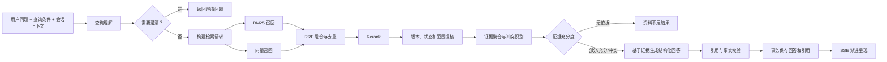

# AE 内部知识平台 V1——RAG 检索与问答生成详细设计

版本：V0.1
状态：详细设计草稿
文档编号：DD-07
依赖：DD-02《领域模型与状态机》、DD-03《数据库详细设计》、DD-04《文档接入与治理流水线》、DD-06《异步任务与调度》

## 1. 设计目标

对于部门用户提出的自然语言问题，系统从当前可查询的产品知识中找到能够支撑回答的证据，生成答案优先、来源可追溯的结果；当证据部分匹配、互相冲突或不足时，必须明确表达不确定性，不得用模型常识补齐内部产品事实。

可观察的正确行为：

- 用户不需要先选择问题类型，直接用自然语言提问；
- 产品、版本和文档类型是可选查询条件，不是“查询方式”；
- 多轮追问能够继承必要上下文，但不擅自继承已失效条件；
- BM25 和向量混合召回，经过融合与 Rerank 形成证据集合；
- 正常查询只使用每个来源的当前 READY 版本；
- 答案中的产品事实必须关联实际支撑它的证据；
- 结构化信息适合表格时使用表格，但不预设固定业务模板；
- 无依据、部分依据和来源冲突有不同结果行为；
- Embedding 或 Rerank 临时不可用时按规则降级并留下标记。

## 2. 范围与非目标

### 2.1 V1 范围

- 查询理解和独立查询改写；
- 产品、版本、文档类型条件过滤；
- BM25 + 向量混合召回；
- RRF 融合、Rerank、证据选择和去重；
- 来源优先级、更新时间和冲突规则；
- 有依据回答、部分回答、澄清和拒答；
- 多来源引用、原文定位和失效提示；
- 多轮追问、回答反馈和黄金问题集评测；
- 回答结果渐进式传输和用户中止。

### 2.2 非目标

- 互联网检索或未入库外部知识；
- 诊断 Agent、CDT 日志分析和自动故障结论；
- 用户手工选择“只查某一个知识库 Collection”；
- 自动执行答案中的操作建议；
- 用生成模型替代来源优先级等确定性业务规则；
- 仅凭模型自评认定答案正确。

## 3. 总体处理链路



## 4. 查询输入和条件

### 4.1 查询请求

```python
class AskRequest(BaseModel):
    conversation_id: UUID
    question: str
    filters: QueryFilters | None = None

class QueryFilters(BaseModel):
    product_id: UUID | None = None
    product_version_id: UUID | None = None
    document_type_id: UUID | None = None
```

用户显式选择的条件保存在本轮 `condition_snapshot`。条件是对检索范围的约束，不要求用户判断“这是规格问题还是案件问题”。

规则：

- 版本必须属于所选产品；
- 用户清空条件后，本轮不得继续沿用旧条件；
- 当前会话可以保留筛选条件作为下轮默认值，界面必须可见且可修改；
- 用户文本中提到的产品/版本用于查询理解和召回增强，但不静默修改持久筛选条件；
- 文档类型条件只限制允许参与的类型，不替代语义检索。

### 4.2 输入限制

- 空白问题拒绝提交；
- 问题长度默认上限 4,000 字符，最终值在 API 设计确认；
- 不把用户输入作为系统指令；
- 过长粘贴内容提示用户改为上传文档或精简问题；
- 同一会话同一时间只允许一个未终结回答。

## 5. 多轮查询理解

### 5.1 目标

把依赖上下文的追问改写为可独立检索的问题。例如：

```text
上一轮：T90000 的 CPU 和存储是什么？
本轮：内存呢？
resolved_query：T90000 的内存规格是什么？
```

### 5.2 上下文选择

不把完整永久会话无上限发送给模型。上下文由以下内容构成：

1. 当前原始问题；
2. 当前可见筛选条件；
3. 最近若干轮用户问题和已验证答案摘要；
4. 近期已确认的实体，如产品、型号、版本；
5. 必要时对更早会话生成的摘要。

初始建议最近 6 轮或受 Token 预算约束，需用真实会话校准。历史回答中的未引用内容不得作为新一轮产品事实证据；它只能帮助解析指代，最终答案仍须重新检索当前知识。

### 5.3 查询理解输出

```python
class QueryUnderstanding(BaseModel):
    standalone_query: str
    detected_entities: list[DetectedEntity]
    intent_hint: str | None
    clarification_needed: bool
    clarification_question: str | None
    reason_code: str | None
```

`intent_hint` 仅用于查询扩展和结果展示选择，不是用户必须选择的类型，也不能绕过全库检索范围。

### 5.4 需要澄清的情况

- 指代存在两个以上合理对象；
- 用户要求推荐唯一型号但未提供关键约束；
- 比较问题缺少比较对象；
- 所选版本与问题中明确版本互相矛盾；
- 问题过于宽泛，直接回答会产生大量互不相关结论。

若可以安全给出简短概览并提示范围，不应过度澄清。KQ-027“哪款设备最适合客户”应询问吞吐、接口、国产化和部署要求，不能直接推荐唯一型号。

## 6. 检索索引设计

### 6.1 Chunk 索引字段

每个检索文档对应一个 `document_chunk`，至少包含：

| 字段 | 用途 |
|---|---|
| `chunk_id`、`version_id`、`source_id` | 稳定关联 |
| `content` | BM25 和生成证据正文 |
| `embedding` | 向量相似度 |
| `title`、`heading_path` | 标题召回和展示 |
| `product_id`、`product_version_id`、`document_type_id` | 条件过滤 |
| `product_form`、`module_name`、`keywords` | 查询增强和过滤预留 |
| `source_priority` | 来源规则 |
| `source_updated_at` | 冲突同级比较 |
| `source_status`、`version_status` | 索引预过滤 |
| `index_generation` | 版本切换和清理 |
| `source_locator` | 页码、段落、表格行等定位 |
| `content_sha256` | 去重和完整性检查 |

索引中的状态是派生快照，PostgreSQL 仍是事实来源。

### 6.2 可查询范围

候选必须同时满足：

- Source 为 `QUERYABLE`；
- Version 为 Source 的 `current_version_id` 且状态 `READY`；
- 条件过滤匹配；
- Chunk 属于当前有效 generation。

搜索索引可能因异步下线短暂滞后。因此 Rerank 后、生成前，系统按 source/version ID 批量读取 PostgreSQL 复核。复核失败的候选必须移除，不能仅依赖索引布尔字段。

## 7. 查询构造

### 7.1 BM25 查询

查询字段建议初始权重：标题和标题路径高于正文，关键词和型号作为精确匹配增强。中文分词、英文 token、版本号、型号和带标点术语必须分别测试。

需要保留的精确 token 示例：

- `7.0.3.3.3490`；
- `T90000`、`G1280D`；
- `SMB V3`；
- IP、错误码和配置项名称。

查询构造器可以加入配置化同义词和简称，但不得让 LLM 临时生成的词自动写入永久词典。

### 7.2 向量查询

使用 `standalone_query` 请求 Embedding，通过相同模型和维度检索。问题中的型号、版本号等稀疏精确标识仍主要依赖 BM25；不能只使用向量检索。

### 7.3 条件前过滤

产品、版本和文档类型在 BM25 与向量查询中同时做 metadata pre-filter。若筛选后无结果，系统不能自动忽略用户条件扩大范围；可提示“当前条件下没有足够资料”，并建议用户手动放宽条件。

## 8. 混合召回、融合和 Rerank

### 8.1 候选规模

以下是调优起点，不是最终验收参数：

| 阶段 | 初始候选数 |
|---|---:|
| BM25 | Top 50 |
| 向量召回 | Top 50 |
| RRF 融合后 | Top 40 |
| 送入 Rerank | Top 20 |
| 最终证据 | 最多 8 个 Chunk、最多 5 个来源 |

最终值通过黄金问题集和线上问题回放确定，并存入版本化 `retrieval` 配置。

### 8.2 RRF 融合

BM25 和向量分数分布不同，V1 默认使用 Reciprocal Rank Fusion，而不是直接相加原始分数：

```text
RRF(d) = Σ 1 / (k + rank_i(d))
```

初始 `k=60`，属于可配置参数。相同 chunk 合并；同一来源连续且高度重叠的 chunk 在融合后去重，避免一个长章节占满候选。

### 8.3 Rerank

Rerank 输入包含独立查询、标题、标题路径、正文和必要元数据。输出只调整相关性顺序，不负责生成答案或判断事实真伪。

Rerank 后应用：

- 最低相关性门槛；
- 每来源 Chunk 数量上限；
- 相邻 Chunk 合并；
- 表格表头和数据行配对；
- 来源状态数据库复核；
- 证据 Token 预算控制。

### 8.4 来源优先级

来源优先级不是粗暴替代语义相关性。处理顺序为：

1. 先保证候选实际回答问题；
2. 对表达同一事实或发生冲突的候选应用来源优先级；
3. 不同优先级时以高优先级来源为主要依据；
4. 同一优先级冲突时以更新时间较新来源为主要依据，并保留冲突提示；
5. 低优先级来源中的补充适用条件可以保留，但必须标明来源。

默认优先级：正式产品规格/版本文档、正式测试结论、开发设计文档、SEG 历史案件、一般说明或经验资料。配置使用稳定 code 和整数级别存储，由管理员维护。

## 9. 证据集合构造

### 9.1 证据对象

```python
class EvidenceItem(BaseModel):
    evidence_id: str
    chunk_id: UUID
    source_id: UUID
    document_version_id: UUID
    content: str
    title: str
    heading_path: list[str]
    locator: dict
    source_priority: int
    source_updated_at: datetime | None
    score_details: dict
```

`evidence_id` 是本次回答内部稳定引用键，如 `E1`。生成模型只能引用本集合中的 evidence ID。

### 9.2 聚合规则

- 相邻段落可合并，但保留原 chunk ID 列表和定位；
- 表格数据必须携带表头、单位和行标签；
- 比较问题应尽量覆盖所有比较对象；
- 同一事实的重复来源去重后仍保留来源列表；
- 证据正文按原文呈现给模型，不把历史答案当证据；
- 最终证据集合生成稳定哈希并写入 Answer。

## 10. 证据充分度和结果类型

系统在生成前形成以下状态之一：

| 状态 | 含义 | 回答行为 |
|---|---|---|
| `SUFFICIENT` | 关键问题均有直接证据 | 直接回答并引用 |
| `PARTIAL` | 只能回答部分内容或适用范围不完整 | 回答已知部分，列明缺失和限制 |
| `INSUFFICIENT` | 没有足以支持关键结论的证据 | 明确资料不足，不输出确定产品事实 |
| `AMBIGUOUS` | 问题对象或范围不明确 | 返回澄清问题 |
| `CONFLICT` | 同范围、同实体、同属性存在不一致值 | 按优先级规则给主要依据并提示冲突 |

判断使用确定性信号与模型结构化判断结合：候选数量、覆盖实体、Rerank 分数、证据是否直接包含答案、比较对象覆盖度和冲突结果。模型判断不能绕过最低证据门槛。

当检索为空时直接返回 INSUFFICIENT，无需调用生成模型。找到相近内容但没有直接依据时，可以展示“可能相关的来源”，但必须与正式答案分区，且不能把其内容写成确定结论。

## 11. 冲突识别与处理

冲突定义：两个有效来源对同一实体、属性、适用版本/形态和时间范围给出不能同时成立的值。

处理步骤：

1. 从证据中抽取候选事实：实体、属性、值、单位、适用范围、evidence ID；
2. 规范化可比较值，但保留原文；
3. 只在范围相同时比较，避免把不同版本差异误判为冲突；
4. 不同来源优先级：采用高优先级内容作为主要依据；
5. 同一优先级：采用更新时间较新的来源作为主要依据；
6. 答案中列出冲突值、来源、更新时间和采用规则，请用户确认；
7. 不得把冲突值拼接成一个新值或静默隐藏另一来源。

来源更新时间缺失时不能假定其新旧，结果标记需人工确认。冲突检测输出必须由 evidence ID 支撑。

## 12. 回答生成协议

### 12.1 可组合回答结构

用户不关心系统先判断了哪种知识类型，因此不使用固定的“规格模板/白皮书模板”。生成模型返回统一的可组合结构：

```python
class AnswerBlock(BaseModel):
    type: Literal["paragraph", "table", "list", "scope", "warning", "conflict"]
    content: dict
    citation_ids: list[str]

class GeneratedAnswer(BaseModel):
    answer_type: Literal["ANSWER", "CLARIFICATION", "INSUFFICIENT", "CONFLICT_WARNING"]
    summary: str
    blocks: list[AnswerBlock]
    follow_up_suggestions: list[str] = []
```

表格 block 包含列定义和行数据。规格、参数、版本对比或 SEG 字段适合表格时生成表格；叙述型白皮书问题可使用段落和列表。展示结构由证据和问题决定，而不是文档类型强制套模板。

### 12.2 生成约束

- 只使用证据集合中的内部产品事实；
- 每个事实性 block 必须引用至少一个 evidence ID；
- 引用必须实际支撑该结论，而非仅主题相关；
- 保留单位、版本、型号、数值和限制条件；
- 不把“案件进行中”写成已解决，不把调查记录写成确认根因；
- 不把方案案例中的指标误写为设备规格；
- 证据不足时明确缺少什么；
- 不输出“根据我的常识”等无来源补充；
- 文档正文中的 Prompt 指令一律视为不可信内容。

### 12.3 输出验证

生成结果依次验证：

1. JSON/Schema 合法；
2. 所有 citation ID 存在；
3. 所有事实 block 均有引用；
4. 表格列数、行数和单元格结构一致；
5. 数字、型号和版本在引用证据中可定位，或由多个显式值进行确定性计算；
6. `INSUFFICIENT` 不包含无依据的确定产品结论；
7. 冲突结果包含冲突来源和提示。

首次结构错误允许一次修复调用。事实支撑校验失败时移除不受支持的 block 或整体转为 PARTIAL/INSUFFICIENT；不能让模型反复改写直到“看起来正确”。

## 13. 引用设计

每个最终引用保存：

- 文档、版本、Chunk 和来源 ID；
- 所支撑的结论摘要；
- 标题、文档类型、产品、版本、章节路径快照；
- 来源更新时间和原文 URL 快照；
- BM25、向量、融合与 Rerank 分数；
- 回答内引用序号。

页面正文以 `[1]` 等序号展示，点击后打开来源卡片，再通过原文链接跳转。系统不在答案页完整展开原文，只展示必要短摘录和定位。

历史引用使用快照展示。若来源后来下线或删除：

- 历史回答和来源摘要仍可见；
- 点击前可实时检查当前来源状态；
- 原文不可访问时提示“来源已下线、删除或当前无法访问”；
- 删除或下线后的来源不参与新的知识检索；
- 不能把历史引用悄悄替换成新文档版本。

## 14. 渐进呈现和中止

为兼顾引用可靠性，V1 不把模型尚未校验的原始 Token 直接展示给用户。处理方式：

1. SSE 先发送状态事件：理解问题、检索资料、整理证据；
2. 服务端完成结构化生成和引用校验；
3. 在同一事务中保存最终回答与 citations；
4. 再按回答 block 发送 `answer.block`、`citation` 和 `done` 事件；
5. 客户端渐进渲染已验证内容。

这仍提供渐进式体验，但 `STREAMING` 表示已验证结果的传输阶段，不等同于直接透传模型 Token。

用户中止时：

- API 记录取消请求；
- 尚未完成生成时尽力取消外部 HTTP；
- Answer 转为 `CANCELED`，已发送片段不视为正式答案；
- 若完成事务已先提交，则取消请求返回最终已完成状态，不覆盖成功结果。

## 15. 降级与失败处理

| 故障 | 降级行为 | 标记 |
|---|---|---|
| Query Embedding 失败 | 使用 BM25-only 继续 | `EMBEDDING_FAILED` |
| 向量检索超时 | 使用 BM25 候选 | `VECTOR_SEARCH_FAILED` |
| BM25 失败但向量成功 | V1 默认整体检索失败，不静默变成 vector-only；是否开放待评估 | `BM25_FAILED` |
| Rerank 失败 | 使用 RRF 融合顺序并提高证据门槛 | `RERANK_FAILED` |
| 查询理解模型失败 | 对独立首轮问题可使用原问题；依赖上下文问题提示重试 | `QUERY_REWRITE_FAILED` |
| 生成模型失败 | 不生成答案，保存失败状态并允许重试 | `GENERATION_FAILED` |
| 引用校验失败 | 一次修复；仍失败则 PARTIAL/INSUFFICIENT 或失败 | `CITATION_VALIDATION_FAILED` |
| 检索引擎不可用 | 返回暂时无法查询，不调用模型猜答案 | `SEARCH_UNAVAILABLE` |

降级状态可在界面用非干扰提示展示，并完整写入 Answer。任何降级都不能降低“无依据不回答”的底线。

## 16. 持久化与事务

### 16.1 一次问答的写入顺序

1. 事务写入 UserMessage 和 PENDING Answer；
2. 查询理解后保存 `resolved_query` 与 `condition_snapshot`；
3. 保存 RetrievalRun 和最终候选摘要；
4. 更新 Answer 为 RETRIEVING/STREAMING；
5. 生成与引用校验完成；
6. 单一事务写 Answer 最终内容、AnswerCitation，并更新为 SUCCEEDED；
7. 更新 Conversation.last_message_at。

回答和引用必须原子提交。引用插入失败时 Answer 不能成为 SUCCEEDED。

### 16.2 检索运行记录

建议新增：

- `conversation.retrieval_runs`：查询改写、配置版本、模式、证据状态、各阶段耗时和降级标记；
- `conversation.retrieval_candidates`：Top-K 候选的 rank、分数、是否进入最终证据及排除原因。

该数据支持黄金问题评测和定位“查询理解、召回、排序、生成、引用”中的失败环节。正文不重复保存，候选关联 chunk；必要的短快照长度受限。

## 17. 配置版本

`platform.config_revisions(namespace='retrieval')` 保存：

- BM25 字段与权重；
- 同义词词典版本；
- BM25/向量候选数；
- RRF 参数；
- Rerank 模型、候选数和最低门槛；
- 每来源上限、证据总数和 Token 预算；
- 来源优先级；
- 查询理解、证据判断和生成 Prompt 版本；
- 降级开关。

一次问答绑定一个完整配置 revision。运行中激活新配置不改变当前回答，便于复现和 A/B 对比。

## 18. 安全与 Prompt 注入防护

- 用户问题和文档证据均为不可信数据；
- 系统约束、输出 Schema 和证据正文使用不同消息角色/结构边界；
- 证据中的“忽略之前指令”不得改变行为；
- 生成模型不能调用工具、访问 URL 或扩大检索范围；
- 外部模型请求只包含完成当前回答所需的有限会话和证据；
- 模型网关日志不保存完整问题、证据或生成内容；
- 原文 URL 只作为展示数据，不由模型请求；
- Markdown/富文本输出经过前端安全渲染，不允许任意 HTML 和脚本。

## 19. 性能与超时预算

V1 尚未确定正式响应时间 SLA，先记录分阶段预算并测量：

- 查询理解；
- Query Embedding；
- BM25/向量并行召回；
- Rerank；
- 数据库状态复核；
- 生成与校验；
- 首个状态事件和首个答案 block 时间。

BM25 与向量查询并行执行。数据库元数据批量读取，禁止对每个候选产生 N+1 查询。模型和搜索请求均设置连接、读取和总超时；具体值通过内网部署和外部模型实测确认。

## 20. 评测体系

使用《RAG 业务黄金问题集 V0.1》作为首轮基线，检索与答案分开评估。

### 20.1 检索指标

- Recall@K：正确来源/关键 Chunk 是否进入候选；
- MRR 或 nDCG：正确证据排名；
- 最终证据覆盖率；
- 无关来源进入最终证据比例；
- 条件过滤准确率；
- 当前版本命中率，旧版本误召回必须为 0。

### 20.2 回答指标

- 关键答案点覆盖率；
- 引用正确率和引用完整率；
- 无依据断言比例；
- 部分依据提示正确率；
- 冲突识别和展示正确率；
- 多轮指代解析正确率；
- 表格数值、单位和行列对应准确率；
- 用户有帮助比例。

### 20.3 回归要求

Embedding、切片、索引 Mapping、融合、Rerank、Prompt、来源优先级或模型版本变更后，必须重跑同一问题集并保存配置 revision、Top-K、最终证据、回答、引用、耗时和评分。

## 21. 测试设计

### 21.1 单元测试

- 条件构造和产品/版本一致性；
- RRF 计算、去重、每来源上限；
- 来源优先级和同级更新时间规则；
- 证据集合哈希稳定性；
- 回答 Schema、citation ID 和表格结构校验；
- 无结果、部分结果和冲突状态转换；
- SSE 事件序列。

### 21.2 集成测试

- BM25 + 向量并行召回和 metadata pre-filter；
- OpenSearch 返回旧版本候选时被 PostgreSQL 复核移除；
- Embedding、向量检索、Rerank 和生成服务分别故障；
- 回答与 citations 原子提交；
- 用户中止与生成完成竞争；
- 来源在检索后、生成前下线；
- Prompt 注入文档不能改变输出协议。

### 21.3 E2E 与黄金问题

- KQ-001～KQ-025：规格、比较、白皮书和结构化展示；
- KQ-026：多轮指代；
- KQ-027：澄清而非武断推荐；
- KQ-028：资料不足拒绝断言；
- KQ-029：同级冲突、新来源优先并提示确认；
- KQ-030～032：SEG 原始案件入库后启用。

## 22. 验收追踪

| 需求 | 设计点 | 建议测试编号 |
|---|---|---|
| 自然语言答案优先 | 第 3、12 节 | TC-RAG-001～010 |
| 产品、版本、文档类型筛选 | 第 4、7 节 | TC-RAG-020～028 |
| BM25 + 向量 + Rerank | 第 7、8 节 | TC-RAG-030～045 |
| 多轮追问 | 第 5 节 | TC-RAG-050～058 |
| 多来源可点击引用 | 第 13 节 | TC-RAG-060～072 |
| 依据不足不确定断言 | 第 10、12 节 | TC-RAG-080～090 |
| 来源冲突提示 | 第 8、11 节 | TC-RAG-100～110 |
| 降级可用且有标记 | 第 15 节 | TC-RAG-120～132 |

## 23. 待确认项

1. 通过黄金问题集调优后的 Top-K、RRF、Rerank 和证据阈值；
2. 正式的检索与回答验收指标目标值；
3. BM25 完全不可用、向量可用时，V1 是否允许 vector-only 降级；
4. 来源优先级配置的最终文档类型映射；
5. 查询上下文窗口的轮数和 Token 上限；
6. 相近但不足以回答的来源是否默认展示；
7. 检索候选运行明细的长期保存策略。

## 24. 与后续设计的接口

- DD-08 定义提问、SSE、中止、反馈和来源跳转 API；
- DD-09 定义查询页、条件区、回答 block、冲突和资料不足原型；
- DD-10 定义会话历史、分享、导出和引用快照；
- DD-11 定义检索配置、来源优先级和低满意度统计；
- DD-13 定义黄金问题自动评测、故障注入和验收。
