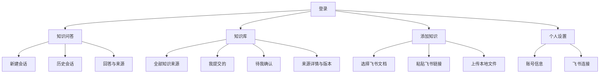
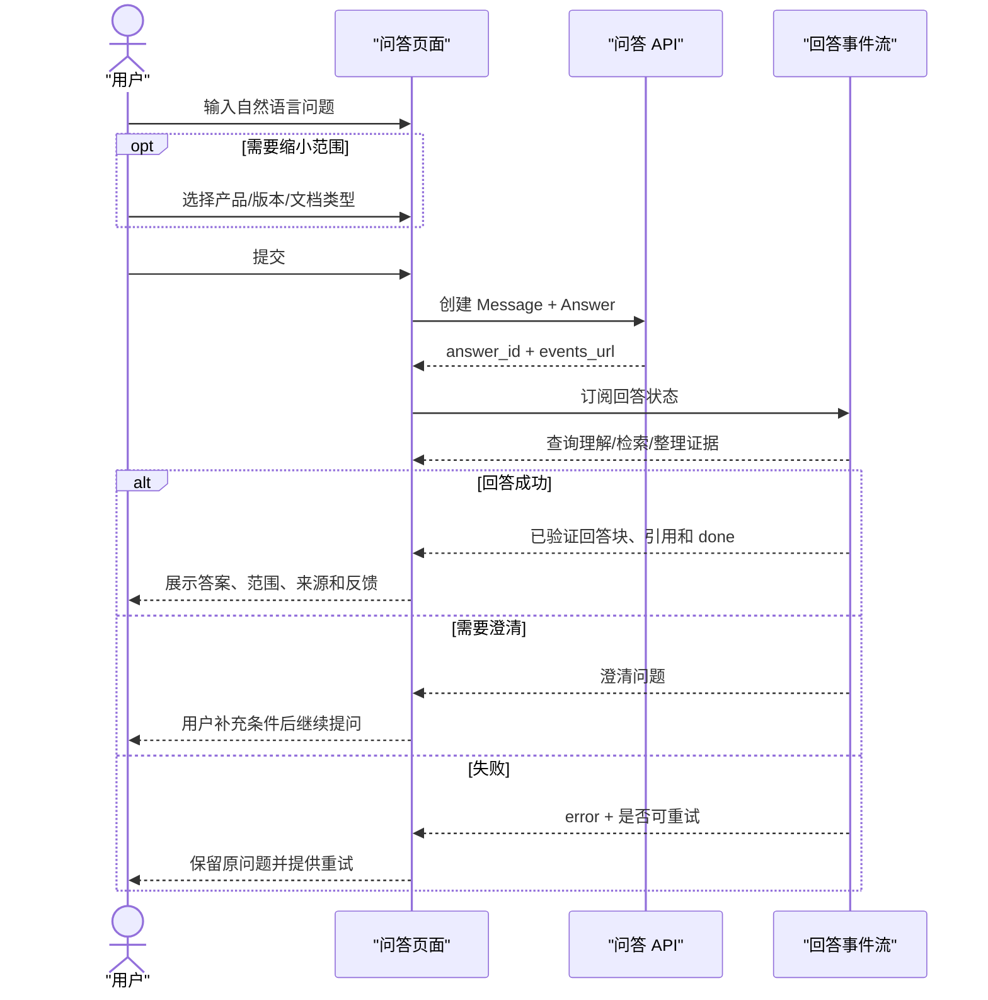
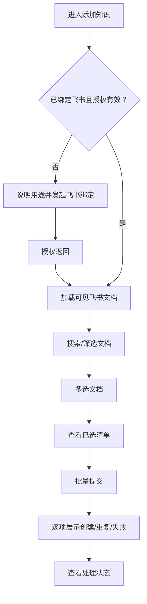
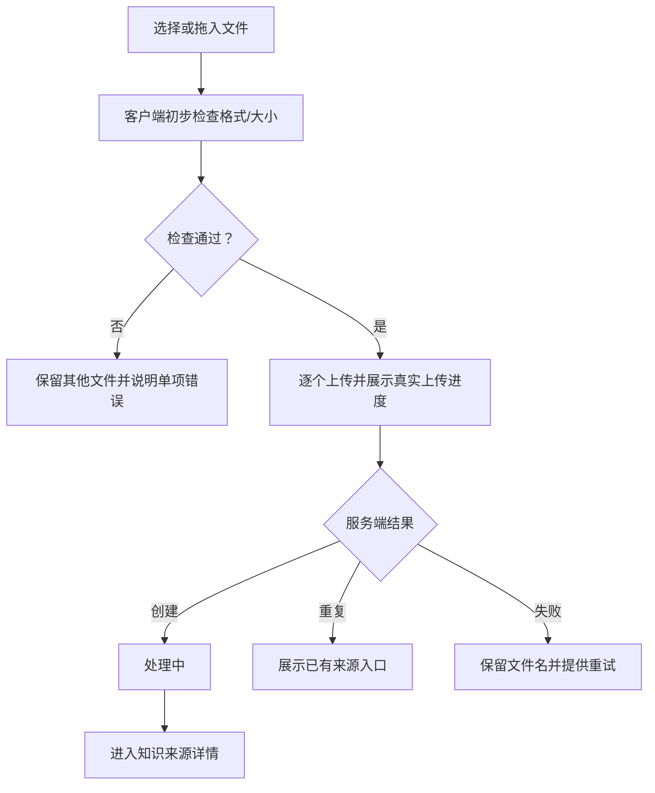

# AE 内部知识平台 V1——普通用户端结构原型与交互详细设计

版本：V0.1
状态：结构原型和三套 HTML 视觉方向完成；视觉选择与 React 原型待补充
文档编号：DD-09
依赖：DD-02《领域模型与状态机》、DD-04《文档接入与治理流水线》、DD-07《RAG 检索与问答生成》、DD-08《后端 API 与 SSE 接口》

## 1. 原型目标

普通用户进入系统后，应能在不了解 RAG、Collection、Embedding 或文档分类实现的情况下完成两件核心任务：

1. 直接提出产品问题，获得有依据、有来源的答案；
2. 从自己的飞书文档或本地文件中选择相关资料，提交到知识库并跟踪处理结果。

原型用于验证需求、交互、状态和 API 是否一致，不只是视觉效果展示。当前分册先确定不依赖视觉风格的信息架构与交互行为；视觉布局必须在三套方向中选择后再固化，可交互 React/MUI 原型随后实现。

## 2. 原型范围

### 2.1 本分册覆盖

- 账号密码和飞书扫码登录；
- 知识问答、查询条件、多轮会话、引用和反馈；
- 历史会话的新建、切换、归档、删除和恢复；
- 飞书绑定、文档发现、搜索、多选和批量提交；
- Word、PDF、Excel 本地文件上传；
- 知识来源列表、详情、版本、处理状态和失败重试；
- 提交者撤回、恢复和修改分类；
- 待确认文档的人工确认；
- 个人飞书连接状态。

### 2.2 不在本分册

- 管理员仪表盘、用户管理、任务管理、配置管理和运行统计，见 DD-11；
- 问题诊断、CDT 日志分析和诊断报告；
- 文档权限配置和操作审计；
- 最终品牌色、字体、圆角、阴影和图标细节；
- 生产前端代码和真实 API 联调。

## 3. 设计原则

1. **问题优先**：登录后的默认入口是知识问答，而不是文档列表或系统介绍。
2. **答案优先**：先展示结论，再展示适用范围、限制、冲突和来源。
3. **来源可追溯**：关键结论必须能定位到实际来源，来源不是装饰性文档列表。
4. **条件可见但不强迫**：产品、版本和文档类型是可选条件，不要求用户先选择问题类型。
5. **状态说人话**：界面显示“正在解析”“等待确认”等用户可理解状态，不直接暴露内部 task_type。
6. **失败可恢复**：每个失败页面说明发生了什么、数据是否保留、用户下一步能做什么。
7. **不虚构进度**：只展示稳定阶段，不显示没有依据的百分比进度。
8. **危险操作明确**：撤回、删除、解除绑定等操作解释影响并要求确认。
9. **复杂度按需展开**：普通用户先看到关键结果，技术分数、任务 attempt 等留给管理端。

## 4. 用户任务优先级

| 优先级 | 用户任务 | 成功标准 |
|---|---|---|
| P0 | 提问并获得答案 | 答案、适用范围和来源清楚，依据不足时不误导 |
| P0 | 继续追问 | 系统正确继承上下文，当前查询条件始终可见 |
| P0 | 提交飞书文档 | 用户能搜索、多选、确认并看到逐项提交结果 |
| P0 | 上传本地文件 | 文件校验、重复提示和处理状态明确 |
| P0 | 查看处理失败并重试 | 用户知道失败阶段和可执行下一步 |
| P1 | 查看知识来源和版本 | 能分辨当前可查询版本、更新失败和下线状态 |
| P1 | 处理待确认分类 | 确认前明确提示“不参与查询” |
| P1 | 管理自己的会话 | 新建、归档、删除、恢复行为可预期 |
| P1 | 撤回自己提交的来源 | 影响范围清楚，非提交者没有撤回入口 |
| P2 | 分享或导出会话 | 具体 V1 范围由 DD-10 确认 |

## 5. 信息架构

主导航只保留“知识问答”“知识库”“添加知识”。个人设置从用户菜单进入。管理员入口仅在 `is_admin=true` 时出现，并跳转 DD-11 管理端，不在普通导航中铺开功能。

## 6. 路由设计

| 页面编号 | 路由 | 页面名称 | 主要目标 |
|---|---|---|---|
| UI-AUTH-001 | `/login` | 登录 | 账号密码或飞书扫码进入系统 |
| UI-QA-001 | `/chat/new` | 新会话 | 提出第一个问题 |
| UI-QA-002 | `/chat/:conversationId` | 知识问答 | 查看会话、继续追问、查看来源与反馈 |
| UI-KB-001 | `/knowledge` | 知识来源列表 | 查找和筛选知识来源 |
| UI-KB-002 | `/knowledge/:sourceId` | 知识来源详情 | 查看状态、元数据、版本和可执行操作 |
| UI-KB-003 | `/knowledge/pending-confirmation` | 待确认列表 | 找到尚未入库的待确认文档 |
| UI-KB-004 | `/knowledge/:sourceId/confirm` | 分类确认 | 确认相关性和修正元数据 |
| UI-ADD-001 | `/knowledge/add` | 添加知识入口 | 选择飞书或本地文件方式 |
| UI-ADD-002 | `/knowledge/add/feishu` | 选择飞书文档 | 搜索、多选并批量提交 |
| UI-ADD-003 | `/knowledge/add/link` | 添加飞书链接 | 解析并提交指定链接 |
| UI-ADD-004 | `/knowledge/add/files` | 上传本地文件 | 上传、校验、去重并提交 |
| UI-PROFILE-001 | `/settings/profile` | 个人设置 | 查看账号和登录方式 |
| UI-PROFILE-002 | `/settings/feishu` | 飞书连接 | 绑定、检查或解除飞书连接 |

`/`：已登录跳转最近活动会话；没有会话时跳转 `/chat/new`。未登录访问业务路由时跳转 `/login?return_to=...`。

## 7. 应用外壳

当前只确定结构，不确定左侧栏、顶部栏或混合导航的最终视觉形式。

应用外壳必须提供：

- 产品标识和当前环境提示；
- 三个主导航入口；
- 当前页面标题或上下文；
- 用户菜单和飞书连接异常提示；
- 全局通知区域；
- 页面级错误恢复入口；
- 管理员入口（仅管理员）；
- 键盘跳过导航并直达主内容的入口。

问答页允许使用专门的会话导航区域，但不能让全局导航和会话列表产生两个同等突出的侧栏。

## 8. 核心流程一：知识问答

### 8.1 UX-FLOW-QA-001 首次提问

提交后输入框保留原问题，直到 API 成功创建消息；失败时用户不需要重新输入。

### 8.2 UX-FLOW-QA-002 多轮追问

- 用户在同一会话继续输入问题；
- 当前会话查询条件保持可见；
- 系统可以继承指代上下文，但每轮重新检索当前知识；
- 用户清空条件后，本轮必须按清空后的范围查询；
- 同一会话已有未完成回答时，发送按钮不可重复创建第二个回答；
- 用户切换会话前提示当前回答仍在运行，但切换不取消任务；
- 返回后通过 Answer 状态和 SSE 重连恢复展示。

### 8.3 UX-FLOW-QA-003 中止与重试

- 生成期间显示“停止回答”；
- 点击后立即进入“正在停止”，避免重复点击；
- 若服务端已完成，展示最终回答；
- 若成功中止，保留问题并显示“已停止”，可重新生成；
- 重试创建新的回答记录，旧失败/取消状态继续可见；
- 页面提示新结果可能使用更新后的知识和配置。

## 9. UI-QA-001/002 知识问答页面

### 9.1 页面目的

让用户用最少操作提出问题，并快速判断：答案是什么、适用于什么范围、依据是什么、是否存在不确定性。

### 9.2 页面信息区域

最终布局待视觉方案选择，但必须包含以下语义区域：

1. 会话上下文：标题、新建会话、历史会话入口；
2. 消息区域：用户问题、系统回答和状态；
3. 回答内容：summary 和可组合 blocks；
4. 来源区域：citation 卡片、定位和原文链接；
5. 查询条件：产品、版本、文档类型；
6. 输入区域：多行输入、发送、停止；
7. 回答操作：有帮助、没有帮助、重试；
8. 会话操作：改名、归档、删除、分享/导出预留。

### 9.3 首次进入状态

不展示空白聊天框。页面应有：

- 明确输入提示：“直接提问产品规格、版本功能、部署方式或历史问题”；
- 2～4 个来自黄金问题集的可点击示例，但不伪装成用户历史；
- 可选查询条件；
- 飞书未绑定不阻止使用已有知识，但可显示轻量提示“绑定后可添加自己的飞书文档”。

示例问题：

- `T90000 的 CPU、内存和磁盘配置是什么？`
- `信舷防毒墙支持哪些部署模式？`
- `网桥模式和路由模式有什么区别？`
- `当前有哪些国产化型号？`

### 9.4 查询条件交互

条件默认折叠为紧凑区域，但已选择条件必须始终可见。

规则：

- 产品、版本、文档类型均可为空；
- 先选版本时需要能搜索并同时确定所属产品，或要求先选产品；最终交互在视觉原型确认；
- 切换产品后，清除不属于新产品的版本并提示用户；
- 条件变化只影响下一轮，不重写历史回答；
- 条件作为会话默认值保存；
- “清除全部”是单一操作；
- 不提供“查询方式”“问题类型”“选择 Collection”等技术选项。

### 9.5 回答块

| block type | 页面行为 |
|---|---|
| `paragraph` | 正文段落，控制舒适行宽 |
| `table` | 显示表头、单位、横向滚动和逐行引用能力 |
| `list` | 展示能力、步骤、场景或限制列表 |
| `scope` | 以明确标签展示产品、版本、形态和限制 |
| `warning` | 展示部分依据、降级和资料时效提示 |
| `conflict` | 展示冲突值、来源、更新时间和采用规则 |

回答不根据“规格/白皮书/案件”套固定模板。是否使用表格由问题和证据决定。

### 9.6 引用交互

- 正文引用序号可点击；
- 点击后定位对应来源摘要；
- 来源摘要展示文档标题、类型、版本/更新时间、章节/表格行和短摘录；
- “查看原文”在新标签页打开；
- 来源不可用时按钮替换为明确状态，不提供失效跳转；
- 历史回答显示回答时快照，不自动替换成最新版本；
- 一个来源支持多个结论时只显示一个来源项，但可展开所支撑结论。

### 9.7 反馈交互

- 成功回答末尾显示“有帮助/没有帮助”；
- 选择有帮助后立即保存并给出轻量确认；
- 选择没有帮助后先保存评分，再可选原因和评论；
- 原因包括答案不准确、缺少关键内容、来源不正确、没有理解问题、其他；
- 用户可以修改或撤销反馈；
- 反馈失败不影响回答展示，可独立重试。

## 10. 问答页面状态矩阵

| 状态 | 主内容 | 允许操作 | 禁止/隐藏 |
|---|---|---|---|
| 首次进入 | 输入引导和示例问题 | 提问、选择条件 | 反馈、来源 |
| PENDING | 已发送问题、等待处理 | 切换会话、停止 | 再次发送 |
| RETRIEVING | 稳定阶段提示 | 停止、切换会话 | 虚假百分比 |
| STREAMING/传输 | 逐块出现已验证内容 | 停止、查看已到达内容 | 反馈直至 done |
| 正常回答 | 答案、范围、来源 | 追问、反馈、查看原文 | 无 |
| 多来源 | 答案和多个来源 | 逐项查看来源 | 不展开全文 |
| 部分依据 | 已知内容 + 明确缺失项 | 追问、放宽条件 | 把缺失包装成结论 |
| 资料不足 | 资料不足说明和补充建议 | 修改问题/条件 | 确定性产品结论 |
| 需要澄清 | 一个聚焦澄清问题 | 直接补充回答 | 无关推荐 |
| 来源冲突 | 主要依据 + 冲突对照 | 查看两侧来源、继续确认 | 静默隐藏冲突 |
| Embedding 降级 | 正常答案 + 轻量降级提示 | 正常使用 | 技术堆栈详情 |
| Rerank 降级 | 正常/部分答案 + 提示 | 正常使用 | 宣称结果完全等价 |
| 生成失败 | 原问题、失败说明 | 重试、复制问题 | 丢失问题 |
| 已停止 | 已停止状态 | 重新生成 | 把片段视为正式答案 |
| SSE 断线 | 自动重连提示 | 手动刷新状态 | 创建重复回答 |
| 来源已下线 | 历史引用快照 + 失效状态 | 查看回答 | 无效原文跳转 |

## 11. 会话管理交互

### 11.1 会话列表

- 按最近消息时间倒序；
- 显示标题、最近问题摘要和更新时间；
- ACTIVE 和 ARCHIVED 分区或筛选；
- 支持按标题或问题摘要搜索；搜索 API 是否单独提供需在 DD-10 确认；
- 当前运行中的会话有非干扰状态标记；
- 空列表引导新建会话。

### 11.2 会话操作

| 操作 | 交互规则 |
|---|---|
| 新建 | 立即进入空会话输入态；首次消息提交时确保后端会话存在 |
| 改名 | 行内或轻量对话框；并发冲突刷新当前标题 |
| 归档 | 不删除内容，移出默认列表，可恢复 |
| 删除 | 明确为逻辑删除；确认后离开当前会话 |
| 恢复 | 从归档或已删除列表恢复 ACTIVE |
| 分享/导出 | 入口预留，最终行为由 DD-10 决定 |

删除和归档不能使用相同图标或相同提示语。

## 12. 核心流程二：提交飞书文档

### 12.1 UX-FLOW-ADD-001 绑定后发现文档

用户绑定飞书不意味着立即扫描并导入全部文档。系统只发现用户可见文档，由用户主动选择后提交。

### 12.2 多选模型

交互参考微信式多选：

- 列表项提供复选框；
- 页面持续显示“已选择 N 项”；
- 提供固定的“查看已选”入口；
- 搜索和翻页后已选状态保留；
- 已选清单支持单项移除和全部清空；
- 已经入库的文档仍可看见，但标记“已添加”，默认不可重复选择；
- 单次最多 50 项，到达上限后明确说明；
- 提交后逐项返回结果，不把部分失败表示为整体失败。

## 13. UI-ADD-002 选择飞书文档页面

### 13.1 页面区域

- 飞书连接状态；
- 搜索框；
- 资源类型和修改时间筛选；
- 文档结果列表；
- 已提交状态；
- 已选数量和已选清单；
- 批量提交操作；
- 粘贴链接的替代入口。

### 13.2 列表项字段

- 文档标题；
- Wiki/Docx 等资源类型；
- 最近修改时间；
- 所有者摘要；
- 是否已添加；
- 当前选择状态。

### 13.3 页面状态

| 状态 | 展示与操作 |
|---|---|
| 未绑定 | 解释绑定用途，主按钮“绑定飞书” |
| 授权失效 | 说明不会删除已入库知识，按钮“重新授权” |
| 首次加载 | 列表骨架，搜索暂不可提交 |
| 正常列表 | 搜索、筛选、多选、翻页 |
| 无可见文档 | 提示检查飞书账号，提供粘贴链接入口 |
| 搜索无结果 | 保留搜索词，支持清除条件 |
| 飞书限流 | 保留已选项，按 Retry-After 提示稍后重试 |
| 部分提交成功 | 分组展示已创建、已存在和失败项 |
| 全部重复 | 引导查看已有知识来源，不创建共同所有权 |

## 14. UI-ADD-003 飞书链接提交

- 支持 Docx/Wiki URL；
- 粘贴后先解析，不直接提交；
- 解析成功展示标题、类型、修改时间和当前是否已添加；
- 用户确认后提交；
- 链接格式错误、资源不存在、授权不足分别提示；
- 重复来源提供“查看已有来源”，不提供撤回权限；
- 不让用户接触 token、node_token 等实现字段。

## 15. 核心流程三：本地文件上传

### 15.1 UX-FLOW-ADD-002 文件上传

### 15.2 UI-ADD-004 页面要求

- 支持点击选择和拖放；
- 明确支持 Word/PDF/Excel 和默认 100 MB 上限；
- 多文件时每个文件独立状态；
- 上传百分比只表示网络上传，不表示解析/分类/入库百分比；
- 上传完成后改为稳定阶段状态；
- 浏览器刷新后通过 source_id 恢复已创建项；
- 不支持格式只影响对应文件；
- 重复文件显示已有来源标题、状态和查看入口；
- 取消上传只取消尚未完成的网络上传，不撤回已经创建的来源。

## 16. UI-KB-001 知识来源列表

### 16.1 页面目的

让用户查找知识来源、判断处理状态并进入详情，而不是展示检索技术参数。

### 16.2 筛选与字段

筛选：关键词、状态、来源类型、产品、文档类型、“我提交的”。

列表字段：

- 标题；
- 来源类型；
- 产品/版本；
- 文档类型；
- 提交者；
- 当前状态；
- 最近更新时间；
- 可执行主操作。

### 16.3 状态文案

| 组合状态 | 用户文案 | 列表主操作 |
|---|---|---|
| PROCESSING | 处理中 · 当前阶段 | 查看详情 |
| QUERYABLE + IDLE | 可查询 | 查看详情 |
| QUERYABLE + PROCESSING | 可查询 · 正在同步新版 | 查看详情 |
| QUERYABLE + FAILED | 可查询 · 新版同步失败 | 查看失败原因 |
| PENDING_CONFIRMATION | 等待确认 · 暂不可查询 | 去确认 |
| FAILED | 处理失败 | 查看并重试 |
| OFFLINE | 已下线 · 不参与查询 | 查看/恢复 |

不能把“新版同步失败”显示成整篇文档不可查询，旧 current version 仍能服务。

## 17. UI-KB-002 知识来源详情

### 17.1 页面区域

1. 标题和综合状态；
2. 来源信息：飞书 URL 或本地文件名、提交者、更新时间；
3. 当前采用的分类元数据；
4. 当前可查询版本；
5. 正在处理或失败的新版本；
6. 版本历史；
7. 最近任务的用户可理解摘要；
8. 可执行操作。

### 17.2 操作可见性

| 状态/关系 | 操作 |
|---|---|
| 自己提交 + PROCESSING | 查看进度、撤回 |
| 自己提交 + QUERYABLE | 修改分类、撤回 |
| 自己提交 + FAILED | 重试、撤回 |
| 自己提交 + PENDING_CONFIRMATION | 去确认、重新分类、撤回 |
| 自己提交 + OFFLINE | 恢复 |
| 他人提交 | 查看；不显示撤回、恢复和修改入口 |
| 管理员 | 管理操作进入 DD-11，不在普通详情页堆叠 |

### 17.3 撤回确认

确认对话框必须说明：

- 文档将不再参与新查询；
- 历史回答和来源摘要仍保留；
- 正在处理的新版会停止后续阶段；
- 可以在无重复有效来源时恢复；
- 需要用户主动确认，默认焦点不放在危险按钮。

## 18. UI-KB-003/004 待确认分类

### 18.1 列表

显示：标题、来源、分类器候选、相关性置信信息摘要、无法判断原因、等待时间。

明确文案：“这些文档尚未进入可查询知识库，需要确认是否相关。”

### 18.2 确认页

页面结构：

- 文档基本信息；
- 分类器简短判断说明；
- 有限证据摘录和原文定位；
- 可编辑元数据；
- “确认相关并继续处理”；
- “标记为无关”；
- “使用当前配置重新分类”；
- “暂不处理并返回”。

元数据字段：产品、产品版本、文档类型、产品形态、是否国产化、模块、业务主题、关键词。

规则：

- 不展示模型隐藏推理；
- 未知布尔值允许为空，不默认解释为“否”；
- 版本必须属于产品；
- 确认相关后进入处理中，不立即宣称可查询；
- 标记无关后不进入索引；
- 暂不处理保持待确认；
- 页面离开前有未保存修改时提示。

## 19. UI-PROFILE-001/002 个人设置和飞书连接

个人设置展示账号名、显示名、登录方式和账号状态。

飞书连接展示：

- 未绑定、已连接、授权即将失效/失效；
- 飞书显示名和绑定时间；
- 绑定、重新授权和解除绑定操作；
- 解除绑定的影响说明。

解除绑定前说明：

- 已经入库的知识不会自动删除；
- 以后可能无法发现新文档；
- 依赖用户凭据的 Wiki 每日同步可能停止，最终策略待确认；
- 如果账号没有其他登录方式，禁止直接解除并引导先设置密码。

## 20. 跨页面反馈规则

### 20.1 加载

- 首次加载使用与真实布局一致的骨架；
- 小型按钮操作使用按钮内进度，不遮挡整页；
- 后台任务不使用持续全屏 loading；
- 同一操作提交期间禁用重复点击。

### 20.2 空状态

空状态必须说明“为什么为空”和“下一步做什么”：

- 没有会话 → 新建会话；
- 没有知识来源 → 添加飞书文档或上传文件；
- 筛选无结果 → 清除筛选；
- 没有待确认 → 返回知识列表；
- 没有搜索结果 → 调整关键词，不宣称没有任何知识。

### 20.3 错误

- 页面根据稳定 error code 展示用户文案；
- request_id 放入“错误详情”，不作为主文案；
- 网络错误提供重试，不清空用户输入和选择；
- 表单错误定位到字段；
- 部分成功页面逐项展示，不能只弹一个“操作失败”；
- 未知状态 code 使用中性“状态更新中”，并允许刷新，不能页面崩溃。

### 20.4 通知

- Toast 只用于轻量、无需后续处理的成功反馈；
- 失败原因、重复来源、冲突和待确认不能只使用短暂 Toast；
- 需要用户决策的信息保留在页面或对话框中；
- 同一事件不同时出现 Toast、Banner 和 Dialog 三重提示。

## 21. 页面与 API 映射

| 页面 | 读取 API | 命令 API |
|---|---|---|
| UI-AUTH-001 | API-AUTH-003 | API-AUTH-001、004、005 |
| UI-QA-001/002 | API-CONV-002～004、API-QA-002/003、API-DICT-001～003 | API-CONV-001/005～008、API-QA-001/004～007 |
| 引用详情 | API-QA-008 | 无 |
| UI-ADD-002 | API-FS-001/002 | API-FS-004、API-AUTH-004 |
| UI-ADD-003 | API-FS-001 | API-FS-003/004 |
| UI-ADD-004 | 无 | API-KB-001 |
| UI-KB-001 | API-KB-002、API-DICT-001～004 | 无 |
| UI-KB-002 | API-KB-003/004 | API-KB-005～009 |
| UI-KB-003/004 | API-KB-002/003、API-DICT-001～004 | API-KB-007/008/010 |
| UI-PROFILE-001/002 | API-AUTH-003、API-FS-001 | API-AUTH-004～006 |

发现的接口缺口：

1. 会话搜索尚未在 DD-08 提供专用 query 参数定义；
2. 已逻辑删除会话的列表/恢复入口需要明确 API 查询方式；
3. 飞书凭据失效后对现有来源同步的影响摘要需要 API 返回；
4. 本地多文件上传是前端逐文件调用 API-KB-001，还是提供批量协议，建议前端逐文件并发受限调用；
5. 待确认列表需要 API-KB-002 明确支持 `status=PENDING_CONFIRMATION&submitted_by=me`。

上述缺口在 DD-10 和 DD-08 修订时关闭。

## 22. 页面与 MUI 组件候选映射

本节只约束可实现性，不决定最终视觉布局。

| 交互 | MUI 候选组件 |
|---|---|
| 全局导航 | AppBar、Drawer、List、Menu |
| 查询条件 | Autocomplete、Select、Chip、Button |
| 问题输入 | TextField multiline、IconButton/Button |
| 回答内容 | Typography、Table、List、Alert、Divider |
| 来源详情 | List、Accordion/Drawer、Link |
| 会话列表 | List、Menu、Dialog |
| 飞书文档多选 | Checkbox、List/Table、Pagination |
| 文件上传 | Button、LinearProgress、List |
| 来源状态 | Chip + 明文状态；颜色不是唯一信号 |
| 分类确认 | Autocomplete、TextField、FormControl、Dialog |
| 错误和确认 | Alert、Snackbar、Dialog |

如使用 MUI X Data Grid，V1 默认仅采用免费 Community 能力；不能在未评审许可证前依赖 Pro/Premium 功能。

## 23. 响应式与桌面范围

V1 以桌面浏览器为主：

- 设计基准视口：1440 × 1024；
- 最低重点验证：1280 × 720；
- 小于 1024 宽度时允许会话导航和来源区域变为抽屉；
- 表格允许横向滚动，不能缩小到不可读；
- 输入区不得遮挡最后一条回答；
- 浏览器缩放 200% 时核心任务仍可完成；
- V1 不单独设计手机端，但登录、查看回答和基本提问不应完全不可用。

## 24. 可访问性和键盘交互

- 所有操作可通过键盘到达；
- 明确可见焦点；
- Enter 发送、Shift+Enter 换行，输入法组合阶段不得误发送；
- Escape 关闭非关键弹层，不关闭未保存表单而无提示；
- SSE 状态使用适当 live region，避免每个细小阶段重复朗读；
- 表格使用语义表头，单位不能只放在视觉提示中；
- 状态不能只靠颜色；
- 图标按钮有可访问名称和 Tooltip；
- 原文链接说明将在新标签页打开；
- 错误信息与对应字段关联。

## 25. 原型 Mock 数据

原型使用与黄金问题集一致的真实感数据，不使用 Lorem Ipsum。

### 25.1 问答场景

- T90000：AMD EPYC 7H12、64 核 128 线程、256GB、16TB；
- E380 与 E680 对比；
- 当前国产化型号；
- 网桥模式和路由模式区别；
- V7.0.3 未出现操作系统的资料不足；
- 同优先级来源对同一参数值冲突；
- 白云机场案件仍在进行中，解决办法和关闭日期为空。

### 25.2 文档场景

- 飞书 Wiki《信舷防毒墙系统 V7.0 产品白皮书》；
- 飞书电子表格《AE 硬件规格》；
- Word《Analyzer 7.0.3 部署说明》；
- PDF《版本兼容性清单》；
- Excel《SEG 问题案件》；
- 重复文件、待确认文件、解析失败文件和新版同步失败文件。

## 26. 可交互原型场景清单

视觉方向选定后，React/MUI 原型至少实现以下可操作场景：

| 场景编号 | 场景 | 完成条件 |
|---|---|---|
| PROTO-001 | 密码登录 | 正确/错误状态可切换并进入问答页 |
| PROTO-002 | 飞书扫码登录 | 展示授权、回调成功和已绑定身份匹配 |
| PROTO-003 | 首次提问 | 创建会话、模拟状态事件并展示答案 |
| PROTO-004 | 多轮追问 | “内存呢？”正确继承 T90000 上下文 |
| PROTO-005 | 查询条件 | 选择、清除产品/版本/文档类型 |
| PROTO-006 | 资料不足 | 不输出确定结论，可修改条件再问 |
| PROTO-007 | 来源冲突 | 展示两个值、来源、时间和采用规则 |
| PROTO-008 | SSE 断线 | 自动重连且不创建重复回答 |
| PROTO-009 | 回答反馈 | 无帮助原因选填并可修改 |
| PROTO-010 | 飞书文档多选 | 搜索、跨页保留选择、查看已选和部分成功 |
| PROTO-011 | 文件上传 | 正常、重复、格式错误和上传中断 |
| PROTO-012 | 来源详情 | 查看七类组合状态和版本信息 |
| PROTO-013 | 分类确认 | 修正元数据、确认相关或标记无关 |
| PROTO-014 | 撤回来源 | 影响确认、下线和恢复冲突 |

原型使用 Mock Service 层模拟 DD-08 响应和 SSE 事件，不把 Mock 逻辑散落在页面组件中。

## 27. 视觉方向选择门

在创建 React/MUI 原型代码前，先通过三套独立 HTML 页面比较“知识问答主页面”的视觉方向。三套方案在以下方面有实质差异：

- 会话导航和全局导航的关系；
- 回答正文与来源证据的空间关系；
- 查询条件的显隐方式；
- 长表格和多来源的处理；
- 桌面宽度下降时的收敛方式。

共同约束：

- 桌面 Web，1440 × 1024 基准；
- 可由 React + MUI 实现；
- 企业内部、可信、克制；
- 问答是页面主任务；
- 不堆叠卡片、指标和导航；
- 不展示诊断、审计或权限功能；
- 使用真实中文问题、回答和来源数据。

三套 HTML 视觉方向位于 `outputs/prototypes/visual-directions/`：

1. `focus-workspace.html`：专注问答工作台，会话、回答、来源三栏；
2. `search-first.html`：搜索优先工作台，答案居中、来源按需展开；
3. `evidence-analysis.html`：证据分析工作台，回答与原文证据并排。

`index.html` 为统一选择入口。上述页面是视觉探索用静态 HTML/CSS，不是生产前端；最终仍需由用户选择方向后用 React + MUI 实现并进行浏览器视觉验收。

## 28. 结构原型验收标准

- 每个普通用户核心需求都有页面或明确后台行为；
- 每个页面操作都能追溯到 API 或标记接口缺口；
- 问答页覆盖 DD-00 要求的全部正常和异常状态；
- 文档详情覆盖处理中、可查询、待确认、失败、新版同步失败、已下线和恢复处理中；
- 查询条件不被描述为查询方式；
- 多轮追问属于自然语言问答，不成为独立查询模式；
- 待确认文档明确不参与查询；
- 非提交者没有撤回、恢复或修改分类入口；
- 资料不足和冲突状态不会被普通答案样式弱化；
- 页面不暴露 Collection、Embedding、task_type、token 等实现概念；
- 原型 Mock 数据与黄金问题集关键事实一致。

## 29. 测试与评审方法

### 29.1 结构评审

由产品、开发和测试按核心任务逐步走查：

1. 用户从哪里进入；
2. 需要看到什么；
3. 可以执行什么；
4. 成功后去哪里；
5. 失败后数据是否保留；
6. 刷新或重复操作会怎样；
7. 对应 API 和状态机是什么。

### 29.2 可用性评审

视觉原型完成后，选择至少 5 名目标用户完成：提问、查看来源、提交飞书文档、上传文件、处理失败和待确认。记录完成率、误操作、关键犹豫点和用户语言，不仅询问“好不好看”。

### 29.3 工程验收

- React Router 路由可达；
- TanStack Query 缓存和失效规则符合 API；
- Mock SSE 断线可恢复；
- Vitest/RTL 覆盖状态和关键交互；
- Playwright 覆盖核心任务流；
- 1440×1024、1280×720 和 200% 缩放截图检查；
- 键盘完成提问、筛选、来源查看和分类确认。

## 30. 待确认项

1. 会话列表采用常驻侧栏、可收起面板还是独立入口；
2. 来源证据采用右侧常驻区、正文下方还是按需抽屉；
3. 视觉方向选择；
4. 已删除会话是否在 V1 提供用户恢复入口；
5. 会话分享和导出的 V1 具体范围；
6. 普通用户是否可以修改自己提交文档的分类，当前设计为可以；
7. 解除飞书绑定后，已有 Wiki 来源同步使用何种凭据；
8. 飞书文档发现接口能否稳定返回所有者和最近修改时间；
9. V1 是否开放多文件并发上传，当前建议前端最多 3 个并发。

## 31. 后续工作

1. 用户打开三套 HTML 视觉方向并选择或提出组合意见；
2. 基于选定方向实现独立 React/MUI 可交互原型；
3. 用真实 Mock 场景完成截图、键盘和任务流验证；
4. 根据验证结果回写本分册和 DD-08 接口缺口；
5. 进入 DD-10 会话、分享和导出详细设计及 DD-11 管理端设计。
