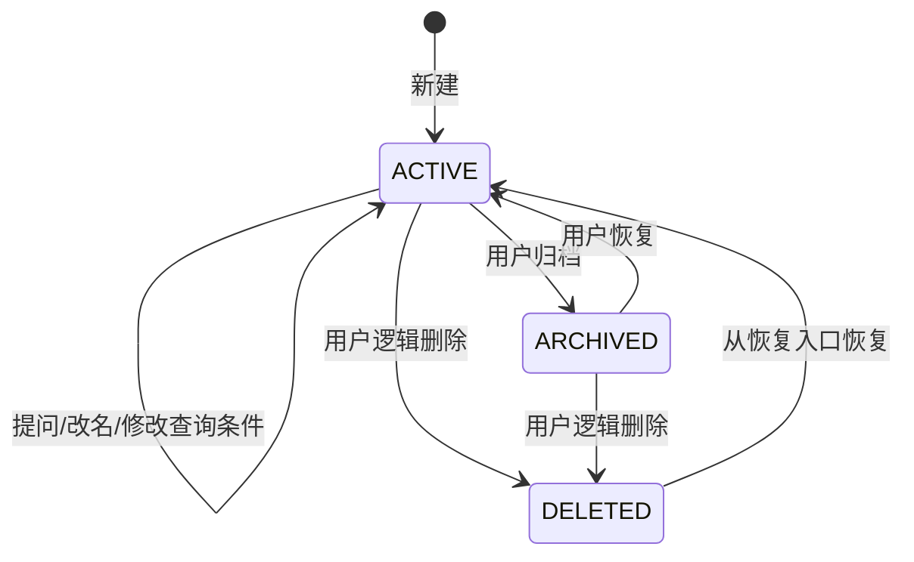
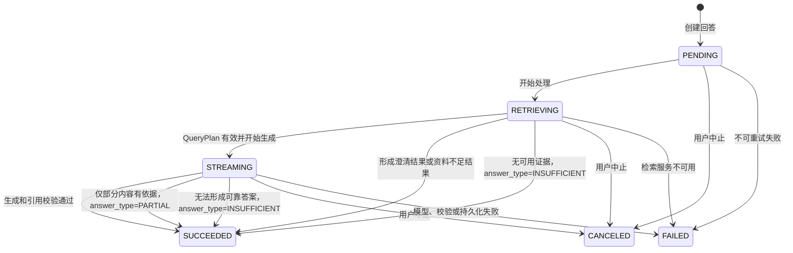

# AE 内部知识平台 V1——会话、答案、分享与导出详细设计

版本：V0.1  
状态：讨论稿  
文档编号：DD-10  
日期：2026-08-24  
依赖：DD-02、DD-03、DD-07、DD-08、DD-15

## 1. 设计目标

定义会话、用户消息、回答、引用、反馈、分享快照和导出物的生命周期，使问答过程满足：

- 对话默认持久化；
- 多轮追问能够读取上下文，但每轮答案仍重新检索当前知识；
- 同一会话同时只能有一个未结束回答；
- SSE 断线后可以通过快照恢复；
- 回答正文和引用必须原子保存；
- 历史回答引用保持当时的证据快照，不被新版本文档静默替换；
- 分享是不可变快照，导出是异步生成的独立产物。

## 2. 会话状态机



### 2.1 状态规则

| 状态 | 可查看 | 可提问 | 可导出/分享 | 可恢复 |
|---|---:|---:|---:|---:|
| `ACTIVE` | 是 | 是 | 是 | 否 |
| `ARCHIVED` | 是 | 否 | 是 | 是 |
| `DELETED` | 默认否 | 否 | 否 | 是（7 天内） |

删除进入回收站，不立即删除消息、回答、引用或反馈。V1 的普通列表默认只显示 `ACTIVE`，归档和已删除通过管理入口查看。删除后 7 天内可恢复；超过 7 天由清理任务彻底删除会话及其关联数据，导出物按自身过期策略处理。

## 3. 提问事务

一次提问由一个用户消息和一个回答记录组成：

```text
锁定 Conversation
    ↓
检查会话状态和未结束回答
    ↓
保存 UserMessage
    ↓
保存 PENDING Answer
    ↓
保存本轮 filters 快照
    ↓
提交事务
    ↓
后台执行 QueryPlan → RAG → 生成 → 引用校验
```

### 3.1 并发规则

- `ARCHIVED`、`DELETED` 会话拒绝新提问；
- 同一会话存在 `PENDING/RETRIEVING/STREAMING` 回答时，返回 `409 ANSWER_ALREADY_IN_PROGRESS`；更细的理解、重排、生成和校验阶段写入 `progress_stage`；
- 同一请求使用幂等键重复提交时，返回已创建的 `message_id` 和 `answer_id`；
- 不同会话可以并行执行；
- 切换会话只改变前端展示，不取消原会话正在执行的回答；
- 用户明确点击中止时才发送取消命令。

## 4. 回答状态机



对用户展示的最终结果类型：

- `ANSWER`：有充分依据的正常答案；
- `PARTIAL`：部分依据答案，作为 `answer_type` 保存，回答状态仍为 `SUCCEEDED`；
- `CLARIFICATION`：需要用户补充信息；
- `INSUFFICIENT`：资料不足，作为 `answer_type` 保存，回答状态仍为 `SUCCEEDED`；
- `CONFLICT_WARNING`：存在冲突并提示确认；
- `FAILED`：系统处理失败，可以重试；
- `CANCELED`：用户主动中止。

## 5. 多轮上下文

每轮提问保存：

- 用户原始问题；
- 规范化问题；
- 本轮产品、版本、文档类型条件快照；
- QueryPlan；
- 最终证据集合；
- 答案和引用。

下一轮可以使用历史消息帮助解析“它”“这个版本”等指代，但历史答案不能直接作为新一轮产品事实证据。新一轮仍需重新检索当前可查询知识。

上下文发送给模型时优先使用：

1. 当前问题；
2. 当前会话条件；
3. 最近若干轮问题和已验证答案摘要；
4. 当前轮检索证据。

不把完整永久会话无限制发送给模型。初始窗口建议为最近 6 轮，最终以真实样本和 Token 预算校准。

## 6. 引用快照

### 6.1 引用内容

每个 `answer_citation` 保存回答生成时的最小必要快照：

- 来源 ID 和版本 ID；
- 文档标题；
- 来源类型；
- 原文链接；
- 章节、页码、工作表或定位信息；
- 支撑答案的短摘录；
- 引用在答案中的序号；
- 生成时的来源更新时间。

答案页面只展示摘要和链接，不展开完整原文。

### 6.2 历史引用处理

如果来源后续下线、删除或外部链接失效：

- 历史答案仍然保留；
- 引用显示 `SOURCE_OFFLINE`、`SOURCE_DELETED` 或 `EXTERNAL_UNAVAILABLE`；
- 不把历史引用替换为同名新文档；
- 可展示当时保存的短摘录，但不保证原文链接继续可访问。

## 7. 反馈

用户可以对已完成回答选择：

- 有帮助；
- 没有帮助；
- 没有帮助原因（选填）。

反馈更新采用幂等写入：同一用户对同一回答只能保留一条当前反馈。反馈不直接自动修改 Prompt、检索权重或文档分类；管理员后续从统计结果中形成黄金问题、知识补充或配置变更。

## 8. 分享快照

### 8.1 生成范围

分享只包含创建时的：

- 会话标题；
- 用户问题；
- 已完成答案；
- 结构化表格；
- 来源标题、摘要和链接；
- 部分依据、冲突或失效提示。

不包含：

- 知识库完整原文；
- 检索候选全集；
- 模型内部 Prompt 或隐藏推理；
- 未完成、失败或已取消的回答。

### 8.2 分享不变量

- 分享快照创建后不随原会话变化；
- 创建新回答不会修改旧分享；
- 分享页面仍要求系统登录；
- 分享 Token 仅用于定位快照，不能替代登录身份；
- 普通用户可以创建和撤销自己会话的分享；
- V1 支持创建和撤销分享；
- 撤销后访问返回 `SHARE_REVOKED`，不删除快照记录。

## 9. 导出

### 9.1 导出流程

```text
用户点击导出
    ↓
API 校验会话状态
    ↓
创建 EXPORT_CONVERSATION 任务
    ↓
Worker 读取会话快照
    ↓
生成 Markdown 文件
    ↓
写入对象存储
    ↓
更新 ExportArtifact 为 READY
    ↓
返回下载或飞书文档链接
```

导出读取的是任务创建时的会话内容快照，不因为用户在导出过程中继续提问而改变文件内容。

### 9.2 V1 格式

V1 首选 Markdown，内容顺序为：

1. 会话标题和导出时间；
2. 用户问题；
3. 综合答案；
4. 结构化信息表格；
5. 来源摘要和原文链接；
6. 不确定性、冲突和资料缺口提示。

飞书云文档导出属于后续版本能力，可复用飞书文档创建能力；V1 不实现该适配器，不能让会话业务依赖飞书写入成功才能完成普通 Markdown 导出。

## 10. API 与页面映射

| 业务行为 | API | 页面交互 |
|---|---|---|
| 新建会话 | `POST /conversations` | 新建会话 |
| 切换会话 | `GET /conversations/{id}` | 最近会话列表 |
| 改名 | `PATCH /conversations/{id}` | 会话操作/重命名 |
| 提问 | `POST /conversations/{id}/messages` | 输入框发送 |
| 订阅回答 | `GET /answers/{id}/events` | 回答流式展示 |
| 中止回答 | `POST /answers/{id}/cancel` | 停止生成 |
| 反馈 | `PUT /answers/{id}/feedback` | 有帮助/没有帮助 |
| 归档/恢复 | `POST .../archive` / `restore` | 会话管理 |
| 删除 | `DELETE /conversations/{id}` | 删除确认 |
| 分享 | `POST /conversations/{id}/shares` | 分享弹窗 |
| 导出 | `POST /conversations/{id}/exports` | 导出弹窗和任务状态 |

## 11. 验收标准

| 编号 | 验收标准 |
|---|---|
| AC-CONV-001 | 刷新页面后，用户仍能看到已保存的会话和回答 |
| AC-CONV-002 | 同一会话并发提问只成功创建一个未完成回答 |
| AC-CONV-003 | SSE 断线重连后可通过 snapshot 恢复当前回答状态 |
| AC-CONV-004 | 历史答案引用不因文档更新而静默替换 |
| AC-CONV-005 | 会话归档后不能继续提问，但可恢复 |
| AC-CONV-006 | 逻辑删除不删除消息、回答和引用数据 |
| AC-CONV-007 | 分享快照不随原会话后续提问变化 |
| AC-CONV-008 | 导出内容只包含答案、表格和来源摘要，不包含完整原文 |
| AC-CONV-009 | 反馈原因可为空，重复提交不会产生重复反馈 |

## 12. 待确认事项

1. 导出文件的临时下载链接有效期；
2. 是否允许导出包含失败或部分完成的回答。
