# AE 内部知识平台 V1——Agent 编排与业务能力详细设计

版本：V0.1  
状态：讨论稿  
文档编号：DD-15  
日期：2026-08-24  
依赖：DD-00、DD-02、DD-04、DD-05、DD-06、DD-07、DD-08

## 1. 设计目标

本设计定义企业知识平台中的 Agent 边界、业务能力、调用链和输出契约，解决以下问题：

- RAG 只是检索手段，不承担业务编排；
- 文档分类器是单一职责组件，不承担用户问答；
- 用户不需要先选择“问答/总结/对比/关联”模式；
- 产品事实必须由企业知识库证据支撑；
- 大模型通用知识只能作为明确标识的补充，不能覆盖企业事实；
- V1 保持模块化单体，不提前拆分为多个微服务或多个自治 Agent。

## 2. 业务定位

平台的核心产品能力是：

> 面向企业产品研发、测试和技术支持人员的知识智能助手，根据用户自然语言问题，从企业知识库中检索可追溯证据，完成回答、总结、对比和知识关联。

RAG、向量检索、BM25、重排序和 Embedding 都属于基础技术能力，不直接作为用户可见的产品功能名称。

## 3. Agent 与组件边界

### 3.1 V1 组件划分

```text
用户
  ↓
Knowledge Assistant Orchestrator
  ├── 意图与查询计划
  ├── 调用检索服务 RAG
  ├── 证据充分度判断
  ├── 答案组织
  └── 引用和事实校验

RAG Retrieval Service
  ├── 查询改写
  ├── BM25 召回
  ├── 向量召回
  ├── 融合与重排序
  └── 返回证据片段

Document Classification Service
  ├── 相关性判断
  ├── 文档分类
  ├── 产品/版本/元数据识别
  └── 无法判断时返回 UNCERTAIN
```

### 3.2 组件职责

| 组件 | 负责 | 不负责 |
|---|---|---|
| Knowledge Assistant Orchestrator | 理解业务问题、选择查询策略、组织答案、控制降级 | 直接读数据库正文、直接操作检索索引 |
| RAG Retrieval Service | 根据查询计划返回证据和元数据 | 生成最终业务结论、决定来源优先级以外的业务规则 |
| Answer Generation Service | 基于允许的证据生成答案文本和表格 | 自行搜索互联网、凭记忆补充产品事实 |
| Citation Validator | 检查答案事实是否关联证据、生成引用定位 | 判断企业业务事实是否正确 |
| Document Classification Service | 文档相关性、分类和字段提取 | 用户问答、知识检索、改变领域状态 |
| Governance Handler | 持久化分类结果、进入待确认或可查询状态 | 解释模型隐藏推理过程 |

### 3.3 后续 Agent

问题诊断 Agent 单独属于后续业务模块，负责问题描述、CDT 日志、历史案件关联和诊断报告。它可以复用 RAG，但不应被建模为知识问答 Agent 的一个隐藏分支。

## 4. 用户问题能力模型

V1 不要求用户选择查询类型。主 Agent 根据自然语言推断 `operation`：

| operation | 示例 | 主要处理方式 |
|---|---|---|
| `ANSWER` | T90000 的 CPU 是什么？ | 找到事实并直接回答 |
| `SUMMARIZE` | 总结 T90000 的硬件规格 | 召回多个字段并结构化整理 |
| `RELATE` | 这个产品还有哪些部署文档和历史案件？ | 以产品、版本和主题扩展关联检索 |
| `EXPLAIN` | 64 核 128 线程是什么意思？ | 通用解释，可选企业上下文 |
| `CLARIFY` | 问题缺少产品或版本且无法安全判断 | 先提出澄清问题，不生成确定答案 |

这些 operation 是内部查询计划，不要求在页面上作为固定入口暴露。用户仍然可以通过产品、版本和文档类型条件缩小检索范围。

## 5. 主 Agent 处理流程

```mermaid
flowchart TD
    A[用户自然语言问题] --> B[读取会话上下文和查询条件]
    B --> C[生成 QueryPlan]
    C --> D{需要澄清?}
    D -- 是 --> E[返回澄清问题]
    D -- 否 --> F[调用 RAG Retrieval Service]
    F --> G[证据去重、版本和状态复核]
    G --> H{证据状态}
    H -- 充分 --> I[基于证据生成答案]
    H -- 部分 --> J[生成已确认内容并标注缺口]
    H -- 冲突 --> K[按来源优先级和更新时间处理并提示确认]
    H -- 无依据 --> L[返回资料不足]
    I --> M[Citation Validator]
    J --> M
    K --> M
    M --> N[持久化消息、答案和引用]
    N --> O[SSE 返回前端]
```



### 5.1 QueryPlan

主 Agent 只能生成结构化查询计划，不能直接生成任意工具调用：

```python
class QueryPlan(BaseModel):
    operation: Literal["ANSWER", "SUMMARIZE", "RELATE", "EXPLAIN", "CLARIFY"]
    normalized_question: str
    query_texts: list[str]
    product: str | None = None
    versions: list[str] = []
    document_types: list[str] = []
    required_fields: list[str] = []
    needs_clarification: bool = False
    clarification_question: str | None = None
    allow_general_explanation: bool = True
```

程序必须校验 QueryPlan：

- `query_texts` 不能为空；
- `CLARIFY` 必须有 `clarification_question`；
- 产品、版本和文档类型必须来自数据库配置或规范化后的已知值；
- 不允许计划中出现任意 URL、任意 SQL、任意文件路径或未注册工具名。

## 6. 知识来源边界

### 6.1 默认来源策略

V1 的产品事实只允许来自当前可查询的企业知识库版本：

```text
企业知识库证据：答案事实主体
大模型通用知识：可选解释补充
Web Search：V1 不调用
```

大模型可解释 CPU、线程、吞吐量等通用概念，但不能根据通用知识推导企业产品的实际配置或性能。

### 6.2 答案分区

如果回答同时包含企业事实和通用解释，生成器必须按逻辑分区：

1. **基于产品资料的结论**：每个事实关联至少一个引用；
2. **通用知识补充**：明确标记，不作为产品资料结论；
3. **尚未确认的信息**：列出知识库没有覆盖的部分。

## 7. 证据充分度与降级

### 7.1 证据状态

| 状态 | 条件 | 行为 |
|---|---|---|
| `SUFFICIENT` | 关键事实均有可用来源 | 正常生成答案 |
| `PARTIAL` | 部分事实有来源，部分缺失 | 只回答已确认内容并说明缺口 |
| `CONFLICTED` | 同优先级来源内容冲突 | 默认采用更新时间较新的来源并提示用户确认 |
| `INSUFFICIENT` | 没有足够相关证据 | 不生成产品事实，返回资料不足 |
| `RETRIEVAL_DEGRADED` | 向量或重排序不可用 | 使用可用检索能力，标记降级状态 |

### 7.2 禁止行为

- 不得用大模型内置知识填补缺失的企业产品参数；
- 不得把公开 CPU 规格当作产品实测性能；
- 不得在答案中出现没有对应 Citation 的确定性产品事实；
- 不得因为模型自评“有把握”而跳过证据校验；
- 不得静默调用 Web Search。

## 8. 答案内部契约

```python
class AnswerFact(BaseModel):
    text: str
    fact_type: Literal["PRODUCT_FACT", "GENERAL_EXPLANATION", "UNCERTAIN"]
    citation_ids: list[UUID] = []
    confidence: Literal["SUPPORTED", "PARTIAL", "UNSUPPORTED"]

class GeneratedAnswer(BaseModel):
    operation: str
    summary: str
    facts: list[AnswerFact]
    tables: list[dict] = []
    evidence_status: Literal["SUFFICIENT", "PARTIAL", "CONFLICTED", "INSUFFICIENT", "RETRIEVAL_DEGRADED"]
    citations: list[UUID]
    follow_up_question: str | None = None
```

`UNSUPPORTED` 的 `PRODUCT_FACT` 不允许进入最终答案；如果是通用解释，可以作为明确标识的补充内容返回。

## 9. 事务与持久化

主 Agent 不直接持久化业务状态。应用服务负责：

1. 创建用户消息；
2. 生成并保存查询请求标识；
3. 读取检索结果和模型输出；
4. 校验答案事实与引用；
5. 在一个事务中保存 Answer、Citation 和证据状态；
6. 提交后通过 SSE 推送可呈现事件。

模型调用失败、客户端断开或 SSE 连接中断时，不得产生“已完成但无答案记录”的假状态。可恢复的生成任务沿用 DD-06 的任务模型。

## 10. 失败和外部依赖策略

| 依赖 | 失败行为 |
|---|---|
| Query LLM | 返回可重试错误，不执行无计划检索 |
| BM25 | 若向量可用，进入降级检索并标记 |
| 向量检索 | 若 BM25 可用，进入降级检索并标记 |
| Rerank | 使用融合结果，标记 `RETRIEVAL_DEGRADED` |
| Answer LLM | 保留用户问题和检索请求，提示稍后重试 |
| Citation Validator | 不输出未经校验的产品事实 |
| PostgreSQL | 不宣称回答成功；客户端可按请求 ID 查询状态 |

外部模型服务统一经过 Model Gateway，业务 Agent 不直接拼装供应商特定请求。

## 11. V1 验收标准

| 编号 | 验收标准 |
|---|---|
| AC-AG-001 | 用户无需选择问题类型即可完成产品知识查询 |
| AC-AG-002 | 产品事实答案中的每个关键事实都能定位到企业知识库来源 |
| AC-AG-003 | 知识库没有性能测试数据时，不得从 CPU 通用知识推导产品性能 |
| AC-AG-004 | 总结结果可将多个来源整理为结构化内容，并保留来源 |
| AC-AG-005 | 用户请求版本对比时，V1 明确提示暂不支持，不生成对比结论 |
| AC-AG-006 | 来源冲突时显示采用规则和需要用户确认的提示 |
| AC-AG-007 | 向量或重排序不可用时，系统按降级规则返回并标记状态 |
| AC-AG-008 | 无依据问题返回资料不足，不输出确定性产品事实 |
| AC-AG-009 | 分类器不能直接改变文档状态，必须由治理 Handler 执行状态转换 |

## 12. 待确认事项

1. `EXPLAIN` 类型的通用知识补充是否在 V1 默认展示，还是需要用户主动请求；
2. Answer LLM 的事实校验采用规则校验、二次模型校验，还是两者组合；
3. 回答生成是同步 HTTP + SSE，还是统一创建 `GENERATE_ANSWER` 任务；
4. 当前产品知识库的来源优先级配置是否由管理员在页面维护。
