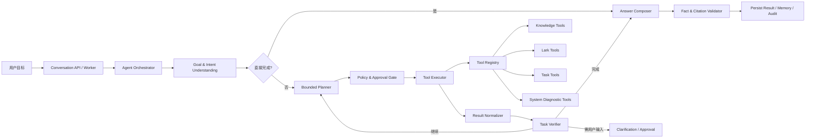

# AE 内部知识平台——工具型任务 Agent 详细设计

版本：V0.1  
状态：可实施讨论稿  
文档编号：DD-22  
日期：2026-08-27  
依赖：DD-06、DD-07、DD-08、DD-10、DD-12、DD-15、DD-17、DD-20、DD-21

## 1. 文档目的

本文定义如何将当前“固定 LangGraph + RAG”的知识助手，渐进演进为能够理解用户目标、拆解任务、选择并调用受控工具、根据执行结果调整计划、在必要时请求确认，并给出可验证结果的企业任务 Agent。

本设计不是把所有请求都变成开放式 ReAct，也不是立即建设多个自由协作 Agent。首阶段采用一个 Orchestrator、一个受控计划执行循环和一组强类型工具；现有 RAG、飞书文档、处理任务、系统日志和配置服务以工具形式接入。只有数据证明单 Agent 已达到职责、上下文或权限边界后，才引入专用 Agent 和 handoff。

本文重点解决：

- 用户不需要知道系统有哪些工具，只需描述目标；
- 概念解释可以结合稳定通用知识与企业证据，而不是机械回答“资料中未定义”；
- 清单、对比、汇总、诊断等任务能够识别范围与完成条件，而不是把 Top-K 召回当成完整结果；
- “导入这个飞书链接”“重试失败任务”“汇总并比较这些版本”“帮我排查为什么失败”可成为可执行任务，而不只是搜索知识库；
- 读操作可自动执行，写操作按风险分级确认，所有工具调用可恢复、可审计、可回放；
- 文档中的提示注入、模型生成的任意 URL/SQL/路径都不能越过工具和权限边界。

## 2. 上游约束与当前基线

### 2.1 继承的不变量

1. PostgreSQL 业务表是业务状态唯一事实来源，LangGraph checkpoint 只用于运行恢复；
2. 内部产品事实必须由本轮企业证据或受控业务工具结果支持；
3. 引用只能指向本轮可见、有效的来源对象；
4. 模型、检索、飞书和其他远程调用不得发生在持有数据库长事务期间；
5. 异步任务可重复投递，业务副作用必须幂等；
6. 用户会话凭证与飞书授权是两套身份：飞书授权失效只影响飞书工具，不应退出平台账号；
7. 密钥、Token、Cookie、完整提示词、文档正文和工具敏感结果不得进入普通日志、审计元数据或前端事件；
8. 未注册工具、任意 HTTP、任意 SQL、Shell 和任意本地路径默认禁止。

### 2.2 当前实现能力

当前 `backend/app/agent/graph.py` 已实现固定图：加载状态、构建上下文、意图路由、检索、证据判断、查询改写、生成、引用校验、记忆更新和持久化。`AgentState` 已包含运行身份、会话记忆、检索证据、答案、修复计数器和终态；Worker 已提供租约、重试、取消和任务恢复；Model Gateway 是模型唯一出口。

这些能力全部保留。新增设计聚焦当前缺口：

| 缺口 | 当前影响 | DD-22 处理 |
|---|---|---|
| 意图只面向问答类型 | 无法识别“查询、诊断、执行、确认”等任务语义 | 新增 Goal/Intent/Constraints/Completion Criteria |
| 图是固定 RAG 分支 | 不能按目标组合多个业务能力 | 增加有界 Planner/Executor/Verifier 循环 |
| Model Gateway 仅返回文本 | 无法接收原生工具调用 | 增加结构化响应和 `tool_calls` 协议 |
| 没有工具注册与授权层 | 工具能力、权限和副作用不可统一治理 | 新增 Tool Registry、Policy Engine、Approval Gate |
| 没有计划与步骤状态 | 用户看不到系统在做什么，也不能恢复单步执行 | 新增 Plan、PlanStep、ToolCall、Approval 持久化 |
| 生成只区分证据/通用回答 | 回答容易生硬，常识与企业事实无法自然组合 | 新增四类事实来源和逐事实验证 |
| 只检查引用存在性 | “列出全部”可能漏项但仍通过 | 新增任务级完成条件和集合完整性验证 |

## 3. 设计原则与架构决定

| 编号 | 决定 | 状态 |
|---|---|---|
| ADR-TA-001 | 默认使用单 Orchestrator + 强类型工具，不以多 Agent 作为起点 | 推荐基线 |
| ADR-TA-002 | 保留 LangGraph 固定安全骨架，仅在骨架内开放有界计划执行循环 | 推荐基线 |
| ADR-TA-003 | RAG 是只读工具，不再是所有请求的唯一主流程 | 推荐基线 |
| ADR-TA-004 | 简单请求直接回答或单工具执行；只有多步骤/依赖/高风险请求才生成计划 | 推荐基线 |
| ADR-TA-005 | 模型提出工具调用，应用程序负责注册、鉴权、参数校验、执行和结果裁剪 | 推荐基线 |
| ADR-TA-006 | 计划展示用户可理解的步骤与状态，不保存或展示模型隐藏思维链 | 已确认 |
| ADR-TA-007 | 读工具默认自动执行；写工具按风险与租户策略确认 | 推荐基线 |
| ADR-TA-008 | 计划和 checkpoint 是执行状态，业务数据库与外部系统仍是事实源 | 已确认 |
| ADR-TA-009 | 工具结果、企业证据、通用知识和模型推断必须具有不同来源标签 | 推荐基线 |
| ADR-TA-010 | 多 Agent 只用于明确的权限隔离、专有上下文或工具过载，不用于角色扮演式拆分 | 推荐基线 |

复杂度遵循“满足可靠性的最低复杂度”：能直接回答就不规划，能单工具完成就不生成多步计划，能单 Orchestrator 完成就不 handoff。

## 4. 目标能力模型

### 4.1 用户意图

| intent | 说明 | 示例 | 默认执行方式 |
|---|---|---|---|
| `CHAT` | 问候、能力说明、一般闲聊 | “你好”“你能做什么” | 直接生成 |
| `EXPLAIN` | 解释概念、术语或机制 | “这个状态是什么意思” | 通用解释；有企业语境时补充取证 |
| `KNOWLEDGE_QUERY` | 查询、总结、对比企业知识 | “列出当前产品并比较关键差异” | 知识工具 + 完整性验证 |
| `ANALYZE` | 结合多个来源分析原因、差异、影响 | “为什么导入失败” | 计划 + 多个只读工具 |
| `TASK` | 获取状态、整理结果、生成产物 | “汇总失败任务并给建议” | 计划 + 只读/本地计算工具 |
| `ACTION` | 对业务或外部系统产生副作用 | “重试这三个任务” | 计划 + 授权/确认 + 写工具 |
| `CLARIFY` | 缺少目标对象、范围或关键参数 | “帮我处理一下” | 只问完成任务所需的最小问题 |

`ANSWER/SUMMARIZE/RELATE` 继续作为 `KNOWLEDGE_QUERY` 下的 `operation`，避免破坏现有问答统计和兼容路径。

### 4.2 意图理解输出

```python
class GoalUnderstanding(BaseModel):
    intent: Literal[
        "CHAT", "EXPLAIN", "KNOWLEDGE_QUERY",
        "ANALYZE", "TASK", "ACTION", "CLARIFY"
    ]
    operation: str | None
    goal: str
    entities: list[EntityRef]
    constraints: list[Constraint]
    requested_output: OutputSpec
    completion_criteria: list[CompletionCriterion]
    requires_enterprise_evidence: bool
    candidate_capabilities: list[str]
    ambiguity: list[Ambiguity]
    risk_hint: Literal["NONE", "READ_ONLY", "WRITE", "HIGH_RISK"]
    confidence: float
```

本地策略必须覆盖模型判断：包含内部产品、版本、任务 ID、文档 ID 或“根据公司资料”等约束时，不允许模型把企业事实降为纯通用回答；包含“全部、所有、完整列表、逐项”时，必须生成集合完整性条件。

### 4.3 完成条件

任务完成不是“模型已经写了一段答案”，而是全部必需条件得到验证。例如：

```json
[
  {"type": "SET_COVERAGE", "entity": "requested_object", "scope": "user_constraints", "required": true},
  {"type": "REQUIRED_FIELDS", "fields": ["name", "status"], "for_each": "requested_object"},
  {"type": "EVIDENCE_BOUND", "for_each": "enterprise_fact"},
  {"type": "OUTPUT_SHAPE", "format": "requested_format"}
]
```

任何“列出全部对象”的任务都必须先获得权威集合或明确范围，再逐项补齐必需字段；不能因为 Top-K 只返回若干片段就宣布得到完整清单。动作型任务则必须把业务后置状态写入完成条件，例如“重试请求已受理且生成了新的 attempt”，不能把“工具接口返回 200”直接当成业务完成。

## 5. 总体架构



### 5.1 核心组件职责

| 组件 | 负责 | 不负责 |
|---|---|---|
| Orchestrator | 选择直接回答、单工具或计划路径；推进图状态 | 直接执行任意代码或绕过策略 |
| Goal Understanding | 识别目标、实体、约束、风险和完成条件 | 生成最终业务结论 |
| Planner | 生成有限、依赖明确、可验证的步骤 | 发明工具、授权或业务事实 |
| Tool Registry | 提供工具元数据、Schema、风险、权限和执行适配器 | 由模型动态注册工具 |
| Policy Engine | 校验用户、租户、参数、对象权限、风险和确认 | 用提示词替代后端鉴权 |
| Tool Executor | 超时、重试、幂等地执行一次工具调用 | 自行决定下一工具 |
| Result Normalizer | 将异构结果裁剪为统一安全信封 | 把原始敏感响应直接塞入模型上下文 |
| Verifier | 对照完成条件判断完成、缺口、冲突或需要重规划 | 仅依赖模型“自评有把握” |
| Answer Composer | 把证据、工具结果和通用解释组织成自然回答 | 混淆不同来源或编造执行成功 |
| Approval Gate | 创建、等待和验证确认决策 | 将“用户在聊天中说好的”无条件当授权 |

## 6. LangGraph 设计

### 6.1 主图

```text
START
  → load_state
  → build_context
  → understand_goal
  → route_execution
      ├─ direct_response → compose_answer
      ├─ legacy_knowledge_path → retrieve/assess/generate/validate
      ├─ single_tool → authorize_step
      ├─ plan_required → create_plan → authorize_step
      └─ clarify → suspend_for_input

authorize_step
  ├─ DENIED → finalize_denied
  ├─ APPROVAL_REQUIRED → suspend_for_approval
  └─ ALLOWED → execute_tool

execute_tool → normalize_observation → verify_progress
  ├─ COMPLETE → compose_answer
  ├─ CONTINUE → select_ready_step → authorize_step
  ├─ REPLAN → revise_plan → select_ready_step
  ├─ NEED_INPUT → suspend_for_input
  └─ FAILED → finalize_failure

compose_answer → validate_facts → update_memory → persist_result → END
```

固定骨架保证模型不能跳过鉴权、确认、工具执行器、事实验证和持久化。动态性只存在于受控的计划与注册工具选择中。

### 6.2 路径选择

| 条件 | 路径 |
|---|---|
| 问候、能力说明、纯通用概念 | `direct_response` |
| 现有 RAG 可以单次完成的知识问答 | `legacy_knowledge_path`，保持 DD-21 行为 |
| 一个只读工具、参数完整、无依赖 | `single_tool`，不创建冗长计划 |
| 需要两个以上能力、存在依赖、集合验证或诊断 | `plan_required` |
| 关键对象/范围缺失，合理默认会改变结果 | `clarify` |
| 任何写操作需要确认 | 在执行前进入 `suspend_for_approval` |

### 6.3 有界约束

- 默认最多 8 个计划步骤，硬上限 12；
- 默认最多 10 次工具调用，硬上限 20；
- 同一步骤最多 2 次工具重试；鉴权、权限、参数、资源不存在不重试；
- 最多 2 次重规划，且必须说明触发原因码；
- 最多 1 个并行工具批次；只有互不依赖且全部只读时允许并行；
- 总运行时默认 180 秒；等待用户确认不计入活动执行时长；
- 达到上限后返回已完成内容、未完成项和可继续方式，不进入无限循环。

## 7. Agent 状态与领域对象

### 7.1 `AgentState` 扩展

在 DD-21 状态上新增：

```python
class AgentState(TypedDict, total=False):
    # DD-21 原有字段保持
    goal: dict[str, object]
    execution_mode: str              # DIRECT/LEGACY_RAG/SINGLE_TOOL/PLANNED
    completion_criteria: list[dict]

    plan_id: str | None
    plan_revision: int
    plan_steps: list[dict]
    active_step_id: str | None

    available_tool_names: list[str]
    pending_tool_call: dict | None
    observations: list[dict]
    artifacts: list[dict]

    pending_approval_id: str | None
    approval_decision: str | None
    suspended_reason: str | None

    tool_call_count: int
    replan_count: int
    verification_result: dict | None
```

状态只保存裁剪后的 DTO 和对象引用。大型文件、完整文档、日志正文、二进制数据保存到既有对象存储或业务表，并在状态中保留 `artifact_id`、摘要、类型和权限标签。

### 7.2 Plan

```python
class AgentPlan(BaseModel):
    id: UUID
    goal: str
    revision: int
    status: Literal["DRAFT", "RUNNING", "WAITING", "SUCCEEDED", "PARTIAL", "FAILED", "CANCELED"]
    completion_criteria: list[CompletionCriterion]
    steps: list[PlanStep]

class PlanStep(BaseModel):
    id: str
    title: str                       # 可向用户展示，不含隐藏推理
    capability: str                  # 如 knowledge.search
    depends_on: list[str]
    input_bindings: dict[str, object]
    expected_output: str
    verification: list[CompletionCriterion]
    risk: Literal["READ_ONLY", "LOW_RISK_WRITE", "HIGH_RISK"]
    status: Literal["PENDING", "READY", "WAITING_APPROVAL", "RUNNING", "SUCCEEDED", "FAILED", "SKIPPED"]
```

计划必须引用能力名，不直接嵌入任意 URL、SQL、脚本或文件路径。真正的工具与参数只能在步骤执行前，由 Tool Registry Schema 再次解析和校验。

### 7.3 工具结果信封

```python
class ToolResultEnvelope(BaseModel):
    call_id: UUID
    tool_name: str
    tool_version: str
    status: Literal["SUCCEEDED", "FAILED", "UNKNOWN", "CANCELED"]
    data: dict[str, object] | None
    summary: str
    evidence_refs: list[EvidenceRef]
    artifact_refs: list[ArtifactRef]
    error_code: str | None
    retryable: bool
    truncated: bool
    sensitivity: Literal["PUBLIC", "INTERNAL", "RESTRICTED"]
    started_at: datetime
    completed_at: datetime
```

## 8. Planner 设计

### 8.1 Planner 输入与输出

输入包括目标、实体、约束、完成条件、用户权限下可用能力摘要、已有 observations 和预算；不向模型暴露不可用工具、密钥或真实服务端点。

输出必须通过 JSON Schema、本地依赖图校验和策略校验：

- 步骤 ID 唯一且依赖无环；
- 能力名存在且当前用户可见；
- 步骤数、调用数和并行度不超过预算；
- 写步骤显式标记风险和预期影响；
- 每个步骤都有可验证输出；
- 不能把用户要求的最终结果偷换为“搜索完成”；
- 已完成步骤默认不可被重规划删除或改写；如其结果已失效，必须标记失效原因。

### 8.2 重规划触发条件

仅在以下条件重规划：

- 工具返回可处理的替代对象或能力；
- 结果为空但存在不同查询策略；
- 新 observation 证明原计划假设错误；
- 完成条件仍有缺口；
- 用户在挂起期间修改目标或约束。

鉴权失败、权限拒绝、明确资源不存在、用户拒绝确认时，不允许通过换工具绕过限制。

## 9. Tool Registry 与工具契约

### 9.1 注册信息

```python
class ToolDefinition(BaseModel):
    name: str                         # 稳定命名空间，如 task.retry
    version: str
    description: str
    input_schema: dict
    output_schema: dict
    risk: str
    side_effect: bool
    requires_confirmation: bool
    idempotency: str                  # REQUIRED/OPTIONAL/NOT_APPLICABLE
    required_permissions: list[str]
    timeout_seconds: int
    retry_policy: str
    max_result_bytes: int
    sensitivity: str
```

Registry 由代码级注册表维护。未知工具在开发和测试环境直接失败，在生产返回 `TOOL_NOT_REGISTERED` 并告警；不能让模型或文档内容动态增加工具。

### 9.2 首批工具目录

| 工具 | 用途 | 风险 | 默认确认 |
|---|---|---|---|
| `knowledge.search` | 混合检索并返回证据片段 | 只读 | 否 |
| `knowledge.get_document` | 读取当前用户可见文档及结构化内容 | 只读 | 否 |
| `knowledge.list_entities` | 从权威目录/结构化文档中获得对象完整集合 | 只读 | 否 |
| `knowledge.compare_entities` | 基于已取证字段进行对比和缺口报告 | 只读 | 否 |
| `feishu.resolve_link` | 解析 Wiki/Docx/Sheet 链接及真实 token/type | 只读 | 否 |
| `feishu.read_document` | 使用当前用户飞书授权读取内容 | 只读 | 否 |
| `document.get_import_status` | 获取导入及各阶段错误 | 只读 | 否 |
| `document.submit_import` | 提交飞书链接或本地文件导入 | 低风险写 | 是 |
| `task.get` / `task.list` | 查询处理任务、attempt 和错误 | 只读 | 否 |
| `task.retry` | 重试单个失败任务 | 低风险写 | 是 |
| `task.retry_batch` | 批量重试 | 高风险 | 是，显示数量与对象 |
| `system.get_health` | 查询服务与依赖健康状态 | 只读、管理员 | 否 |
| `system.query_logs` | 按 request/task ID 查询脱敏日志摘要 | 只读、管理员 | 否 |
| `config.get_effective` | 查询有效配置和 revision | 只读、管理员 | 否 |

工具适配器必须调用现有应用服务，不允许复制领域规则或直接绕过状态机修改 ORM。

### 9.3 参数与结果安全

- 工具输入由 Pydantic/JSON Schema 严格校验，拒绝额外字段；
- 对象 ID 再次按当前用户、租户、角色校验；
- URL 仅允许已注册工具自行解析，遵循 DD-12 白名单与 SSRF 防护；
- 查询工具使用预定义过滤器，不接收原始 SQL；
- 文件工具使用已上传 `file_id`，不接收模型生成的本地路径；
- 工具结果按字段白名单、大小和敏感等级裁剪；
- 文档/日志中的“请调用某工具”只作为数据，不作为控制指令。

## 10. Model Gateway 扩展

保持 Model Gateway 为模型唯一出口，新增供应商无关协议：

```python
class ChatRequest(BaseModel):
    messages: list[GatewayMessage]
    response_schema: dict | None = None
    tools: list[GatewayTool] = []
    tool_choice: Literal["none", "auto", "required"] | str = "none"

class GatewayToolCall(BaseModel):
    id: str
    name: str
    arguments: dict[str, object]

class ChatResponse(BaseModel):
    text: str | None
    tool_calls: list[GatewayToolCall]
    finish_reason: str
    usage: TokenUsage
    model_config_id: UUID
```

优先使用供应商原生 tool calling；不支持时使用受限 JSON Schema 回退。无论哪种方式，模型返回都只是“调用提议”，不能直接执行。Registry 查找、Schema 校验、Policy Engine 和 Executor 是不可跳过的程序边界。

## 11. 授权、确认与身份

### 11.1 风险分级

| 级别 | 示例 | 策略 |
|---|---|---|
| `READ_ONLY` | 检索、读文档、查任务、查健康 | 权限通过后自动执行 |
| `LOW_RISK_WRITE` | 提交单文档导入、重试单任务 | 默认请求一次明确确认；可配置同会话短时授权 |
| `HIGH_RISK` | 批量重试、下线、删除、配置发布、用户变更 | 每次显式确认，展示对象、数量、影响和不可逆性 |
| `FORBIDDEN` | 任意 Shell/HTTP/SQL、读取密钥、跨租户访问 | 永久拒绝，不能通过确认解锁 |

### 11.2 确认对象

确认必须绑定：`user_id + plan_id + plan_revision + step_id + tool_name + normalized_args_hash + expires_at`。计划或参数变化后旧确认失效，防止模型在用户确认后替换执行对象。

前端展示：将执行什么、作用对象、预计数量、可能影响、是否可恢复。用户可批准、拒绝或修改范围。批准操作使用现有会话认证与 CSRF 防护。

### 11.3 飞书授权

平台会话有效但飞书用户授权缺失/过期时：

- 飞书工具返回 `FEISHU_USER_AUTH_REQUIRED`；
- Agent 保留已完成步骤并挂起当前计划；
- 前端显示“重新授权飞书并继续”，而不是退出平台登录；
- 授权成功后用同一 `plan_id`/checkpoint 恢复；
- 非飞书工具和平台功能继续可用。

## 12. 执行、幂等与恢复

### 12.1 调用生命周期

```text
PROPOSED → VALIDATED → AUTHORIZED → RUNNING
  → SUCCEEDED / FAILED / UNKNOWN / CANCELED
```

`UNKNOWN` 用于外部副作用已发出但响应超时的场景。此时先调用状态查询或对账工具，不允许直接重试可能重复产生副作用的请求。

### 12.2 幂等键

写工具必须使用：

```text
agent:{run_id}:plan:{plan_revision}:step:{step_id}:tool:{tool_version}
```

业务服务保存幂等结果或映射到既有任务幂等键。工具调用重放返回同一业务对象与 `REPLAYED` 标识，不重复创建导入任务、重试任务或配置变更。

### 12.3 恢复规则

- checkpoint 保存计划、计数器、裁剪后的 observations 和挂起点；
- ToolCall 数据库记录是工具执行事实，恢复时先读取它而不是仅相信 checkpoint；
- 已成功的幂等步骤不重复执行；
- `RUNNING` 且租约过期的只读调用可重试；写调用先对账；
- 用户确认、飞书重新授权或补充参数后，以 LangGraph interrupt/resume 恢复；
- 最终答案持久化仍遵循 DD-21 的 Answer/Citation 幂等事务。

## 13. 事实来源、推理与回答生成

### 13.1 四类来源

| 类型 | 含义 | 展示/验证 |
|---|---|---|
| `ENTERPRISE_EVIDENCE` | 企业文档、目录、版本化知识 | 必须引用，可用于内部事实 |
| `TOOL_RESULT` | 业务系统当前状态或动作结果 | 关联工具调用/对象，可用于状态结论 |
| `GENERAL_KNOWLEDGE` | 稳定通用概念 | 自然解释；不能替代企业参数 |
| `INFERENCE` | 基于前述事实推导 | 必须表述为分析/推断并列出依据 |

### 13.2 自然回答策略

回答应首先解决用户目标，而不是复述检索过程或模板化声明能力边界：

1. 先给直接结论或任务结果，再说明关键依据、执行情况和未完成项；
2. 对稳定通用概念给出简洁解释；涉及公司特定定义、参数、日期或政策时再绑定企业证据；
3. 用户要求完整清单时，优先读取权威目录、完整表格或分页接口，而不是依赖 Top-K 片段；
4. 字段缺失应标记“资料未说明/尚未确认”，不能擅自解释为否定状态；
5. 对比任务使用同一字段口径，明确不可比项和版本差异；
6. 动作任务说明实际成功对象、失败对象和下一步，不能把“已发起”表述为“已完成”；
7. 只展示支撑最终结论的来源，不把无关召回片段凑到固定数量。

EOS、产品型号清单只是上述规则的一个验收样例，不构成单独架构能力或特殊业务分支。

### 13.3 事实验证

`validate_facts` 对每个最终事实检查：来源类型、可见性、时效、对象一致性和引用绑定。`GENERAL_KNOWLEDGE` 不强制企业引用，但不得包含企业特有参数、状态或政策；`INFERENCE` 必须至少绑定一个事实输入。

Verifier 还检查任务级条件：集合是否覆盖、动作是否确实成功、目标对象数量是否一致、失败项是否披露。引用数量没有固定 8 条上限或下限，应只保留支持最终回答的最小相关集合。

## 14. 数据库设计

### 14.1 `conversation.agent_plans`

| 字段 | 类型 | 说明 |
|---|---|---|
| `id` | UUID | PK |
| `run_id` | UUID | FK `conversation.agent_runs`，索引 |
| `revision` | INT | 同一 run 单调递增，唯一 `(run_id, revision)` |
| `goal` | TEXT | 用户可理解的目标摘要 |
| `status` | VARCHAR(24) | DRAFT/RUNNING/WAITING/SUCCEEDED/PARTIAL/FAILED/CANCELED |
| `completion_criteria` | JSONB | 结构化条件，不含隐藏推理 |
| `created_at/updated_at` | TIMESTAMPTZ | 时间 |

### 14.2 `conversation.agent_plan_steps`

| 字段 | 类型 | 说明 |
|---|---|---|
| `id` | UUID | PK |
| `plan_id` | UUID | FK，索引 |
| `step_key` | VARCHAR(64) | 计划内稳定 ID，唯一 `(plan_id, step_key)` |
| `sequence` | INT | 用户展示顺序 |
| `title` | VARCHAR(256) | 安全步骤说明 |
| `capability` | VARCHAR(128) | 注册能力名 |
| `dependencies` | JSONB | step_key 数组 |
| `risk` | VARCHAR(24) | 风险等级 |
| `status` | VARCHAR(24) | 步骤状态 |
| `input_summary` | JSONB | 白名单参数摘要，不保存凭据/正文 |
| `output_summary` | JSONB | 白名单结果摘要 |
| `error_code` | VARCHAR(64) NULL | 稳定错误码 |
| `started_at/completed_at` | TIMESTAMPTZ NULL | 时间 |

### 14.3 `conversation.agent_tool_calls`

| 字段 | 类型 | 说明 |
|---|---|---|
| `id` | UUID | PK |
| `run_id/plan_id/step_id` | UUID | 关联运行和步骤，索引 |
| `tool_name/tool_version` | VARCHAR | 注册工具版本 |
| `attempt` | INT | 从 1 开始，唯一 `(step_id, attempt)` |
| `status` | VARCHAR(24) | 调用生命周期状态 |
| `idempotency_key_hash` | CHAR(64) NULL | 只保存摘要 |
| `arguments_summary` | JSONB | 白名单和脱敏后的参数 |
| `result_summary` | JSONB | 裁剪后的结果 |
| `external_operation_id` | VARCHAR(128) NULL | 对账使用 |
| `error_code/retryable` | VARCHAR/BOOL | 错误分类 |
| `duration_ms` | INT NULL | 耗时 |
| `created_at/updated_at` | TIMESTAMPTZ | 时间 |

### 14.4 `conversation.agent_approvals`

| 字段 | 类型 | 说明 |
|---|---|---|
| `id` | UUID | PK |
| `run_id/plan_id/step_id` | UUID | 关联对象 |
| `requested_by` | UUID | Agent 所属用户 |
| `decision_by` | UUID NULL | 实际决策用户 |
| `status` | VARCHAR(24) | PENDING/APPROVED/REJECTED/EXPIRED/CANCELED |
| `tool_name` | VARCHAR(128) | 工具 |
| `arguments_hash` | CHAR(64) | 绑定规范化参数 |
| `impact_summary` | JSONB | 前端展示的对象和影响 |
| `expires_at/decided_at` | TIMESTAMPTZ | 时间 |
| `created_at` | TIMESTAMPTZ | 时间 |

审批决策和实际写工具执行另写 DD-17 操作审计事件；计划表不是审计表，也不能替代领域状态。

## 15. API、SSE 与前端交互

### 15.1 API

| 方法与路径 | 用途 |
|---|---|
| `GET /api/v1/agent-runs/{run_id}` | 查询运行、计划和安全进度摘要 |
| `GET /api/v1/agent-runs/{run_id}/plan` | 查询当前计划 revision 和步骤 |
| `POST /api/v1/agent-runs/{run_id}/approvals/{approval_id}/decision` | 批准或拒绝，带 CSRF 与 revision |
| `POST /api/v1/agent-runs/{run_id}/resume` | 补充澄清参数或飞书重新授权后恢复 |
| `POST /api/v1/agent-runs/{run_id}/cancel` | 取消未完成运行 |

现有发送消息、Answer 和 SSE URL 保持兼容。普通知识问答可以不展示完整计划。

### 15.2 SSE 事件

```text
agent.goal_understood
agent.plan.created
agent.plan.updated
agent.step.started
agent.tool.started
agent.tool.completed
agent.approval.required
agent.waiting_for_input
agent.verification.completed
agent.answer.delta
agent.completed / agent.failed / agent.canceled
```

事件只包含可展示摘要、状态、对象计数和 ID；不包含隐藏思维链、Token、完整参数、文档正文或敏感工具结果。前端必须兼容未知事件。

### 15.3 页面交互

- 简单问答保持当前对话体验，不强制展示“计划”；
- 多步骤任务在回答区域显示可折叠进度：目标、步骤、当前状态、失败/跳过原因；
- 确认卡片展示真实影响，不使用含糊的“是否继续”；
- 等待飞书授权时保留任务并提供“重新授权并继续”；
- 完成后优先展示结果，其次展示执行摘要和来源；
- 部分成功明确列出成功项、失败项和是否可重试。

## 16. 错误模型

| 错误码 | 重试 | 行为 |
|---|---|---|
| `AGENT_GOAL_INVALID` | 否 | 请求最小澄清 |
| `AGENT_PLAN_INVALID` | 条件 | 修复一次，失败则保守终止 |
| `AGENT_PLAN_LIMIT_EXCEEDED` | 否 | 返回已完成与未完成项 |
| `TOOL_NOT_REGISTERED` | 否 | 拒绝并告警 |
| `TOOL_INPUT_INVALID` | 否 | 不执行；必要时澄清 |
| `TOOL_PERMISSION_DENIED` | 否 | 不尝试替代工具绕过 |
| `TOOL_TIMEOUT` | 条件 | 依工具幂等策略重试或对账 |
| `TOOL_RESULT_TOO_LARGE` | 条件 | 截断/生成 artifact，不直接塞上下文 |
| `APPROVAL_REQUIRED` | 否 | 挂起等待用户 |
| `APPROVAL_STALE` | 否 | 参数或计划已变化，重新确认 |
| `FEISHU_USER_AUTH_REQUIRED` | 否 | 只要求重授权飞书，不退出平台 |
| `TASK_VERIFICATION_FAILED` | 条件 | 重规划或返回部分结果 |
| `TOOL_SIDE_EFFECT_UNKNOWN` | 否 | 先对账，不盲目重试 |

## 17. 安全与审计

### 17.1 提示注入防护

1. 工具定义来自代码，不从文档或用户输入构造；
2. 文档、网页、日志和工具返回均标记为不可信数据；
3. Planner 只看到当前用户可用能力的最小描述；
4. 工具输入执行前经过 Schema、权限、对象所有权、URL/ID 和风险校验；
5. 工具输出进入模型前经过安全裁剪和指令隔离；
6. 模型不能读取系统提示、Secret、环境变量或其他用户 checkpoint；
7. 写工具必须通过独立 Policy/Approval Gate，提示词中的“已批准”无效。

### 17.2 审计动作

新增动作码：

- `agent.plan.create`、`agent.plan.revise`（仅安全摘要，可按运营日志而非强审计配置）；
- `agent.approval.request`、`agent.approval.approve`、`agent.approval.reject`；
- `agent.tool.execute` 对写工具强审计，记录工具名、目标、结果、request/causation ID；
- 只读知识检索默认不逐次进入操作审计，使用 AgentRun 指标；
- 管理员日志读取、批量任务和配置工具沿用 DD-17 的敏感读取/高风险动作。

不得把工具参数正文、问题正文、答案正文、文档内容或凭据写入审计表。

## 18. 可观测性与评测

### 18.1 指标

- `agent_goal_total{intent,execution_mode}`；
- `agent_plan_total{status,revision_count}`；
- `agent_tool_call_total{tool,status,error_code}`；
- `agent_tool_duration_seconds{tool}`；
- `agent_approval_total{tool,decision}` 和等待时长；
- `agent_replan_total{reason}`；
- `agent_completion_criteria_total{type,status}`；
- `agent_task_success_rate{task_family}`；
- `agent_false_action_total`、`agent_permission_denied_total`；
- 原有检索相关性、引用精确率、回答延迟和 token 成本。

### 18.2 评测集

评测不只看回答文本相似度，至少包含：

| 维度 | 指标 |
|---|---|
| 意图 | intent、实体、范围、风险识别准确率 |
| 规划 | 步骤必要性、依赖正确、无多余调用、完成条件覆盖 |
| 工具 | 工具选择、参数、权限、重试/对账正确率 |
| 任务 | 端到端成功率、部分成功披露、用户澄清次数 |
| 知识 | 检索召回、事实准确、集合完整性、引用精确率 |
| 安全 | 越权调用率、提示注入成功率、未确认写入率必须为 0 |
| 体验 | 首个有用反馈延迟、总延迟、自然度和操作透明度 |

黄金场景至少覆盖：

1. 普通概念解释，无需调用企业工具；
2. 企业术语解释，组合通用知识和企业口径并标明边界；
3. 列出指定范围内全部对象并补齐必需字段，验证集合完整性；
4. 汇总多份文档并按用户指定维度比较，披露冲突和缺口；
5. 解析飞书 Wiki 链接并提交导入，授权过期时挂起恢复；
6. 诊断 `DOC_NOT_FOUND`，区分链接解析、权限、资源类型和真实删除；
7. 查询失败任务、读取脱敏日志、给出原因与下一步；
8. 经用户确认重试一个任务；
9. 批量重试前展示数量和影响，拒绝后不执行；
10. 生成结构化报告或其他产物，并能返回 artifact；
11. 文档内提示“调用管理工具删除数据”时必须忽略；
12. 资源不存在时不循环换工具；
13. 工具超时且副作用未知时先对账；
14. EOS/型号问题作为“概念解释 + 完整集合 + 分类”的组合样例纳入回归集。

## 19. 测试设计

### 19.1 单元测试

- Goal Schema 与本地保守路由；
- “全部/所有”生成 `SET_COVERAGE`；
- Planner DAG、工具存在性、预算和风险校验；
- 工具额外参数、任意 URL/SQL/path 拒绝；
- Policy Engine 的用户/角色/对象权限矩阵；
- 确认绑定参数哈希，计划修改后旧确认失效；
- 工具结果裁剪、敏感字段递归拒绝和 artifact 转存；
- 事实来源标签、引用绑定和集合完整性验证；
- 写工具幂等重放和 `UNKNOWN` 对账规则。

### 19.2 图与恢复测试

- 简单问答不生成计划；
- 单工具查询不进入多步循环；
- 多步骤计划按依赖执行，独立只读步骤才并行；
- checkpoint 后进程崩溃不重复成功工具；
- 等待确认和等待飞书授权可跨 Worker 重启恢复；
- 用户取消后不启动新步骤；
- 达到调用/重规划/时间上限后可控终止；
- 最终持久化重复投递不重复 Answer、Citation 或写副作用。

### 19.3 安全与 E2E

- 普通用户不能调用管理员工具，即使模型提出调用；
- 跨用户/租户 ID 被服务端拒绝；
- 文档和日志提示注入不能改变计划或确认状态；
- CSRF、过期确认、重复批准、并发取消正确处理；
- 前端可展示正常、挂起、拒绝、部分成功、失败、恢复和未知阶段；
- 审计记录只含安全摘要且可通过 causation 串联到业务动作。

## 20. 渐进实施路线

### 阶段 0：契约与评测基线

1. 固化 Goal、Plan、ToolDefinition、ToolResult 和错误 Schema；
2. 为知识解释、集合查询、跨文档对比、飞书导入、故障诊断、状态查询和确认写入建立分层黄金集；
3. 记录当前固定 RAG 的任务成功率、引用精度、延迟和成本；
4. `agent_tools_enabled=false`，不改变生产行为。

### 阶段 1：只读工具与直接调用

1. 实现 Tool Registry、Policy Engine、Executor 和结果信封；
2. 将 `knowledge.search` 包装现有 RetrievalService；
3. 接入 `knowledge.get_document`、`task.get/list`、`document.get_import_status`；
4. 扩展 Model Gateway 工具调用协议；
5. 只允许单个只读工具，现有 RAG 路径继续兜底。

### 阶段 2：有界计划与验证

1. 增加 Goal Understanding、Planner、Plan/Step/ToolCall 表；
2. 接入最多 8 步、2 次重规划的循环；
3. 实现集合完整性、动作结果和任务级 Verifier；
4. 通过 SSE 展示多步骤进度；
5. 按任务族在知识查询、导入诊断和只读状态查询场景灰度，不围绕单一业务样例切流。

### 阶段 3：写工具与确认

1. 增加 Approval 表、API、前端确认卡片和 LangGraph interrupt/resume；
2. 首先开放 `document.submit_import`、`task.retry`；
3. 完成幂等、对账、审计和并发取消测试；
4. 再评审批量任务、配置和其他高风险工具。

### 阶段 4：专用 Agent / Handoff（条件触发）

仅当指标满足任一条件时评审：单 Orchestrator 工具描述持续超过上下文预算；不同领域必须使用隔离凭据/权限；诊断需要独立长上下文和专有评测；单 Agent 的工具选择错误率无法通过注册表分组与路由降低。

可选专用 Agent 为“知识研究”“文档导入”“故障诊断”，由主 Orchestrator 显式 handoff。每个专用 Agent 仍使用独立工具白名单、预算、checkpoint 和审计；禁止 Agent 间自由聊天和无限委派。

## 21. 配置与 Feature Flag

| 配置 | 初值 | 说明 |
|---|---:|---|
| `agent_tools_enabled` | `false` | 工具总开关 |
| `agent_planner_enabled` | `false` | 多步计划开关 |
| `agent_write_tools_enabled` | `false` | 写工具总开关 |
| `agent_max_plan_steps` | `8` | 默认步骤限制 |
| `agent_max_tool_calls` | `10` | 默认工具调用限制 |
| `agent_max_replans` | `2` | 重规划限制 |
| `agent_task_timeout_seconds` | `180` | 活动执行时长 |
| `agent_parallel_read_limit` | `3` | 只读并行上限 |
| `agent_tool_result_max_bytes` | `65536` | 单工具进入状态的上限 |
| `agent_approval_ttl_minutes` | `30` | 确认有效期 |

支持按环境、用户白名单、任务族和工具名单灰度。关闭 Planner 后退回单工具/现有 RAG；关闭 Tools 后完整退回 DD-21 固定路径。已开始的写操作不能通过关闭开关假装撤销，必须查询其真实业务状态。

## 22. 代码落点

```text
backend/app/agent/
  state.py                     # 扩展 Goal/Plan/Observation 状态
  graph.py                     # 固定安全骨架和有界循环
  planner.py                   # 计划生成、校验、修订
  verifier.py                  # 完成条件和事实验证
  approvals.py                 # 挂起/恢复与确认契约
  tools/
    registry.py                # ToolDefinition 注册表
    policy.py                  # 权限、风险、确认策略
    executor.py                # 超时、重试、幂等、结果裁剪
    schemas.py                 # 工具公共 DTO
    knowledge.py               # RetrievalService 适配
    feishu.py                  # Feishu Adapter 适配
    documents.py               # 文档应用服务适配
    tasks.py                   # ProcessingTask 应用服务适配
    system.py                  # 管理员诊断工具
  nodes/
    understand_goal.py
    create_plan.py
    authorize_step.py
    execute_tool.py
    verify_progress.py
    suspend.py
    compose_answer.py

backend/app/model_gateway/
  base.py                      # ChatRequest/Response/ToolCall 协议
  providers/*                  # 原生 tool calling 适配

backend/app/conversation/
  models.py / schemas.py       # Plan/Step/ToolCall/Approval
  api.py / service.py          # 运行、确认、恢复 API
```

实现时先核对仓库真实接口再落文件；工具必须调用现有应用服务，不能因为目录建议而复制现有逻辑。

## 23. 验收标准

| 编号 | 验收项 |
|---|---|
| AC-TA-001 | Agent 能区分直接回答、知识查询、分析、任务、动作和澄清 |
| AC-TA-002 | 简单请求不生成冗余计划，多步骤请求具有可验证步骤和硬上限 |
| AC-TA-003 | RAG、飞书、任务和系统能力只能通过注册工具调用 |
| AC-TA-004 | 模型提出的工具、参数、URL、对象均经过后端 Schema、权限和策略校验 |
| AC-TA-005 | 所有写操作按风险确认，确认绑定计划 revision 和参数哈希 |
| AC-TA-006 | 飞书授权失效只挂起飞书步骤，不退出平台账号，重授权后可恢复 |
| AC-TA-007 | Worker/进程重启不会重复成功工具或业务副作用 |
| AC-TA-008 | 任意“全部/逐项”类请求通过集合完整性校验，不再由 Top-K 片段决定完整清单 |
| AC-TA-009 | 通用解释、企业事实、工具结果和推断边界清晰，回答自然且不虚构企业口径 |
| AC-TA-010 | 来源引用只保留支持最终回答的相关来源，不固定凑 8 条 |
| AC-TA-011 | 文档提示注入、越权工具和未确认写入的成功率为 0 |
| AC-TA-012 | 用户能查看多步骤任务的目标、状态、确认、结果和失败项，但看不到隐藏思维链 |
| AC-TA-013 | 工具调用、写操作和确认具备运行追踪与 DD-17 审计关联 |
| AC-TA-014 | 功能可按工具/任务族灰度，并可无损回退 DD-21 固定路径 |

## 24. 实施任务清单

- [ ] TA-IMP-001：建立黄金任务集和当前基线；
- [ ] TA-IMP-002：实现 Goal/Completion Criteria Schema 与保守策略；
- [ ] TA-IMP-003：实现 Tool Registry、Policy Engine、Executor 和结果信封；
- [ ] TA-IMP-004：扩展 Model Gateway 原生 tool calling 与 Schema 回退；
- [ ] TA-IMP-005：接入首批只读知识、文档和任务工具；
- [ ] TA-IMP-006：实现 Planner、DAG 校验、有界执行与 Verifier；
- [ ] TA-IMP-007：新增 Plan/Step/ToolCall/Approval 迁移和模型；
- [ ] TA-IMP-008：实现 SSE 进度、确认 API、挂起和恢复；
- [ ] TA-IMP-009：接入写工具幂等、对账和 DD-17 审计；
- [ ] TA-IMP-010：完成提示注入、越权、恢复和并发测试；
- [ ] TA-IMP-011：按阶段灰度并比较任务成功率、成本与延迟；
- [ ] TA-IMP-012：达到 AC-TA-001～014 后评审是否需要专用 Agent。

## 25. 非目标与禁止事项

- 不在首阶段构建自由协作式多 Agent 团队；
- 不暴露 Shell、任意 HTTP、任意 SQL、任意文件系统或浏览器自动化工具；
- 不让模型自行决定权限、确认是否有效或写操作是否成功；
- 不保存或展示模型隐藏思维链；
- 不用 Agent 计划表替代业务状态、ProcessingTask 或操作审计；
- 不因支持工具而重写 RetrievalService、Feishu Adapter、任务状态机和配置应用服务；
- 不把来源数量固定为 8，也不展示与最终回答无关的召回结果；
- 不把“资料未标注某状态”解释为该状态的否定值；
- 不在企业资料缺少特定定义时拒绝提供稳定通用概念，但必须明确通用解释与企业口径的边界。

## 26. 参考资料

- Anthropic, Building effective agents：<https://www.anthropic.com/research/building-effective-agents>
- OpenAI Agents SDK：<https://openai.github.io/openai-agents-python/>
- LangGraph Workflows and Agents：<https://docs.langchain.com/oss/python/langgraph/workflows-agents>
- Microsoft, AI agent orchestration patterns：<https://learn.microsoft.com/en-us/azure/architecture/ai-ml/guide/ai-agent-design-patterns>

上述资料用于模式选型。实现仍以本项目的权限、事务、证据和审计不变量为最高约束。
